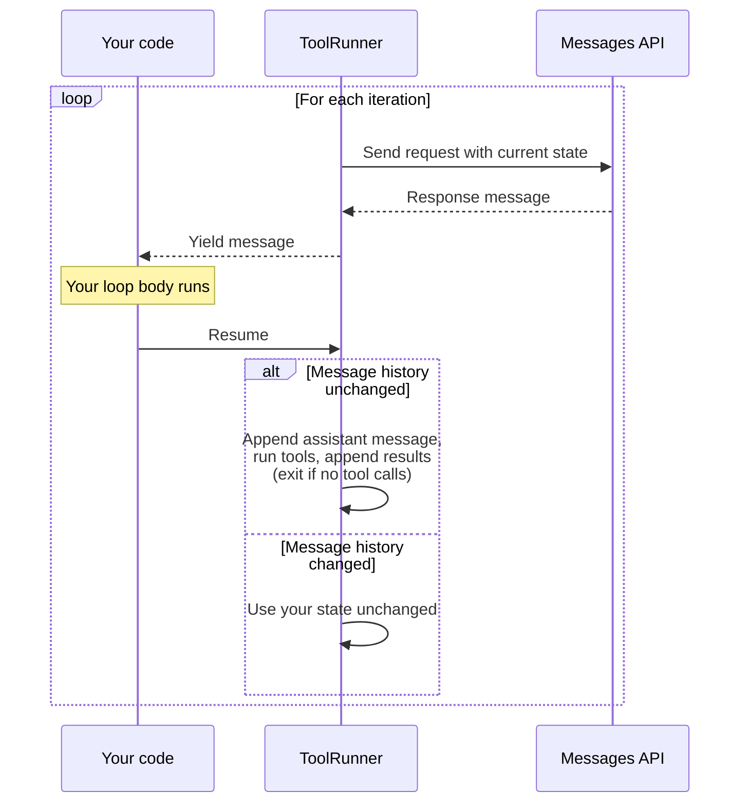

"# Tool use with Claude

Connect Claude to external tools and APIs. Learn where tools execute and how the agentic loop works.

---

Tool use lets Claude call functions you define or that Anthropic provides. Claude decides when to call a tool based on the user's request and the tool's description, then returns a structured call that your application executes (client tools) or that Anthropic executes (server tools).

Here's the simplest example using a server tool, where Anthropic handles execution:

<CodeGroup>
```bash cURL
curl https://api.anthropic.com/v1/messages \
  -H "x-api-key: $ANTHROPIC_API_KEY" \
  -H "anthropic-version: 2023-06-01" \
  -H "content-type: application/json" \
  -d '{
    "model": "claude-opus-4-7",
    "max_tokens": 1024,
    "tools": [{"type": "web_search_20260209", "name": "web_search"}],
    "messages": [{"role": "user", "content": "What'\''s the latest on the Mars rover?"}]
  }'
```

```bash CLI
ant messages create --transform content --format yaml \
  --model claude-opus-4-7 \
  --max-tokens 1024 \
  --tool '{type: web_search_20260209, name: web_search}' \
  --message '{role: user, content: "What is the latest on the Mars rover?"}'
```

```python Python
import anthropic

client = anthropic.Anthropic()
response = client.messages.create(
    model="claude-opus-4-7",
    max_tokens=1024,
    tools=[{"type": "web_search_20260209", "name": "web_search"}],
    messages=[{"role": "user", "content": "What's the latest on the Mars rover?"}],
)
print(response.content)
```

```typescript TypeScript
import Anthropic from "@anthropic-ai/sdk";

const client = new Anthropic();
const response = await client.messages.create({
  model: "claude-opus-4-7",
  max_tokens: 1024,
  tools: [{ type: "web_search_20260209", name: "web_search" }],
  messages: [{ role: "user", content: "What's the latest on the Mars rover?" }]
});
console.log(response.content);
```
</CodeGroup>

---

## How tool use works

Tools differ primarily by where the code executes. **Client tools** (including user-defined tools and Anthropic-schema tools like bash and text_editor) run in your application: Claude responds with `stop_reason: "tool_use"` and one or more `tool_use` blocks, your code executes the operation, and you send back a `tool_result`. **Server tools** (web_search, code_execution, web_fetch, tool_search) run on Anthropic's infrastructure: you see the results directly without handling execution.

For the full conceptual model including the agentic loop and when to choose each approach, see [How tool use works](/docs/en/agents-and-tools/tool-use/how-tool-use-works).

For connecting to MCP servers, see the [MCP connector](/docs/en/agents-and-tools/mcp-connector). For building your own MCP client, see [modelcontextprotocol.io](https://modelcontextprotocol.io/docs/develop/build-client).

<Tip>
**Guarantee schema conformance with strict tool use**

Add `strict: true` to your tool definitions to ensure Claude's tool calls always match your schema exactly. See [Strict tool use](/docs/en/agents-and-tools/tool-use/strict-tool-use).
</Tip>

Tool access is one of the highest-leverage primitives you can give an agent. On benchmarks like [LAB-Bench FigQA](https://lab-bench.org/) (scientific figure interpretation) and [SWE-bench](https://www.swebench.com/) (real-world software engineering), adding even basic tools produces outsized capability gains, often surpassing human expert baselines.

---

## Tool use examples

For a complete hands-on walkthrough, see the [tutorial](/docs/en/agents-and-tools/tool-use/build-a-tool-using-agent). For reference examples of individual concepts, see [Define tools](/docs/en/agents-and-tools/tool-use/define-tools) and [Handle tool calls](/docs/en/agents-and-tools/tool-use/handle-tool-calls).

<section title="What happens when Claude needs more information">

If the user's prompt doesn't include enough information to fill all the required parameters for a tool, Claude Opus is much more likely to recognize that a parameter is missing and ask for it. Claude Sonnet may ask, especially when prompted to think before outputting a tool request. But it may also do its best to infer a reasonable value.

For example, given a `get_weather` tool that requires a `location` parameter, if you ask Claude "What's the weather?" without specifying a location, Claude (particularly Claude Sonnet) may make a guess about tool inputs:

```json JSON
{
  "type": "tool_use",
  "id": "toolu_01A09q90qw90lq917835lq9",
  "name": "get_weather",
  "input": { "location": "New York, NY", "unit": "fahrenheit" }
}
```

This behavior is not guaranteed, especially for more ambiguous prompts and for less intelligent models. If Claude Opus doesn't have enough context to fill in the required parameters, it is far more likely to respond with a clarifying question instead of making a tool call.

</section>

---

## Pricing

Tool use requests are priced based on:
1. The total number of input tokens sent to the model (including in the `tools` parameter)
2. The number of output tokens generated
3. For server-side tools, additional usage-based pricing (e.g., web search charges per search performed)

Client-side tools are priced the same as any other Claude API request, while server-side tools may incur additional charges based on their specific usage.

The additional tokens from tool use come from:

- The `tools` parameter in API requests (tool names, descriptions, and schemas)
- `tool_use` content blocks in API requests and responses
- `tool_result` content blocks in API requests

When you use `tools`, the API also automatically includes a special system prompt for the model which enables tool use. The number of tool use tokens required for each model are listed below (excluding the additional tokens listed above). Note that the table assumes at least 1 tool is provided. If no `tools` are provided, then a tool choice of `none` uses 0 additional system prompt tokens.

| Model                    | Tool choice                                          | Tool use system prompt token count          |
|--------------------------|------------------------------------------------------|---------------------------------------------|
| Claude Opus 4.7                | `auto`, `none`<hr />`any`, `tool`   | 346 tokens<hr />313 tokens |
| Claude Opus 4.6              | `auto`, `none`<hr />`any`, `tool`   | 346 tokens<hr />313 tokens |
| Claude Opus 4.5            | `auto`, `none`<hr />`any`, `tool`   | 346 tokens<hr />313 tokens |
| Claude Opus 4.1            | `auto`, `none`<hr />`any`, `tool`   | 346 tokens<hr />313 tokens |
| Claude Opus 4 ([deprecated](/docs/en/about-claude/model-deprecations)) | `auto`, `none`<hr />`any`, `tool`   | 346 tokens<hr />313 tokens |
| Claude Sonnet 4.6          | `auto`, `none`<hr />`any`, `tool`   | 346 tokens<hr />313 tokens |
| Claude Sonnet 4.5          | `auto`, `none`<hr />`any`, `tool`   | 346 tokens<hr />313 tokens |
| Claude Sonnet 4 ([deprecated](/docs/en/about-claude/model-deprecations)) | `auto`, `none`<hr />`any`, `tool`   | 346 tokens<hr />313 tokens |
| Claude Haiku 4.5         | `auto`, `none`<hr />`any`, `tool`   | 346 tokens<hr />313 tokens |
| Claude Haiku 3.5 ([retired, except on Bedrock and Vertex AI](/docs/en/about-claude/model-deprecations)) | `auto`, `none`<hr />`any`, `tool`   | 264 tokens<hr />340 tokens |

These token counts are added to your normal input and output tokens to calculate the total cost of a request.

Refer to the [models overview table](/docs/en/about-claude/models/overview#latest-models-comparison) for current per-model prices.

When you send a tool use prompt, just like any other API request, the response will output both input and output token counts as part of the reported `usage` metrics.

---

## Next steps

### Choose your path

<CardGroup>
  <Card href="/docs/en/agents-and-tools/tool-use/how-tool-use-works" title="Understand the concepts">
    Where tools run, how the loop works, and when to use tools.
  </Card>
  <Card href="/docs/en/agents-and-tools/tool-use/build-a-tool-using-agent" title="Build step by step">
    The tutorial: from a single tool call to production.
  </Card>
  <Card href="/docs/en/agents-and-tools/tool-use/tool-reference" title="Browse all tools">
    Directory of Anthropic-provided tools and properties.
  </Card>
</CardGroup>"

"# How tool use works

Understand the tool use loop, where tools execute, and when to use tools instead of prose.

---

This page explains the concepts behind tool use: where tools run, how the agentic loop works, and when tool use is the right approach. For hands-on guidance, start with the [tutorial](/docs/en/agents-and-tools/tool-use/build-a-tool-using-agent) or the [implementation guide](/docs/en/agents-and-tools/tool-use/define-tools).

## The tool-use contract

Tool use is a contract between your application and the model. You specify what operations are available and what shape their inputs and outputs take; Claude decides when and how to call them. The model never executes anything on its own. It emits a structured request, your code (or Anthropic's servers) runs the operation, and the result flows back into the conversation.

This contract makes the model behave less like a text generator and more like a function you call. Engineers with classical API experience can integrate tool use the same way they would any other typed interface: define the schema, handle the callback, return a result. The difference is that the caller on the other side is a language model choosing which function to invoke based on the conversation.

## Where tools run

The primary axis along which tools differ is where the code executes. Every tool falls into one of three buckets, and the bucket determines what your application is responsible for.

### User-defined tools (client-executed)

You write the schema, you execute the code, you return the results. This is the main event: the vast majority of tool-use traffic is user-defined tools calling into application-specific logic.

When Claude decides to use one of your tools, the API response contains a `tool_use` block with the tool name and a JSON object of arguments. Your application extracts those arguments, runs the operation (a database query, an HTTP call, a file write, whatever the tool does), and sends the output back in a `tool_result` block on the next request. Claude never sees your implementation; it only sees the schema you provided and the result you returned.

### Anthropic-schema tools (client-executed)

For a handful of common operations (running shell commands, editing files, controlling a browser, managing scratchpad memory), Anthropic publishes the tool schema and your application handles execution. The tools in this category are `bash`, `text_editor`, `computer`, and `memory`.

The execution model is identical to user-defined tools: the response contains a `tool_use` block, your code runs the operation, and you send back a `tool_result`. The reason to use an Anthropic-schema tool instead of defining your own equivalent is that these schemas are trained-in. Claude has been optimized on thousands of successful trajectories that use these exact tool signatures, so it calls them more reliably and recovers from errors more gracefully than it would with a custom tool that does the same thing. The schema is the interface the model already expects.

### Server-executed tools

For `web_search`, `web_fetch`, `code_execution`, and `tool_search`, Anthropic runs the code. You enable the tool in your request and the server handles everything else. You never construct a `tool_result` block for these tools because the server-side loop executes the operation and feeds the output back to the model before the response reaches you.

The response you receive contains `server_tool_use` blocks showing what ran and what came back, but by the time you see them, execution is already complete. Your application's job is to enable the tool and read the final answer, not to participate in the execution loop.

## The agentic loop (client tools)

Client-executed tools (both user-defined and Anthropic-schema) require your application to drive a loop. The model can't run your code, so every tool call is a round trip: the model asks, you execute, you report back, the model continues.

The canonical shape is a `while` loop keyed on `stop_reason`:

1. Send a request with your `tools` array and the user message.
2. Claude responds with `stop_reason: "tool_use"` and one or more `tool_use` blocks.
3. Execute each tool. Format the outputs as `tool_result` blocks.
4. Send a new request containing the original messages, the assistant's response, and a user message with the `tool_result` blocks.
5. Repeat from step 2 while `stop_reason` is `"tool_use"`.

In practice this reads as: while `stop_reason == "tool_use"`, execute the tools and continue the conversation. The loop exits on any other stop reason (`"end_turn"`, `"max_tokens"`, `"stop_sequence"`, or `"refusal"`), which means Claude has either produced a final answer or stopped for another reason that your application should handle.

For the mechanics of building requests, handling parallel tool calls, and formatting results, see [Handle tool calls](/docs/en/agents-and-tools/tool-use/handle-tool-calls).

## The server-side loop

Server-executed tools run their own loop inside Anthropic's infrastructure. A single request from your application might trigger several web searches or code executions before a response comes back. The model searches, reads results, decides to search again, and iterates until it has what it needs, all without your application participating.

This internal loop has an iteration limit. If the model is still iterating when it hits the cap, the response comes back with `stop_reason: "pause_turn"` instead of `"end_turn"`. A paused turn means the work isn't finished; re-send the conversation (including the paused response) to let the model continue where it left off. See [Server tools](/docs/en/agents-and-tools/tool-use/server-tools) for the continuation pattern.

## When to use tools (and when not to)

Tool use fits when the task requires something the model can't do from text alone:

- **Actions with side effects.** Sending an email, writing a file, updating a record. The model can describe these actions, but only a tool can perform them.
- **Fresh or external data.** Current prices, today's weather, the contents of a database. Anything outside the training data or specific to your system needs a tool to fetch it.
- **Structured, guaranteed-shape outputs.** When you need a JSON object with specific fields rather than prose that happens to contain the information, a tool schema enforces the shape.
- **Calling into existing systems.** Databases, internal APIs, file systems. Tool use is the bridge between natural-language requests and the systems that fulfill them.

The tell that you should be using tools: if you're writing a regex to extract a decision from model output, that decision should have been a tool call. Parsing free-form text to recover structured intent is a sign the structure belongs in the schema.

Tool use doesn't fit when:

- The model can answer from training alone. Summarization, translation, and general-knowledge questions don't need a tool round trip.
- The interaction is one-shot Q&A with no side effects. If there's nothing to execute, there's nothing for a tool to do.
- Tool-calling latency would dominate a trivial response. Every tool call is at least one extra round trip; for lightweight tasks the overhead can exceed the work.

## Choosing between approaches

| Approach | When to use it | What to expect | Learn more |
| --- | --- | --- | --- |
| User-defined client tools | Custom business logic, internal APIs, proprietary data | You handle execution and the agentic loop | [Define tools](/docs/en/agents-and-tools/tool-use/define-tools) |
| Anthropic-schema client tools | Standard dev operations (bash, file editing, browser control) | You handle execution; Claude calls the tool reliably because the schema is trained-in | [Tool reference](/docs/en/agents-and-tools/tool-use/tool-reference) |
| Server-executed tools | Web search, code sandbox, web fetch | Anthropic handles execution; you get results directly | [Server tools](/docs/en/agents-and-tools/tool-use/server-tools) |

## Next steps

<CardGroup>
  <Card href="/docs/en/agents-and-tools/tool-use/build-a-tool-using-agent" title="Tutorial: Build a tool-using agent">
    Build an agent step by step from a single tool call to production.
  </Card>
  <Card href="/docs/en/agents-and-tools/tool-use/define-tools" title="Define tools">
    Schema specification, descriptions, and tool_choice.
  </Card>
  <Card href="/docs/en/agents-and-tools/tool-use/tool-reference" title="Tool reference">
    Directory of Anthropic-provided tools.
  </Card>
</CardGroup>"

"# Tutorial: Build a tool-using agent

A guided walkthrough from a single tool call to a production-ready agentic loop.

---

This tutorial builds a calendar-management agent in five concentric rings. Each ring is a complete, runnable program that adds exactly one concept to the ring before it. By the end you will have written the agentic loop by hand and then replaced it with the Tool Runner SDK abstraction.

The example tool is `create_calendar_event`. Its schema uses nested objects, arrays, and optional fields, so you will see how Claude handles realistic input shapes rather than a single flat string.

<Note>
Every ring runs standalone. Copy any ring into a fresh file and it will execute without the code from earlier rings.
</Note>

## Ring 1: Single tool, single turn

The smallest possible tool-using program: one tool, one user message, one tool call, one result. The code is heavily commented so you can map each line to the [tool use lifecycle](/docs/en/agents-and-tools/tool-use/how-tool-use-works).

The request sends a `tools` array alongside the user message. When Claude decides to call a tool, the response comes back with `stop_reason: "tool_use"` and a `tool_use` content block containing the tool name, a unique `id`, and the structured `input`. Your code executes the tool, then sends the result back in a `tool_result` block whose `tool_use_id` matches the `id` from the call.

<CodeGroup>
  
````bash
#!/bin/bash
# Ring 1: Single tool, single turn.
# Source for <CodeSource> in build-a-tool-using-agent.mdx.

# Define one tool as a JSON fragment. The input_schema is a JSON Schema
# object describing the arguments Claude should pass when it calls this
# tool. This schema includes nested objects (recurrence), arrays
# (attendees), and optional fields, which is closer to real-world tools
# than a flat string argument.
TOOLS='[
  {
    "name": "create_calendar_event",
    "description": "Create a calendar event with attendees and optional recurrence.",
    "input_schema": {
      "type": "object",
      "properties": {
        "title": {"type": "string"},
        "start": {"type": "string", "format": "date-time"},
        "end": {"type": "string", "format": "date-time"},
        "attendees": {
          "type": "array",
          "items": {"type": "string", "format": "email"}
        },
        "recurrence": {
          "type": "object",
          "properties": {
            "frequency": {"enum": ["daily", "weekly", "monthly"]},
            "count": {"type": "integer", "minimum": 1}
          }
        }
      },
      "required": ["title", "start", "end"]
    }
  }
]'

USER_MSG="Schedule a 30-minute sync with alice@example.com and bob@example.com next Monday at 10am."

# Send the user's request along with the tool definition. Claude decides
# whether to call the tool based on the request and the tool description.
RESPONSE=$(curl -s https://api.anthropic.com/v1/messages \
  -H "x-api-key: $ANTHROPIC_API_KEY" \
  -H "anthropic-version: 2023-06-01" \
  -H "content-type: application/json" \
  -d "$(jq -n \
    --argjson tools "$TOOLS" \
    --arg msg "$USER_MSG" \
    '{
      model: "claude-opus-4-6",
      max_tokens: 1024,
      tools: $tools,
      tool_choice: {type: "auto", disable_parallel_tool_use: true},
      messages: [{role: "user", content: $msg}]
    }')")

# When Claude calls a tool, the response has stop_reason "tool_use"
# and the content array contains a tool_use block alongside any text.
echo "stop_reason: $(echo "$RESPONSE" | jq -r '.stop_reason')"

# Find the tool_use block. A response may contain text blocks before the
# tool_use block, so filter by type rather than assuming position.
TOOL_USE=$(echo "$RESPONSE" | jq '.content[] | select(.type == "tool_use")')
TOOL_USE_ID=$(echo "$TOOL_USE" | jq -r '.id')
echo "Tool: $(echo "$TOOL_USE" | jq -r '.name')"
echo "Input: $(echo "$TOOL_USE" | jq -c '.input')"

# Execute the tool. In a real system this would call your calendar API.
# Here the result is hardcoded to keep the example self-contained.
RESULT='{"event_id": "evt_123", "status": "created"}'

# Send the result back. The tool_result block goes in a user message and
# its tool_use_id must match the id from the tool_use block above. The
# assistant's previous response is included so Claude has the full history.
ASSISTANT_CONTENT=$(echo "$RESPONSE" | jq '.content')
FOLLOWUP=$(curl -s https://api.anthropic.com/v1/messages \
  -H "x-api-key: $ANTHROPIC_API_KEY" \
  -H "anthropic-version: 2023-06-01" \
  -H "content-type: application/json" \
  -d "$(jq -n \
    --argjson tools "$TOOLS" \
    --arg msg "$USER_MSG" \
    --argjson assistant "$ASSISTANT_CONTENT" \
    --arg tool_use_id "$TOOL_USE_ID" \
    --arg result "$RESULT" \
    '{
      model: "claude-opus-4-6",
      max_tokens: 1024,
      tools: $tools,
      tool_choice: {type: "auto", disable_parallel_tool_use: true},
      messages: [
        {role: "user", content: $msg},
        {role: "assistant", content: $assistant},
        {role: "user", content: [
          {type: "tool_result", tool_use_id: $tool_use_id, content: $result}
        ]}
      ]
    }')")

# With the tool result in hand, Claude produces a final natural-language
# answer and stop_reason becomes "end_turn".
echo "stop_reason: $(echo "$FOLLOWUP" | jq -r '.stop_reason')"
echo "$FOLLOWUP" | jq -r '.content[] | select(.type == "text") | .text'
````

  
````bash
#!/usr/bin/env bash
# Ring 1: Single tool, single turn.
# Uses jq for cross-turn message-array state — building an agentic loop in shell
# requires JSON manipulation beyond ant's single-call --transform scope.
# Source for <CodeSource> in build-a-tool-using-agent.mdx.
set -euo pipefail

USER_MSG="Schedule a 30-minute sync with alice@example.com and bob@example.com next Monday at 10am."
MESSAGES=$(jq -n --arg msg "$USER_MSG" '[{role: "user", content: $msg}]')

# Define one tool. The input_schema is a JSON Schema object describing
# the arguments Claude should pass when it calls this tool. This schema
# includes nested objects (recurrence), arrays (attendees), and optional
# fields, which is closer to real-world tools than a flat string argument.
call_api() {
  # ant reads the request body as YAML on stdin: no auth headers, no
  # hand-built JSON envelope. The static keys (model, tools, tool_choice)
  # live in a quoted heredoc; the growing messages array is appended as
  # JSON, which YAML accepts as flow syntax.
  {
    cat <<'YAML'
model: claude-opus-4-6
max_tokens: 1024
tool_choice: {type: auto, disable_parallel_tool_use: true}
tools:
  - name: create_calendar_event
    description: Create a calendar event with attendees and optional recurrence.
    input_schema:
      type: object
      properties:
        title: {type: string}
        start: {type: string, format: date-time}
        end: {type: string, format: date-time}
        attendees:
          type: array
          items: {type: string, format: email}
        recurrence:
          type: object
          properties:
            frequency: {enum: [daily, weekly, monthly]}
            count: {type: integer, minimum: 1}
      required: [title, start, end]
YAML
    printf 'messages: %s\n' "$MESSAGES"
  } | ant messages create --format json
}

# Send the user's request along with the tool definition. Claude decides
# whether to call the tool based on the request and the tool description.
RESPONSE=$(call_api)

# When Claude calls a tool, the response has stop_reason "tool_use"
# and the content array contains a tool_use block alongside any text.
echo "stop_reason: $(jq -r '.stop_reason' <<<"$RESPONSE")"

# Find the tool_use block. A response may contain text blocks before the
# tool_use block, so filter by type rather than assuming position.
TOOL_USE=$(jq '.content[] | select(.type == "tool_use")' <<<"$RESPONSE")
TOOL_USE_ID=$(jq -r '.id' <<<"$TOOL_USE")
echo "Tool: $(jq -r '.name' <<<"$TOOL_USE")"
echo "Input: $(jq -c '.input' <<<"$TOOL_USE")"

# Execute the tool. In a real system this would call your calendar API.
# Here the result is hardcoded to keep the example self-contained.
RESULT='{"event_id": "evt_123", "status": "created"}'

# Send the result back. The tool_result block goes in a user message and
# its tool_use_id must match the id from the tool_use block above. The
# assistant's previous response is included so Claude has the full history.
MESSAGES=$(jq \
  --argjson assistant "$(jq '.content' <<<"$RESPONSE")" \
  --arg tool_use_id "$TOOL_USE_ID" \
  --arg result "$RESULT" \
  '. + [
    {role: "assistant", content: $assistant},
    {role: "user", content: [
      {type: "tool_result", tool_use_id: $tool_use_id, content: $result}
    ]}
  ]' <<<"$MESSAGES")

FOLLOWUP=$(call_api)

# With the tool result in hand, Claude produces a final natural-language
# answer and stop_reason becomes "end_turn".
echo "stop_reason: $(jq -r '.stop_reason' <<<"$FOLLOWUP")"
jq -r '.content[] | select(.type == "text") | .text' <<<"$FOLLOWUP"
````

  
````python
# Ring 1: Single tool, single turn.
# Source for <CodeSource> in build-a-tool-using-agent.mdx.

import json

import anthropic

# Create a client. It reads ANTHROPIC_API_KEY from the environment.
client = anthropic.Anthropic()

# Define one tool. The input_schema is a JSON Schema object describing
# the arguments Claude should pass when it calls this tool. This schema
# includes nested objects (recurrence), arrays (attendees), and optional
# fields, which is closer to real-world tools than a flat string argument.
tools = [
    {
        "name": "create_calendar_event",
        "description": "Create a calendar event with attendees and optional recurrence.",
        "input_schema": {
            "type": "object",
            "properties": {
                "title": {"type": "string"},
                "start": {"type": "string", "format": "date-time"},
                "end": {"type": "string", "format": "date-time"},
                "attendees": {
                    "type": "array",
                    "items": {"type": "string", "format": "email"},
                },
                "recurrence": {
                    "type": "object",
                    "properties": {
                        "frequency": {"enum": ["daily", "weekly", "monthly"]},
                        "count": {"type": "integer", "minimum": 1},
                    },
                },
            },
            "required": ["title", "start", "end"],
        },
    }
]

# Send the user's request along with the tool definition. Claude decides
# whether to call the tool based on the request and the tool description.
response = client.messages.create(
    model="claude-opus-4-6",
    max_tokens=1024,
    tools=tools,
    tool_choice={"type": "auto", "disable_parallel_tool_use": True},
    messages=[
        {
            "role": "user",
            "content": "Schedule a 30-minute sync with alice@example.com and bob@example.com next Monday at 10am.",
        }
    ],
)

# When Claude calls a tool, the response has stop_reason "tool_use"
# and the content array contains a tool_use block alongside any text.
print(f"stop_reason: {response.stop_reason}")

# Find the tool_use block. A response may contain text blocks before the
# tool_use block, so scan the content array rather than assuming position.
tool_use = next(block for block in response.content if block.type == "tool_use")
print(f"Tool: {tool_use.name}")
print(f"Input: {tool_use.input}")

# Execute the tool. In a real system this would call your calendar API.
# Here the result is hardcoded to keep the example self-contained.
result = {"event_id": "evt_123", "status": "created"}

# Send the result back. The tool_result block goes in a user message and
# its tool_use_id must match the id from the tool_use block above. The
# assistant's previous response is included so Claude has the full history.
followup = client.messages.create(
    model="claude-opus-4-6",
    max_tokens=1024,
    tools=tools,
    tool_choice={"type": "auto", "disable_parallel_tool_use": True},
    messages=[
        {
            "role": "user",
            "content": "Schedule a 30-minute sync with alice@example.com and bob@example.com next Monday at 10am.",
        },
        {"role": "assistant", "content": response.content},
        {
            "role": "user",
            "content": [
                {
                    "type": "tool_result",
                    "tool_use_id": tool_use.id,
                    "content": json.dumps(result),
                }
            ],
        },
    ],
)

# With the tool result in hand, Claude produces a final natural-language
# answer and stop_reason becomes "end_turn".
print(f"stop_reason: {followup.stop_reason}")
final_text = next(block for block in followup.content if block.type == "text")
print(final_text.text)
````

  
````typescript
// Ring 1: Single tool, single turn.
// Source for <CodeSource> in build-a-tool-using-agent.mdx.

import Anthropic from "@anthropic-ai/sdk";

// Create a client. It reads ANTHROPIC_API_KEY from the environment.
const client = new Anthropic();

// Define one tool. The input_schema is a JSON Schema object describing
// the arguments Claude should pass when it calls this tool. This schema
// includes nested objects (recurrence), arrays (attendees), and optional
// fields, which is closer to real-world tools than a flat string argument.
const tools: Anthropic.Tool[] = [
  {
    name: "create_calendar_event",
    description:
      "Create a calendar event with attendees and optional recurrence.",
    input_schema: {
      type: "object",
      properties: {
        title: { type: "string" },
        start: { type: "string", format: "date-time" },
        end: { type: "string", format: "date-time" },
        attendees: {
          type: "array",
          items: { type: "string", format: "email" },
        },
        recurrence: {
          type: "object",
          properties: {
            frequency: { enum: ["daily", "weekly", "monthly"] },
            count: { type: "integer", minimum: 1 },
          },
        },
      },
      required: ["title", "start", "end"],
    },
  },
];

// Send the user's request along with the tool definition. Claude decides
// whether to call the tool based on the request and the tool description.
const response = await client.messages.create({
  model: "claude-opus-4-6",
  max_tokens: 1024,
  tools,
  tool_choice: { type: "auto", disable_parallel_tool_use: true },
  messages: [
    {
      role: "user",
      content:
        "Schedule a 30-minute sync with alice@example.com and bob@example.com next Monday at 10am.",
    },
  ],
});

// When Claude calls a tool, the response has stop_reason "tool_use"
// and the content array contains a tool_use block alongside any text.
console.log(`stop_reason: ${response.stop_reason}`);

// Find the tool_use block. A response may contain text blocks before the
// tool_use block, so scan the content array rather than assuming position.
const toolUse = response.content.find(
  (block): block is Anthropic.ToolUseBlock => block.type === "tool_use",
)!;
console.log(`Tool: ${toolUse.name}`);
console.log(`Input: ${JSON.stringify(toolUse.input)}`);

// Execute the tool. In a real system this would call your calendar API.
// Here the result is hardcoded to keep the example self-contained.
const result = { event_id: "evt_123", status: "created" };

// Send the result back. The tool_result block goes in a user message and
// its tool_use_id must match the id from the tool_use block above. The
// assistant's previous response is included so Claude has the full history.
const followup = await client.messages.create({
  model: "claude-opus-4-6",
  max_tokens: 1024,
  tools,
  tool_choice: { type: "auto", disable_parallel_tool_use: true },
  messages: [
    {
      role: "user",
      content:
        "Schedule a 30-minute sync with alice@example.com and bob@example.com next Monday at 10am.",
    },
    { role: "assistant", content: response.content },
    {
      role: "user",
      content: [
        {
          type: "tool_result",
          tool_use_id: toolUse.id,
          content: JSON.stringify(result),
        },
      ],
    },
  ],
});

// With the tool result in hand, Claude produces a final natural-language
// answer and stop_reason becomes "end_turn".
console.log(`stop_reason: ${followup.stop_reason}`);
for (const block of followup.content) {
  if (block.type === "text") {
    console.log(block.text);
  }
}
````

</CodeGroup>

**What to expect**

```text Output
stop_reason: tool_use
Tool: create_calendar_event
Input: {'title': 'Sync', 'start': '2026-03-30T10:00:00', 'end': '2026-03-30T10:30:00', 'attendees': ['alice@example.com', 'bob@example.com']}
stop_reason: end_turn
I've scheduled your 30-minute sync with Alice and Bob for next Monday at 10am.
```

The first `stop_reason` is `tool_use` because Claude is waiting for the calendar result. After you send the result, the second `stop_reason` is `end_turn` and the content is natural language for the user.

## Ring 2: The agentic loop

Ring 1 assumed Claude would call the tool exactly once. Real tasks often need several calls: Claude might create an event, read the confirmation, then create another. The fix is a `while` loop that keeps running tools and feeding results back until `stop_reason` is no longer `"tool_use"`.

The other change is conversation history. Instead of rebuilding the `messages` array from scratch on each request, keep a running list and append to it. Every turn sees the complete prior context.

<CodeGroup>
  
````bash
#!/bin/bash
# Ring 2: The agentic loop.
# Source for <CodeSource> in build-a-tool-using-agent.mdx.

TOOLS='[
  {
    "name": "create_calendar_event",
    "description": "Create a calendar event with attendees and optional recurrence.",
    "input_schema": {
      "type": "object",
      "properties": {
        "title": {"type": "string"},
        "start": {"type": "string", "format": "date-time"},
        "end": {"type": "string", "format": "date-time"},
        "attendees": {"type": "array", "items": {"type": "string", "format": "email"}},
        "recurrence": {
          "type": "object",
          "properties": {
            "frequency": {"enum": ["daily", "weekly", "monthly"]},
            "count": {"type": "integer", "minimum": 1}
          }
        }
      },
      "required": ["title", "start", "end"]
    }
  }
]'

run_tool() {
  local name="$1"
  local input="$2"
  if [ "$name" = "create_calendar_event" ]; then
    local title=$(echo "$input" | jq -r '.title')
    jq -n --arg title "$title" '{event_id: "evt_123", status: "created", title: $title}'
  else
    echo "{\"error\": \"Unknown tool: $name\"}"
  fi
}

# Keep the full conversation history in a JSON array so each turn sees prior context.
MESSAGES='[{"role": "user", "content": "Schedule a weekly team standup every Monday at 9am for the next 4 weeks. Invite the whole team: alice@example.com, bob@example.com, carol@example.com."}]'

call_api() {
  curl -s https://api.anthropic.com/v1/messages \
    -H "x-api-key: $ANTHROPIC_API_KEY" \
    -H "anthropic-version: 2023-06-01" \
    -H "content-type: application/json" \
    -d "$(jq -n --argjson tools "$TOOLS" --argjson messages "$MESSAGES" \
      '{model: "claude-opus-4-6", max_tokens: 1024, tools: $tools, tool_choice: {type: "auto", disable_parallel_tool_use: true}, messages: $messages}')"
}

RESPONSE=$(call_api)

# Loop until Claude stops asking for tools. Each iteration runs the requested
# tool, appends the result to history, and asks Claude to continue.
while [ "$(echo "$RESPONSE" | jq -r '.stop_reason')" = "tool_use" ]; do
  TOOL_USE=$(echo "$RESPONSE" | jq '.content[] | select(.type == "tool_use")')
  TOOL_NAME=$(echo "$TOOL_USE" | jq -r '.name')
  TOOL_INPUT=$(echo "$TOOL_USE" | jq -c '.input')
  TOOL_USE_ID=$(echo "$TOOL_USE" | jq -r '.id')
  RESULT=$(run_tool "$TOOL_NAME" "$TOOL_INPUT")

  ASSISTANT_CONTENT=$(echo "$RESPONSE" | jq '.content')
  MESSAGES=$(echo "$MESSAGES" | jq \
    --argjson assistant "$ASSISTANT_CONTENT" \
    --arg tool_use_id "$TOOL_USE_ID" \
    --arg result "$RESULT" \
    '. + [
      {role: "assistant", content: $assistant},
      {role: "user", content: [{type: "tool_result", tool_use_id: $tool_use_id, content: $result}]}
    ]')

  RESPONSE=$(call_api)
done

echo "$RESPONSE" | jq -r '.content[] | select(.type == "text") | .text'
````

  
````bash
#!/usr/bin/env bash
# Ring 2: The agentic loop.
# Uses jq for cross-turn message-array state — building an agentic loop in shell
# requires JSON manipulation beyond ant's single-call --transform scope.
# Source for <CodeSource> in build-a-tool-using-agent.mdx.
set -euo pipefail

run_tool() {
  local name="$1" input="$2"
  if [ "$name" = "create_calendar_event" ]; then
    jq -n --arg title "$(jq -r '.title' <<<"$input")" \
      '{event_id: "evt_123", status: "created", title: $title}'
  else
    printf '{"error": "Unknown tool: %s"}' "$name"
  fi
}

# Keep the full conversation history in a JSON array so each turn sees
# prior context.
MESSAGES='[{"role": "user", "content": "Schedule a weekly team standup every Monday at 9am for the next 4 weeks. Invite the whole team: alice@example.com, bob@example.com, carol@example.com."}]'

call_api() {
  # ant reads the request body as YAML on stdin: no auth headers, no
  # hand-built JSON envelope. The static keys (model, tools, tool_choice)
  # live in a quoted heredoc; the growing messages array is appended as
  # JSON, which YAML accepts as flow syntax.
  {
    cat <<'YAML'
model: claude-opus-4-6
max_tokens: 1024
tool_choice: {type: auto, disable_parallel_tool_use: true}
tools:
  - name: create_calendar_event
    description: Create a calendar event with attendees and optional recurrence.
    input_schema:
      type: object
      properties:
        title: {type: string}
        start: {type: string, format: date-time}
        end: {type: string, format: date-time}
        attendees:
          type: array
          items: {type: string, format: email}
        recurrence:
          type: object
          properties:
            frequency: {enum: [daily, weekly, monthly]}
            count: {type: integer, minimum: 1}
      required: [title, start, end]
YAML
    printf 'messages: %s\n' "$MESSAGES"
  } | ant messages create --format json
}

RESPONSE=$(call_api)

# Loop until Claude stops asking for tools. Each iteration runs the
# requested tool, appends the result to history, and asks Claude to
# continue.
while [ "$(jq -r '.stop_reason' <<<"$RESPONSE")" = "tool_use" ]; do
  TOOL_USE=$(jq '.content[] | select(.type == "tool_use")' <<<"$RESPONSE")
  TOOL_NAME=$(jq -r '.name' <<<"$TOOL_USE")
  TOOL_INPUT=$(jq -c '.input' <<<"$TOOL_USE")
  TOOL_USE_ID=$(jq -r '.id' <<<"$TOOL_USE")
  RESULT=$(run_tool "$TOOL_NAME" "$TOOL_INPUT")

  MESSAGES=$(jq \
    --argjson assistant "$(jq '.content' <<<"$RESPONSE")" \
    --arg tool_use_id "$TOOL_USE_ID" \
    --arg result "$RESULT" \
    '. + [
      {role: "assistant", content: $assistant},
      {role: "user", content: [
        {type: "tool_result", tool_use_id: $tool_use_id, content: $result}
      ]}
    ]' <<<"$MESSAGES")

  RESPONSE=$(call_api)
done

jq -r '.content[] | select(.type == "text") | .text' <<<"$RESPONSE"
````

  
````python
# Ring 2: The agentic loop.
# Source for <CodeSource> in build-a-tool-using-agent.mdx.

import json

import anthropic

client = anthropic.Anthropic()

tools = [
    {
        "name": "create_calendar_event",
        "description": "Create a calendar event with attendees and optional recurrence.",
        "input_schema": {
            "type": "object",
            "properties": {
                "title": {"type": "string"},
                "start": {"type": "string", "format": "date-time"},
                "end": {"type": "string", "format": "date-time"},
                "attendees": {
                    "type": "array",
                    "items": {"type": "string", "format": "email"},
                },
                "recurrence": {
                    "type": "object",
                    "properties": {
                        "frequency": {"enum": ["daily", "weekly", "monthly"]},
                        "count": {"type": "integer", "minimum": 1},
                    },
                },
            },
            "required": ["title", "start", "end"],
        },
    }
]


def run_tool(name, tool_input):
    if name == "create_calendar_event":
        return {"event_id": "evt_123", "status": "created", "title": tool_input["title"]}
    return {"error": f"Unknown tool: {name}"}


# Keep the full conversation history in a list so each turn sees prior context.
messages = [
    {
        "role": "user",
        "content": "Schedule a weekly team standup every Monday at 9am for the next 4 weeks. Invite the whole team: alice@example.com, bob@example.com, carol@example.com.",
    }
]

response = client.messages.create(
    model="claude-opus-4-6",
    max_tokens=1024,
    tools=tools,
    tool_choice={"type": "auto", "disable_parallel_tool_use": True},
    messages=messages,
)

# Loop until Claude stops asking for tools. Each iteration runs the requested
# tool, appends the result to history, and asks Claude to continue.
while response.stop_reason == "tool_use":
    tool_use = next(block for block in response.content if block.type == "tool_use")
    result = run_tool(tool_use.name, tool_use.input)

    messages.append({"role": "assistant", "content": response.content})
    messages.append(
        {
            "role": "user",
            "content": [
                {
                    "type": "tool_result",
                    "tool_use_id": tool_use.id,
                    "content": json.dumps(result),
                }
            ],
        }
    )

    response = client.messages.create(
        model="claude-opus-4-6",
        max_tokens=1024,
        tools=tools,
        tool_choice={"type": "auto", "disable_parallel_tool_use": True},
        messages=messages,
    )

final_text = next(block for block in response.content if block.type == "text")
print(final_text.text)
````

  
````typescript
// Ring 2: The agentic loop.
// Source for <CodeSource> in build-a-tool-using-agent.mdx.

import Anthropic from "@anthropic-ai/sdk";

const client = new Anthropic();

const tools: Anthropic.Tool[] = [
  {
    name: "create_calendar_event",
    description:
      "Create a calendar event with attendees and optional recurrence.",
    input_schema: {
      type: "object",
      properties: {
        title: { type: "string" },
        start: { type: "string", format: "date-time" },
        end: { type: "string", format: "date-time" },
        attendees: {
          type: "array",
          items: { type: "string", format: "email" },
        },
        recurrence: {
          type: "object",
          properties: {
            frequency: { enum: ["daily", "weekly", "monthly"] },
            count: { type: "integer", minimum: 1 },
          },
        },
      },
      required: ["title", "start", "end"],
    },
  },
];

function runTool(name: string, input: Record<string, unknown>) {
  if (name === "create_calendar_event") {
    return { event_id: "evt_123", status: "created", title: input.title };
  }
  return { error: `Unknown tool: ${name}` };
}

// Keep the full conversation history so each turn sees prior context.
const messages: Anthropic.MessageParam[] = [
  {
    role: "user",
    content:
      "Schedule a weekly team standup every Monday at 9am for the next 4 weeks. Invite the whole team: alice@example.com, bob@example.com, carol@example.com.",
  },
];

let response = await client.messages.create({
  model: "claude-opus-4-6",
  max_tokens: 1024,
  tools,
  tool_choice: { type: "auto", disable_parallel_tool_use: true },
  messages,
});

// Loop until Claude stops asking for tools. Each iteration runs the requested
// tool, appends the result to history, and asks Claude to continue.
while (response.stop_reason === "tool_use") {
  const toolUse = response.content.find(
    (block): block is Anthropic.ToolUseBlock => block.type === "tool_use",
  )!;
  const result = runTool(toolUse.name, toolUse.input as Record<string, unknown>);

  messages.push({ role: "assistant", content: response.content });
  messages.push({
    role: "user",
    content: [
      {
        type: "tool_result",
        tool_use_id: toolUse.id,
        content: JSON.stringify(result),
      },
    ],
  });

  response = await client.messages.create({
    model: "claude-opus-4-6",
    max_tokens: 1024,
    tools,
    tool_choice: { type: "auto", disable_parallel_tool_use: true },
    messages,
  });
}

for (const block of response.content) {
  if (block.type === "text") {
    console.log(block.text);
  }
}
````

</CodeGroup>

**What to expect**

```text Output
I've set up your weekly team standup for the next 4 Mondays at 9am with Alice, Bob, and Carol invited.
```

The loop may run once or several times depending on how Claude breaks down the task. Your code no longer needs to know in advance.

## Ring 3: Multiple tools, parallel calls

Agents rarely have just one capability. Add a second tool, `list_calendar_events`, so Claude can check the existing schedule before creating something new.

When Claude has multiple independent tool calls to make, it may return several `tool_use` blocks in a single response. Your loop needs to process all of them and send back all results together in one user message. Iterate over every `tool_use` block in `response.content`, not just the first.

<CodeGroup>
  
````bash
#!/bin/bash
# Ring 3: Multiple tools, parallel calls.
# Source for <CodeSource> in build-a-tool-using-agent.mdx.

TOOLS='[
  {
    "name": "create_calendar_event",
    "description": "Create a calendar event with attendees and optional recurrence.",
    "input_schema": {
      "type": "object",
      "properties": {
        "title": {"type": "string"},
        "start": {"type": "string", "format": "date-time"},
        "end": {"type": "string", "format": "date-time"},
        "attendees": {"type": "array", "items": {"type": "string", "format": "email"}},
        "recurrence": {
          "type": "object",
          "properties": {
            "frequency": {"enum": ["daily", "weekly", "monthly"]},
            "count": {"type": "integer", "minimum": 1}
          }
        }
      },
      "required": ["title", "start", "end"]
    }
  },
  {
    "name": "list_calendar_events",
    "description": "List all calendar events on a given date.",
    "input_schema": {
      "type": "object",
      "properties": {"date": {"type": "string", "format": "date"}},
      "required": ["date"]
    }
  }
]'

run_tool() {
  case "$1" in
    create_calendar_event)
      jq -n --arg title "$(echo "$2" | jq -r '.title')" '{event_id: "evt_123", status: "created", title: $title}' ;;
    list_calendar_events)
      echo '{"events": [{"title": "Existing meeting", "start": "14:00", "end": "15:00"}]}' ;;
    *)
      echo "{\"error\": \"Unknown tool: $1\"}" ;;
  esac
}

MESSAGES='[{"role": "user", "content": "Check what I have next Monday, then schedule a planning session that avoids any conflicts."}]'

call_api() {
  curl -s https://api.anthropic.com/v1/messages \
    -H "x-api-key: $ANTHROPIC_API_KEY" \
    -H "anthropic-version: 2023-06-01" \
    -H "content-type: application/json" \
    -d "$(jq -n --argjson tools "$TOOLS" --argjson messages "$MESSAGES" \
      '{model: "claude-opus-4-6", max_tokens: 1024, tools: $tools, messages: $messages}')"
}

RESPONSE=$(call_api)

while [ "$(echo "$RESPONSE" | jq -r '.stop_reason')" = "tool_use" ]; do
  # A single response can contain multiple tool_use blocks. Process all of
  # them and return all results together in one user message.
  TOOL_RESULTS='[]'
  while read -r block; do
    NAME=$(echo "$block" | jq -r '.name')
    INPUT=$(echo "$block" | jq -c '.input')
    ID=$(echo "$block" | jq -r '.id')
    RESULT=$(run_tool "$NAME" "$INPUT")
    TOOL_RESULTS=$(echo "$TOOL_RESULTS" | jq --arg id "$ID" --arg result "$RESULT" \
      '. + [{type: "tool_result", tool_use_id: $id, content: $result}]')
  done < <(echo "$RESPONSE" | jq -c '.content[] | select(.type == "tool_use")')

  MESSAGES=$(echo "$MESSAGES" | jq \
    --argjson assistant "$(echo "$RESPONSE" | jq '.content')" \
    --argjson results "$TOOL_RESULTS" \
    '. + [{role: "assistant", content: $assistant}, {role: "user", content: $results}]')

  RESPONSE=$(call_api)
done

echo "$RESPONSE" | jq -r '.content[] | select(.type == "text") | .text'
````

  
````bash
#!/usr/bin/env bash
# Ring 3: Multiple tools, parallel calls.
# Uses jq for cross-turn message-array state — building an agentic loop in shell
# requires JSON manipulation beyond ant's single-call --transform scope.
# Source for <CodeSource> in build-a-tool-using-agent.mdx.
set -euo pipefail

run_tool() {
  case "$1" in
    create_calendar_event)
      jq -n --arg title "$(jq -r '.title' <<<"$2")" \
        '{event_id: "evt_123", status: "created", title: $title}' ;;
    list_calendar_events)
      echo '{"events": [{"title": "Existing meeting", "start": "14:00", "end": "15:00"}]}' ;;
    *)
      printf '{"error": "Unknown tool: %s"}' "$1" ;;
  esac
}

MESSAGES='[{"role": "user", "content": "Check what I have next Monday, then schedule a planning session that avoids any conflicts."}]'

call_api() {
  # ant reads the request body as YAML on stdin: no auth headers, no
  # hand-built JSON envelope. The static keys (model, tools) live in a
  # quoted heredoc; the growing messages array is appended as JSON,
  # which YAML accepts as flow syntax.
  {
    cat <<'YAML'
model: claude-opus-4-6
max_tokens: 1024
tools:
  - name: create_calendar_event
    description: Create a calendar event with attendees and optional recurrence.
    input_schema:
      type: object
      properties:
        title: {type: string}
        start: {type: string, format: date-time}
        end: {type: string, format: date-time}
        attendees:
          type: array
          items: {type: string, format: email}
        recurrence:
          type: object
          properties:
            frequency: {enum: [daily, weekly, monthly]}
            count: {type: integer, minimum: 1}
      required: [title, start, end]
  - name: list_calendar_events
    description: List all calendar events on a given date.
    input_schema:
      type: object
      properties:
        date: {type: string, format: date}
      required: [date]
YAML
    printf 'messages: %s\n' "$MESSAGES"
  } | ant messages create --format json
}

RESPONSE=$(call_api)

while [ "$(jq -r '.stop_reason' <<<"$RESPONSE")" = "tool_use" ]; do
  # A single response can contain multiple tool_use blocks. Process all
  # of them and return all results together in one user message.
  TOOL_RESULTS='[]'
  while read -r block; do
    NAME=$(jq -r '.name' <<<"$block")
    INPUT=$(jq -c '.input' <<<"$block")
    ID=$(jq -r '.id' <<<"$block")
    RESULT=$(run_tool "$NAME" "$INPUT")
    TOOL_RESULTS=$(jq --arg id "$ID" --arg result "$RESULT" \
      '. + [{type: "tool_result", tool_use_id: $id, content: $result}]' \
      <<<"$TOOL_RESULTS")
  done < <(jq -c '.content[] | select(.type == "tool_use")' <<<"$RESPONSE")

  MESSAGES=$(jq \
    --argjson assistant "$(jq '.content' <<<"$RESPONSE")" \
    --argjson results "$TOOL_RESULTS" \
    '. + [
      {role: "assistant", content: $assistant},
      {role: "user", content: $results}
    ]' <<<"$MESSAGES")

  RESPONSE=$(call_api)
done

jq -r '.content[] | select(.type == "text") | .text' <<<"$RESPONSE"
````

  
````python
# Ring 3: Multiple tools, parallel calls.
# Source for <CodeSource> in build-a-tool-using-agent.mdx.

import json

import anthropic

client = anthropic.Anthropic()

tools = [
    {
        "name": "create_calendar_event",
        "description": "Create a calendar event with attendees and optional recurrence.",
        "input_schema": {
            "type": "object",
            "properties": {
                "title": {"type": "string"},
                "start": {"type": "string", "format": "date-time"},
                "end": {"type": "string", "format": "date-time"},
                "attendees": {
                    "type": "array",
                    "items": {"type": "string", "format": "email"},
                },
                "recurrence": {
                    "type": "object",
                    "properties": {
                        "frequency": {"enum": ["daily", "weekly", "monthly"]},
                        "count": {"type": "integer", "minimum": 1},
                    },
                },
            },
            "required": ["title", "start", "end"],
        },
    },
    {
        "name": "list_calendar_events",
        "description": "List all calendar events on a given date.",
        "input_schema": {
            "type": "object",
            "properties": {
                "date": {"type": "string", "format": "date"},
            },
            "required": ["date"],
        },
    },
]


def run_tool(name, tool_input):
    if name == "create_calendar_event":
        return {"event_id": "evt_123", "status": "created", "title": tool_input["title"]}
    if name == "list_calendar_events":
        return {"events": [{"title": "Existing meeting", "start": "14:00", "end": "15:00"}]}
    return {"error": f"Unknown tool: {name}"}


messages = [
    {
        "role": "user",
        "content": "Check what I have next Monday, then schedule a planning session that avoids any conflicts.",
    }
]

response = client.messages.create(
    model="claude-opus-4-6",
    max_tokens=1024,
    tools=tools,
    messages=messages,
)

while response.stop_reason == "tool_use":
    # A single response can contain multiple tool_use blocks. Process all of
    # them and return all results together in one user message.
    tool_results = []
    for block in response.content:
        if block.type == "tool_use":
            result = run_tool(block.name, block.input)
            tool_results.append(
                {
                    "type": "tool_result",
                    "tool_use_id": block.id,
                    "content": json.dumps(result),
                }
            )

    messages.append({"role": "assistant", "content": response.content})
    messages.append({"role": "user", "content": tool_results})

    response = client.messages.create(
        model="claude-opus-4-6",
        max_tokens=1024,
        tools=tools,
        messages=messages,
    )

final_text = next(block for block in response.content if block.type == "text")
print(final_text.text)
````

  
````typescript
// Ring 3: Multiple tools, parallel calls.
// Source for <CodeSource> in build-a-tool-using-agent.mdx.

import Anthropic from "@anthropic-ai/sdk";

const client = new Anthropic();

const tools: Anthropic.Tool[] = [
  {
    name: "create_calendar_event",
    description:
      "Create a calendar event with attendees and optional recurrence.",
    input_schema: {
      type: "object",
      properties: {
        title: { type: "string" },
        start: { type: "string", format: "date-time" },
        end: { type: "string", format: "date-time" },
        attendees: {
          type: "array",
          items: { type: "string", format: "email" },
        },
        recurrence: {
          type: "object",
          properties: {
            frequency: { enum: ["daily", "weekly", "monthly"] },
            count: { type: "integer", minimum: 1 },
          },
        },
      },
      required: ["title", "start", "end"],
    },
  },
  {
    name: "list_calendar_events",
    description: "List all calendar events on a given date.",
    input_schema: {
      type: "object",
      properties: {
        date: { type: "string", format: "date" },
      },
      required: ["date"],
    },
  },
];

function runTool(name: string, input: Record<string, unknown>) {
  if (name === "create_calendar_event") {
    return { event_id: "evt_123", status: "created", title: input.title };
  }
  if (name === "list_calendar_events") {
    return {
      events: [{ title: "Existing meeting", start: "14:00", end: "15:00" }],
    };
  }
  return { error: `Unknown tool: ${name}` };
}

const messages: Anthropic.MessageParam[] = [
  {
    role: "user",
    content:
      "Check what I have next Monday, then schedule a planning session that avoids any conflicts.",
  },
];

let response = await client.messages.create({
  model: "claude-opus-4-6",
  max_tokens: 1024,
  tools,
  messages,
});

while (response.stop_reason === "tool_use") {
  // A single response can contain multiple tool_use blocks. Process all of
  // them and return all results together in one user message.
  const toolResults: Anthropic.ToolResultBlockParam[] = [];
  for (const block of response.content) {
    if (block.type === "tool_use") {
      const result = runTool(block.name, block.input as Record<string, unknown>);
      toolResults.push({
        type: "tool_result",
        tool_use_id: block.id,
        content: JSON.stringify(result),
      });
    }
  }

  messages.push({ role: "assistant", content: response.content });
  messages.push({ role: "user", content: toolResults });

  response = await client.messages.create({
    model: "claude-opus-4-6",
    max_tokens: 1024,
    tools,
    messages,
  });
}

for (const block of response.content) {
  if (block.type === "text") {
    console.log(block.text);
  }
}
````

</CodeGroup>

**What to expect**

```text Output
I checked your calendar for next Monday and found an existing meeting from 2pm to 3pm. I've scheduled the planning session for 10am to 11am to avoid the conflict.
```

For more on concurrent execution and ordering guarantees, see [Parallel tool use](/docs/en/agents-and-tools/tool-use/parallel-tool-use).

## Ring 4: Error handling

Tools fail. A calendar API might reject an event with too many attendees, or a date might be malformed. When a tool raises an error, send the error message back with `is_error: true` instead of crashing. Claude reads the error and can retry with corrected input, ask the user for clarification, or explain the limitation.

<CodeGroup>
  
````bash
#!/bin/bash
# Ring 4: Error handling.
# Source for <CodeSource> in build-a-tool-using-agent.mdx.

TOOLS='[
  {
    "name": "create_calendar_event",
    "description": "Create a calendar event with attendees and optional recurrence.",
    "input_schema": {
      "type": "object",
      "properties": {
        "title": {"type": "string"},
        "start": {"type": "string", "format": "date-time"},
        "end": {"type": "string", "format": "date-time"},
        "attendees": {"type": "array", "items": {"type": "string", "format": "email"}},
        "recurrence": {
          "type": "object",
          "properties": {
            "frequency": {"enum": ["daily", "weekly", "monthly"]},
            "count": {"type": "integer", "minimum": 1}
          }
        }
      },
      "required": ["title", "start", "end"]
    }
  },
  {
    "name": "list_calendar_events",
    "description": "List all calendar events on a given date.",
    "input_schema": {
      "type": "object",
      "properties": {"date": {"type": "string", "format": "date"}},
      "required": ["date"]
    }
  }
]'

run_tool() {
  case "$1" in
    create_calendar_event)
      local count=$(echo "$2" | jq '.attendees | length // 0')
      if [ "$count" -gt 10 ]; then
        echo "ERROR: Too many attendees (max 10)"
        return 1
      fi
      jq -n --arg title "$(echo "$2" | jq -r '.title')" '{event_id: "evt_123", status: "created", title: $title}' ;;
    list_calendar_events)
      echo '{"events": [{"title": "Existing meeting", "start": "14:00", "end": "15:00"}]}' ;;
    *)
      echo "ERROR: Unknown tool: $1"
      return 1 ;;
  esac
}

EMAILS=$(seq 0 14 | sed 's/.*/user&@example.com/' | paste -sd, -)
MESSAGES="[{\"role\": \"user\", \"content\": \"Schedule an all-hands with everyone: $EMAILS\"}]"

call_api() {
  curl -s https://api.anthropic.com/v1/messages \
    -H "x-api-key: $ANTHROPIC_API_KEY" \
    -H "anthropic-version: 2023-06-01" \
    -H "content-type: application/json" \
    -d "$(jq -n --argjson tools "$TOOLS" --argjson messages "$MESSAGES" \
      '{model: "claude-opus-4-6", max_tokens: 1024, tools: $tools, messages: $messages}')"
}

RESPONSE=$(call_api)

while [ "$(echo "$RESPONSE" | jq -r '.stop_reason')" = "tool_use" ]; do
  TOOL_RESULTS='[]'
  while read -r block; do
    NAME=$(echo "$block" | jq -r '.name')
    INPUT=$(echo "$block" | jq -c '.input')
    ID=$(echo "$block" | jq -r '.id')
    if OUTPUT=$(run_tool "$NAME" "$INPUT"); then
      TOOL_RESULTS=$(echo "$TOOL_RESULTS" | jq --arg id "$ID" --arg result "$OUTPUT" \
        '. + [{type: "tool_result", tool_use_id: $id, content: $result}]')
    else
      # Signal failure so Claude can retry or ask for clarification.
      TOOL_RESULTS=$(echo "$TOOL_RESULTS" | jq --arg id "$ID" --arg result "$OUTPUT" \
        '. + [{type: "tool_result", tool_use_id: $id, content: $result, is_error: true}]')
    fi
  done < <(echo "$RESPONSE" | jq -c '.content[] | select(.type == "tool_use")')

  MESSAGES=$(echo "$MESSAGES" | jq \
    --argjson assistant "$(echo "$RESPONSE" | jq '.content')" \
    --argjson results "$TOOL_RESULTS" \
    '. + [{role: "assistant", content: $assistant}, {role: "user", content: $results}]')

  RESPONSE=$(call_api)
done

echo "$RESPONSE" | jq -r '.content[] | select(.type == "text") | .text'
````

  
````bash
#!/usr/bin/env bash
# Ring 4: Error handling.
# Uses jq for cross-turn message-array state — building an agentic loop in shell
# requires JSON manipulation beyond ant's single-call --transform scope.
# Source for <CodeSource> in build-a-tool-using-agent.mdx.
set -euo pipefail

run_tool() {
  case "$1" in
    create_calendar_event)
      local count
      count=$(jq '.attendees | length // 0' <<<"$2")
      if [ "$count" -gt 10 ]; then
        echo "ERROR: Too many attendees (max 10)"
        return 1
      fi
      jq -n --arg title "$(jq -r '.title' <<<"$2")" \
        '{event_id: "evt_123", status: "created", title: $title}' ;;
    list_calendar_events)
      echo '{"events": [{"title": "Existing meeting", "start": "14:00", "end": "15:00"}]}' ;;
    *)
      echo "ERROR: Unknown tool: $1"
      return 1 ;;
  esac
}

EMAILS=$(seq 0 14 | sed 's/.*/user&@example.com/' | paste -sd, -)
MESSAGES=$(jq -n --arg msg "Schedule an all-hands with everyone: $EMAILS" \
  '[{role: "user", content: $msg}]')

call_api() {
  # ant reads the request body as YAML on stdin: no auth headers, no
  # hand-built JSON envelope. The static keys (model, tools) live in a
  # quoted heredoc; the growing messages array is appended as JSON,
  # which YAML accepts as flow syntax.
  {
    cat <<'YAML'
model: claude-opus-4-6
max_tokens: 1024
tools:
  - name: create_calendar_event
    description: Create a calendar event with attendees and optional recurrence.
    input_schema:
      type: object
      properties:
        title: {type: string}
        start: {type: string, format: date-time}
        end: {type: string, format: date-time}
        attendees:
          type: array
          items: {type: string, format: email}
        recurrence:
          type: object
          properties:
            frequency: {enum: [daily, weekly, monthly]}
            count: {type: integer, minimum: 1}
      required: [title, start, end]
  - name: list_calendar_events
    description: List all calendar events on a given date.
    input_schema:
      type: object
      properties:
        date: {type: string, format: date}
      required: [date]
YAML
    printf 'messages: %s\n' "$MESSAGES"
  } | ant messages create --format json
}

RESPONSE=$(call_api)

while [ "$(jq -r '.stop_reason' <<<"$RESPONSE")" = "tool_use" ]; do
  TOOL_RESULTS='[]'
  while read -r block; do
    NAME=$(jq -r '.name' <<<"$block")
    INPUT=$(jq -c '.input' <<<"$block")
    ID=$(jq -r '.id' <<<"$block")
    if OUTPUT=$(run_tool "$NAME" "$INPUT"); then
      TOOL_RESULTS=$(jq --arg id "$ID" --arg result "$OUTPUT" \
        '. + [{type: "tool_result", tool_use_id: $id, content: $result}]' \
        <<<"$TOOL_RESULTS")
    else
      # Signal failure so Claude can retry or ask for clarification.
      TOOL_RESULTS=$(jq --arg id "$ID" --arg result "$OUTPUT" \
        '. + [{type: "tool_result", tool_use_id: $id, content: $result, is_error: true}]' \
        <<<"$TOOL_RESULTS")
    fi
  done < <(jq -c '.content[] | select(.type == "tool_use")' <<<"$RESPONSE")

  MESSAGES=$(jq \
    --argjson assistant "$(jq '.content' <<<"$RESPONSE")" \
    --argjson results "$TOOL_RESULTS" \
    '. + [
      {role: "assistant", content: $assistant},
      {role: "user", content: $results}
    ]' <<<"$MESSAGES")

  RESPONSE=$(call_api)
done

jq -r '.content[] | select(.type == "text") | .text' <<<"$RESPONSE"
````

  
````python
# Ring 4: Error handling.
# Source for <CodeSource> in build-a-tool-using-agent.mdx.

import json

import anthropic

client = anthropic.Anthropic()

tools = [
    {
        "name": "create_calendar_event",
        "description": "Create a calendar event with attendees and optional recurrence.",
        "input_schema": {
            "type": "object",
            "properties": {
                "title": {"type": "string"},
                "start": {"type": "string", "format": "date-time"},
                "end": {"type": "string", "format": "date-time"},
                "attendees": {
                    "type": "array",
                    "items": {"type": "string", "format": "email"},
                },
                "recurrence": {
                    "type": "object",
                    "properties": {
                        "frequency": {"enum": ["daily", "weekly", "monthly"]},
                        "count": {"type": "integer", "minimum": 1},
                    },
                },
            },
            "required": ["title", "start", "end"],
        },
    },
    {
        "name": "list_calendar_events",
        "description": "List all calendar events on a given date.",
        "input_schema": {
            "type": "object",
            "properties": {
                "date": {"type": "string", "format": "date"},
            },
            "required": ["date"],
        },
    },
]


def run_tool(name, tool_input):
    if name == "create_calendar_event":
        if "attendees" in tool_input and len(tool_input["attendees"]) > 10:
            raise ValueError("Too many attendees (max 10)")
        return {"event_id": "evt_123", "status": "created", "title": tool_input["title"]}
    if name == "list_calendar_events":
        return {"events": [{"title": "Existing meeting", "start": "14:00", "end": "15:00"}]}
    raise ValueError(f"Unknown tool: {name}")


messages = [
    {
        "role": "user",
        "content": "Schedule an all-hands with everyone: " + ", ".join(f"user{i}@example.com" for i in range(15)),
    }
]

response = client.messages.create(
    model="claude-opus-4-6",
    max_tokens=1024,
    tools=tools,
    messages=messages,
)

while response.stop_reason == "tool_use":
    tool_results = []
    for block in response.content:
        if block.type == "tool_use":
            try:
                result = run_tool(block.name, block.input)
                tool_results.append(
                    {"type": "tool_result", "tool_use_id": block.id, "content": json.dumps(result)}
                )
            except Exception as exc:
                # Signal failure so Claude can retry or ask for clarification.
                tool_results.append(
                    {
                        "type": "tool_result",
                        "tool_use_id": block.id,
                        "content": str(exc),
                        "is_error": True,
                    }
                )

    messages.append({"role": "assistant", "content": response.content})
    messages.append({"role": "user", "content": tool_results})

    response = client.messages.create(
        model="claude-opus-4-6",
        max_tokens=1024,
        tools=tools,
        messages=messages,
    )

final_text = next(block for block in response.content if block.type == "text")
print(final_text.text)
````

  
````typescript
// Ring 4: Error handling.
// Source for <CodeSource> in build-a-tool-using-agent.mdx.

import Anthropic from "@anthropic-ai/sdk";

const client = new Anthropic();

const tools: Anthropic.Tool[] = [
  {
    name: "create_calendar_event",
    description:
      "Create a calendar event with attendees and optional recurrence.",
    input_schema: {
      type: "object",
      properties: {
        title: { type: "string" },
        start: { type: "string", format: "date-time" },
        end: { type: "string", format: "date-time" },
        attendees: {
          type: "array",
          items: { type: "string", format: "email" },
        },
        recurrence: {
          type: "object",
          properties: {
            frequency: { enum: ["daily", "weekly", "monthly"] },
            count: { type: "integer", minimum: 1 },
          },
        },
      },
      required: ["title", "start", "end"],
    },
  },
  {
    name: "list_calendar_events",
    description: "List all calendar events on a given date.",
    input_schema: {
      type: "object",
      properties: {
        date: { type: "string", format: "date" },
      },
      required: ["date"],
    },
  },
];

function runTool(name: string, input: Record<string, unknown>) {
  if (name === "create_calendar_event") {
    const attendees = input.attendees as string[] | undefined;
    if (attendees && attendees.length > 10) {
      throw new Error("Too many attendees (max 10)");
    }
    return { event_id: "evt_123", status: "created", title: input.title };
  }
  if (name === "list_calendar_events") {
    return {
      events: [{ title: "Existing meeting", start: "14:00", end: "15:00" }],
    };
  }
  throw new Error(`Unknown tool: ${name}`);
}

const emails = Array.from({ length: 15 }, (_, i) => `user${i}@example.com`);
const messages: Anthropic.MessageParam[] = [
  {
    role: "user",
    content: `Schedule an all-hands with everyone: ${emails.join(", ")}`,
  },
];

let response = await client.messages.create({
  model: "claude-opus-4-6",
  max_tokens: 1024,
  tools,
  messages,
});

while (response.stop_reason === "tool_use") {
  const toolResults: Anthropic.ToolResultBlockParam[] = [];
  for (const block of response.content) {
    if (block.type === "tool_use") {
      try {
        const result = runTool(block.name, block.input as Record<string, unknown>);
        toolResults.push({
          type: "tool_result",
          tool_use_id: block.id,
          content: JSON.stringify(result),
        });
      } catch (err) {
        // Signal failure so Claude can retry or ask for clarification.
        toolResults.push({
          type: "tool_result",
          tool_use_id: block.id,
          content: String(err),
          is_error: true,
        });
      }
    }
  }

  messages.push({ role: "assistant", content: response.content });
  messages.push({ role: "user", content: toolResults });

  response = await client.messages.create({
    model: "claude-opus-4-6",
    max_tokens: 1024,
    tools,
    messages,
  });
}

for (const block of response.content) {
  if (block.type === "text") {
    console.log(block.text);
  }
}
````

</CodeGroup>

**What to expect**

```text Output
I tried to schedule the all-hands but the calendar only allows 10 attendees per event. I can split this into two sessions, or you can let me know which 10 people to prioritize.
```

The `is_error` flag is the only difference from a successful result. Claude sees the flag and the error text, and responds accordingly. See [Handle tool calls](/docs/en/agents-and-tools/tool-use/handle-tool-calls) for the full error-handling reference.

## Ring 5: The Tool Runner SDK abstraction

Rings 2 through 4 wrote the same loop by hand: call the API, check `stop_reason`, run tools, append results, repeat. The Tool Runner does this for you. Define each tool as a function, pass the list to `tool_runner`, and retrieve the final message once the loop completes. Error wrapping, result formatting, and conversation management are handled internally.

The Python SDK uses the `@beta_tool` decorator to infer the schema from type hints and the docstring. The TypeScript SDK uses `betaZodTool` with a Zod schema.

<Note>
Tool Runner is available in the Python, TypeScript, and Ruby SDKs. The cURL and CLI tabs show a note instead of code; keep the Ring 4 loop for curl- or CLI-based scripts.
</Note>

<CodeGroup>
  
````bash
#!/bin/bash
# Ring 5: The Tool Runner SDK abstraction.
# Source for <CodeSource> in build-a-tool-using-agent.mdx.

# The Tool Runner SDK abstraction is available in the Python, TypeScript,
# and Ruby SDKs. There is no equivalent for raw curl requests. Switch to
# the Python or TypeScript tab to see Ring 5, or keep the Ring 4 loop as
# your shell implementation.
````

  
````bash
#!/usr/bin/env bash
# Ring 5: The Tool Runner SDK abstraction.
# Source for <CodeSource> in build-a-tool-using-agent.mdx.
set -euo pipefail

# The Tool Runner SDK abstraction is available in the Python, TypeScript,
# and Ruby SDKs. The ant CLI exposes the Messages API directly and has
# no equivalent helper. Switch to the Python or TypeScript tab to see
# Ring 5, or keep the Ring 4 loop as your CLI implementation.
````

  
````python
# Ring 5: The Tool Runner SDK abstraction.
# Source for <CodeSource> in build-a-tool-using-agent.mdx.

import json

import anthropic
from anthropic import beta_tool

client = anthropic.Anthropic()


@beta_tool
def create_calendar_event(
    title: str,
    start: str,
    end: str,
    attendees: list[str] | None = None,
    recurrence: dict | None = None,
) -> str:
    """Create a calendar event with attendees and optional recurrence.

    Args:
        title: Event title.
        start: Start time in ISO 8601 format.
        end: End time in ISO 8601 format.
        attendees: Email addresses to invite.
        recurrence: Dict with 'frequency' (daily, weekly, monthly) and 'count'.
    """
    if attendees and len(attendees) > 10:
        raise ValueError("Too many attendees (max 10)")
    return json.dumps({"event_id": "evt_123", "status": "created", "title": title})


@beta_tool
def list_calendar_events(date: str) -> str:
    """List all calendar events on a given date.

    Args:
        date: Date in YYYY-MM-DD format.
    """
    return json.dumps({"events": [{"title": "Existing meeting", "start": "14:00", "end": "15:00"}]})


final_message = client.beta.messages.tool_runner(
    model="claude-opus-4-6",
    max_tokens=1024,
    tools=[create_calendar_event, list_calendar_events],
    messages=[
        {
            "role": "user",
            "content": "Check what I have next Monday, then schedule a planning session that avoids any conflicts.",
        }
    ],
).until_done()

for block in final_message.content:
    if block.type == "text":
        print(block.text)
````

  
````typescript
// Ring 5: The Tool Runner SDK abstraction.
// Source for <CodeSource> in build-a-tool-using-agent.mdx.

import Anthropic from "@anthropic-ai/sdk";
import { betaZodTool } from "@anthropic-ai/sdk/helpers/beta/zod";
import { z } from "zod";

const client = new Anthropic();

const createCalendarEvent = betaZodTool({
  name: "create_calendar_event",
  description:
    "Create a calendar event with attendees and optional recurrence.",
  inputSchema: z.object({
    title: z.string(),
    start: z.string().datetime(),
    end: z.string().datetime(),
    attendees: z.array(z.string().email()).optional(),
    recurrence: z
      .object({
        frequency: z.enum(["daily", "weekly", "monthly"]),
        count: z.number().int().min(1),
      })
      .optional(),
  }),
  run: async (input) => {
    if (input.attendees && input.attendees.length > 10) {
      throw new Error("Too many attendees (max 10)");
    }
    return JSON.stringify({
      event_id: "evt_123",
      status: "created",
      title: input.title,
    });
  },
});

const listCalendarEvents = betaZodTool({
  name: "list_calendar_events",
  description: "List all calendar events on a given date.",
  inputSchema: z.object({
    date: z.string().date(),
  }),
  run: async () => {
    return JSON.stringify({
      events: [{ title: "Existing meeting", start: "14:00", end: "15:00" }],
    });
  },
});

const finalMessage = await client.beta.messages.toolRunner({
  model: "claude-opus-4-6",
  max_tokens: 1024,
  tools: [createCalendarEvent, listCalendarEvents],
  messages: [
    {
      role: "user",
      content:
        "Check what I have next Monday, then schedule a planning session that avoids any conflicts.",
    },
  ],
});

for (const block of finalMessage.content) {
  if (block.type === "text") {
    console.log(block.text);
  }
}
````

</CodeGroup>

**What to expect**

```text Output
I checked your calendar for next Monday and found an existing meeting from 2pm to 3pm. I've scheduled the planning session for 10am to 11am to avoid the conflict.
```

The output is identical to Ring 3. The difference is in the code: roughly half the lines, no manual loop, and the schema lives next to the implementation.

## What you built

You started with a single hardcoded tool call and ended with a production-shaped agent that handles multiple tools, parallel calls, and errors, then collapsed all of that into the Tool Runner. Along the way you saw every piece of the tool-use protocol: `tool_use` blocks, `tool_result` blocks, `tool_use_id` matching, `stop_reason` checking, and `is_error` signaling.

## Next steps

<CardGroup>
  <Card href="/docs/en/agents-and-tools/tool-use/define-tools" title="Sharpen your schemas">
    Schema specification and best practices.
  </Card>
  <Card href="/docs/en/agents-and-tools/tool-use/tool-runner" title="Tool Runner deep dive">
    The full SDK abstraction reference.
  </Card>
  <Card href="/docs/en/agents-and-tools/tool-use/troubleshooting-tool-use" title="Troubleshooting">
    Fix common tool-use errors.
  </Card>
</CardGroup>"

"# Define tools

Specify tool schemas, write effective descriptions, and control when Claude calls your tools.

---

## Choosing a model

Use the latest Claude Opus (4.7) model for complex tools and ambiguous queries; it handles multiple tools better and seeks clarification when needed.

Use Claude Haiku models for straightforward tools, but note they may infer missing parameters.

<Tip>
If using Claude with tool use and extended thinking, refer to the [extended thinking guide](/docs/en/build-with-claude/extended-thinking) for more information.
</Tip>

## Specifying client tools

Client tools (both Anthropic-schema and user-defined) are specified in the `tools` top-level parameter of the API request. Each tool definition includes:

| Parameter      | Description                                                                                         |
| :------------- | :-------------------------------------------------------------------------------------------------- |
| `name`         | The name of the tool. Must match the regex `^[a-zA-Z0-9_-]{1,64}$`.                                 |
| `description`  | A detailed plaintext description of what the tool does, when it should be used, and how it behaves. |
| `input_schema` | A [JSON Schema](https://json-schema.org/) object defining the expected parameters for the tool.     |
| `input_examples` | (Optional) An array of example input objects to help Claude understand how to use the tool. See [Providing tool use examples](#providing-tool-use-examples). |

For the full set of optional properties available on any tool definition, including `cache_control`, `strict`, `defer_loading`, and `allowed_callers`, see the [Tool reference](/docs/en/agents-and-tools/tool-use/tool-reference#tool-definition-properties).

<section title="Example simple tool definition">

```json JSON
{
  "name": "get_weather",
  "description": "Get the current weather in a given location",
  "input_schema": {
    "type": "object",
    "properties": {
      "location": {
        "type": "string",
        "description": "The city and state, e.g. San Francisco, CA"
      },
      "unit": {
        "type": "string",
        "enum": ["celsius", "fahrenheit"],
        "description": "The unit of temperature, either 'celsius' or 'fahrenheit'"
      }
    },
    "required": ["location"]
  }
}
```

This tool, named `get_weather`, expects an input object with a required `location` string and an optional `unit` string that must be either "celsius" or "fahrenheit".

</section>

### Tool use system prompt

When you call the Claude API with the `tools` parameter, the API constructs a special system prompt from the tool definitions, tool configuration, and any user-specified system prompt. The constructed prompt is designed to instruct the model to use the specified tool(s) and provide the necessary context for the tool to operate properly:

```text
In this environment you have access to a set of tools you can use to answer the user's question.
{{ FORMATTING INSTRUCTIONS }}
String and scalar parameters should be specified as is, while lists and objects should use JSON format. Note that spaces for string values are not stripped. The output is not expected to be valid XML and is parsed with regular expressions.
Here are the functions available in JSONSchema format:
{{ TOOL DEFINITIONS IN JSON SCHEMA }}
{{ USER SYSTEM PROMPT }}
{{ TOOL CONFIGURATION }}
```

### Best practices for tool definitions

To get the best performance out of Claude when using tools, follow these guidelines:

- **Provide extremely detailed descriptions.** This is by far the most important factor in tool performance. Your descriptions should explain every detail about the tool, including:
  - What the tool does
  - When it should be used (and when it shouldn't)
  - What each parameter means and how it affects the tool's behavior
  - Any important caveats or limitations, such as what information the tool does not return if the tool name is unclear. The more context you can give Claude about your tools, the better it will be at deciding when and how to use them. Aim for at least 3-4 sentences per tool description, more if the tool is complex.
- **Prioritize descriptions, but consider using `input_examples` for complex tools.** Clear descriptions are most important, but for tools with complex inputs, nested objects, or format-sensitive parameters, you can use the `input_examples` field to provide schema-validated examples. See [Providing tool use examples](#providing-tool-use-examples) for details.
- **Consolidate related operations into fewer tools.** Rather than creating a separate tool for every action (`create_pr`, `review_pr`, `merge_pr`), group them into a single tool with an `action` parameter. Fewer, more capable tools reduce selection ambiguity and make your tool surface easier for Claude to navigate.
- **Use meaningful namespacing in tool names.** When your tools span multiple services or resources, prefix names with the service (e.g., `github_list_prs`, `slack_send_message`). This makes tool selection unambiguous as your library grows, and is especially important when using [tool search](/docs/en/agents-and-tools/tool-use/tool-search-tool).
- **Design tool responses to return only high-signal information.** Return semantic, stable identifiers (e.g., slugs or UUIDs) rather than opaque internal references, and include only the fields Claude needs to reason about its next step. Bloated responses waste context and make it harder for Claude to extract what matters.

<section title="Example of a good tool description">

```json JSON
{
  "name": "get_stock_price",
  "description": "Retrieves the current stock price for a given ticker symbol. The ticker symbol must be a valid symbol for a publicly traded company on a major US stock exchange like NYSE or NASDAQ. The tool will return the latest trade price in USD. It should be used when the user asks about the current or most recent price of a specific stock. It will not provide any other information about the stock or company.",
  "input_schema": {
    "type": "object",
    "properties": {
      "ticker": {
        "type": "string",
        "description": "The stock ticker symbol, e.g. AAPL for Apple Inc."
      }
    },
    "required": ["ticker"]
  }
}
```

</section>

<section title="Example poor tool description">

```json JSON
{
  "name": "get_stock_price",
  "description": "Gets the stock price for a ticker.",
  "input_schema": {
    "type": "object",
    "properties": {
      "ticker": {
        "type": "string"
      }
    },
    "required": ["ticker"]
  }
}
```

</section>

The good description clearly explains what the tool does, when to use it, what data it returns, and what the `ticker` parameter means. The poor description is too brief and leaves Claude with many open questions about the tool's behavior and usage.

<Tip>
For deeper guidance on tool design (consolidation, naming, and response shaping), see [Writing tools for agents](https://www.anthropic.com/engineering/writing-tools-for-agents).
</Tip>

## Providing tool use examples

You can provide concrete examples of valid tool inputs to help Claude understand how to use your tools more effectively. This is particularly useful for complex tools with nested objects, optional parameters, or format-sensitive inputs.

### Basic usage

Add an optional `input_examples` field to your tool definition with an array of example input objects. Each example must be valid according to the tool's `input_schema`:

<CodeGroup>
```bash cURL
curl -sS https://api.anthropic.com/v1/messages \
  -H "content-type: application/json" \
  -H "x-api-key: $ANTHROPIC_API_KEY" \
  -H "anthropic-version: 2023-06-01" \
  -d @- <<'EOF'
{
  "model": "claude-opus-4-7",
  "max_tokens": 1024,
  "tools": [
    {
      "name": "get_weather",
      "description": "Get the current weather in a given location",
      "input_schema": {
        "type": "object",
        "properties": {
          "location": {
            "type": "string",
            "description": "The city and state, e.g. San Francisco, CA"
          },
          "unit": {
            "type": "string",
            "enum": ["celsius", "fahrenheit"],
            "description": "The unit of temperature"
          }
        },
        "required": ["location"]
      },
      "input_examples": [
        {"location": "San Francisco, CA", "unit": "fahrenheit"},
        {"location": "Tokyo, Japan", "unit": "celsius"},
        {"location": "New York, NY"}
      ]
    }
  ],
  "messages": [
    {"role": "user", "content": "What's the weather like in San Francisco?"}
  ]
}
EOF
```

```bash CLI
ant messages create <<'YAML'
model: claude-opus-4-7
max_tokens: 1024
tools:
  - name: get_weather
    description: Get the current weather in a given location
    input_schema:
      type: object
      properties:
        location:
          type: string
          description: The city and state, e.g. San Francisco, CA
        unit:
          type: string
          enum: [celsius, fahrenheit]
          description: The unit of temperature
      required: [location]
    input_examples:
      - location: San Francisco, CA
        unit: fahrenheit
      - location: Tokyo, Japan
        unit: celsius
      - location: New York, NY  # 'unit' is optional
messages:
  - role: user
    content: What's the weather like in San Francisco?
YAML
```

```python Python
import anthropic

client = anthropic.Anthropic()

response = client.messages.create(
    model="claude-opus-4-7",
    max_tokens=1024,
    tools=[
        {
            "name": "get_weather",
            "description": "Get the current weather in a given location",
            "input_schema": {
                "type": "object",
                "properties": {
                    "location": {
                        "type": "string",
                        "description": "The city and state, e.g. San Francisco, CA",
                    },
                    "unit": {
                        "type": "string",
                        "enum": ["celsius", "fahrenheit"],
                        "description": "The unit of temperature",
                    },
                },
                "required": ["location"],
            },
            "input_examples": [
                {"location": "San Francisco, CA", "unit": "fahrenheit"},
                {"location": "Tokyo, Japan", "unit": "celsius"},
                {
                    "location": "New York, NY"  # 'unit' is optional
                },
            ],
        }
    ],
    messages=[{"role": "user", "content": "What's the weather like in San Francisco?"}],
)

print(response)
```

```typescript TypeScript hidelines={1..4}
import Anthropic from "@anthropic-ai/sdk";

const client = new Anthropic();

const response = await client.messages.create({
  model: "claude-opus-4-7",
  max_tokens: 1024,
  tools: [
    {
      name: "get_weather",
      description: "Get the current weather in a given location",
      input_schema: {
        type: "object",
        properties: {
          location: {
            type: "string",
            description: "The city and state, e.g. San Francisco, CA"
          },
          unit: {
            type: "string",
            enum: ["celsius", "fahrenheit"],
            description: "The unit of temperature"
          }
        },
        required: ["location"]
      },
      input_examples: [
        {
          location: "San Francisco, CA",
          unit: "fahrenheit"
        },
        {
          location: "Tokyo, Japan",
          unit: "celsius"
        },
        {
          location: "New York, NY"
          // Demonstrates that 'unit' is optional
        }
      ]
    }
  ],
  messages: [{ role: "user", content: "What's the weather like in San Francisco?" }]
});

console.log(response);
```

```csharp C# hidelines={1..7}
using System;
using System.Collections.Generic;
using System.Text.Json;
using System.Threading.Tasks;
using Anthropic;
using Anthropic.Models.Messages;

AnthropicClient client = new();

var parameters = new MessageCreateParams
{
    Model = Model.ClaudeOpus4_7,
    MaxTokens = 1024,
    Tools = [
        new ToolUnion(new Tool()
        {
            Name = "get_weather",
            Description = "Get the current weather in a given location",
            InputSchema = new InputSchema()
            {
                Properties = new Dictionary<string, JsonElement>
                {
                    ["location"] = JsonSerializer.SerializeToElement(new { type = "string", description = "The city and state, e.g. San Francisco, CA" }),
                    ["unit"] = JsonSerializer.SerializeToElement(new { type = "string", @enum = new[] { "celsius", "fahrenheit" }, description = "The unit of temperature" }),
                },
                Required = ["location"],
            },
            InputExamples =
            [
                new Dictionary<string, JsonElement>()
                {
                    { "location", JsonSerializer.SerializeToElement("San Francisco, CA") },
                    { "unit", JsonSerializer.SerializeToElement("fahrenheit") },
                },
                new Dictionary<string, JsonElement>()
                {
                    { "location", JsonSerializer.SerializeToElement("Tokyo, Japan") },
                    { "unit", JsonSerializer.SerializeToElement("celsius") },
                },
                new Dictionary<string, JsonElement>()
                {
                    { "location", JsonSerializer.SerializeToElement("New York, NY") },
                },
            ],
        }),
    ],
    Messages = [
        new() { Role = Role.User, Content = "What's the weather like in San Francisco?" }
    ]
};

var message = await client.Messages.Create(parameters);
Console.WriteLine(message);
```

```go Go hidelines={1..11,-1}
package main

import (
	"context"
	"fmt"
	"log"

	"github.com/anthropics/anthropic-sdk-go"
)

func main() {
	client := anthropic.NewClient()

	response, err := client.Messages.New(context.TODO(), anthropic.MessageNewParams{
		Model:     anthropic.ModelClaudeOpus4_7,
		MaxTokens: 1024,
		Tools: []anthropic.ToolUnionParam{
			{OfTool: &anthropic.ToolParam{
				Name:        "get_weather",
				Description: anthropic.String("Get the current weather in a given location"),
				InputSchema: anthropic.ToolInputSchemaParam{
					Properties: map[string]any{
						"location": map[string]any{
							"type":        "string",
							"description": "The city and state, e.g. San Francisco, CA",
						},
						"unit": map[string]any{
							"type":        "string",
							"enum":        []string{"celsius", "fahrenheit"},
							"description": "The unit of temperature",
						},
					},
					Required: []string{"location"},
				},
				InputExamples: []map[string]any{
					{
						"location": "San Francisco, CA",
						"unit":     "fahrenheit",
					},
					{
						"location": "Tokyo, Japan",
						"unit":     "celsius",
					},
					{
						"location": "New York, NY",
						// Demonstrates that 'unit' is optional
					},
				},
			}},
		},
		Messages: []anthropic.MessageParam{
			anthropic.NewUserMessage(anthropic.NewTextBlock("What's the weather like in San Francisco?")),
		},
	})
	if err != nil {
		log.Fatal(err)
	}
	fmt.Println(response)
}
```

```java Java hidelines={1..6,9}
import com.anthropic.client.AnthropicClient;
import com.anthropic.client.okhttp.AnthropicOkHttpClient;
import com.anthropic.core.JsonValue;
import com.anthropic.models.messages.MessageCreateParams;
import com.anthropic.models.messages.Message;
import com.anthropic.models.messages.Model;
import com.anthropic.models.messages.Tool;
import com.anthropic.models.messages.Tool.InputSchema;

void main() {
    AnthropicClient client = AnthropicOkHttpClient.fromEnv();

    MessageCreateParams params = MessageCreateParams.builder()
        .model(Model.CLAUDE_OPUS_4_7)
        .maxTokens(1024L)
        .addTool(Tool.builder()
            .name("get_weather")
            .description("Get the current weather in a given location")
            .inputSchema(InputSchema.builder()
                .properties(JsonValue.from(Map.of(
                    "location", Map.of(
                        "type", "string",
                        "description", "The city and state, e.g. San Francisco, CA"
                    ),
                    "unit", Map.of(
                        "type", "string",
                        "enum", List.of("celsius", "fahrenheit"),
                        "description", "The unit of temperature"
                    )
                )))
                .required(List.of("location"))
                .build())
            .putAdditionalProperty("input_examples", JsonValue.from(List.of(
                Map.of(
                    "location", "San Francisco, CA",
                    "unit", "fahrenheit"
                ),
                Map.of(
                    "location", "Tokyo, Japan",
                    "unit", "celsius"
                ),
                Map.of(
                    "location", "New York, NY"
                )
            )))
            .build())
        .addUserMessage("What's the weather like in San Francisco?")
        .build();

    Message response = client.messages().create(params);
    IO.println(response);
}
```

```php PHP
<?php

use Anthropic\Client;

$client = new Client(apiKey: getenv("ANTHROPIC_API_KEY"));

$message = $client->messages->create(
    maxTokens: 1024,
    messages: [
        ['role' => 'user', 'content' => "What's the weather like in San Francisco?"]
    ],
    model: 'claude-opus-4-7',
    tools: [
        [
            'name' => 'get_weather',
            'description' => 'Get the current weather in a given location',
            'input_schema' => [
                'type' => 'object',
                'properties' => [
                    'location' => [
                        'type' => 'string',
                        'description' => 'The city and state, e.g. San Francisco, CA'
                    ],
                    'unit' => [
                        'type' => 'string',
                        'enum' => ['celsius', 'fahrenheit'],
                        'description' => 'The unit of temperature'
                    ]
                ],
                'required' => ['location']
            ],
            'input_examples' => [
                [
                    'location' => 'San Francisco, CA',
                    'unit' => 'fahrenheit'
                ],
                [
                    'location' => 'Tokyo, Japan',
                    'unit' => 'celsius'
                ],
                [
                    'location' => 'New York, NY'
                ]
            ]
        ]
    ],
);
```

```ruby Ruby
require "anthropic"

client = Anthropic::Client.new

message = client.messages.create(
  model: "claude-opus-4-7",
  max_tokens: 1024,
  tools: [
    {
      name: "get_weather",
      description: "Get the current weather in a given location",
      input_schema: {
        type: "object",
        properties: {
          location: {
            type: "string",
            description: "The city and state, e.g. San Francisco, CA"
          },
          unit: {
            type: "string",
            enum: ["celsius", "fahrenheit"],
            description: "The unit of temperature"
          }
        },
        required: ["location"]
      },
      input_examples: [
        {
          location: "San Francisco, CA",
          unit: "fahrenheit"
        },
        {
          location: "Tokyo, Japan",
          unit: "celsius"
        },
        {
          location: "New York, NY"
        }
      ]
    }
  ],
  messages: [
    { role: "user", content: "What's the weather like in San Francisco?" }
  ]
)
puts message
```
</CodeGroup>

Examples are included in the prompt alongside your tool schema, showing Claude concrete patterns for well-formed tool calls. This helps Claude understand when to include optional parameters, what formats to use, and how to structure complex inputs.

### Requirements and limitations

- **Schema validation** - Each example must be valid according to the tool's `input_schema`. Invalid examples return a 400 error
- **Not supported for server-side tools** - Input examples work on user-defined and Anthropic-schema client tools, but not on server tools like web search or code execution
- **Token cost** - Examples add to prompt tokens: ~20-50 tokens for simple examples, ~100-200 tokens for complex nested objects

## Controlling Claude's output

### Forcing tool use

In some cases, you may want Claude to use a specific tool to answer the user's question, even if Claude would otherwise answer directly without calling a tool. You can do this by specifying the tool in the `tool_choice` field like so:

```text
tool_choice = {"type": "tool", "name": "get_weather"}
```

When working with the tool_choice parameter, there are four possible options:

- `auto` allows Claude to decide whether to call any provided tools or not. This is the default value when `tools` are provided.
- `any` tells Claude that it must use one of the provided tools, but doesn't force a particular tool.
- `tool` forces Claude to always use a particular tool.
- `none` prevents Claude from using any tools. This is the default value when no `tools` are provided.

<Note>
When using [prompt caching](/docs/en/build-with-claude/prompt-caching#what-invalidates-the-cache), changes to the `tool_choice` parameter will invalidate cached message blocks. Tool definitions and system prompts remain cached, but message content must be reprocessed.
</Note>

This diagram illustrates how each option works:

<Frame>
  
</Frame>

Note that when you have `tool_choice` as `any` or `tool`, the API prefills the assistant message to force a tool to be used. This means that the models will not emit a natural language response or explanation before `tool_use` content blocks, even if explicitly asked to do so.

<Note>
When using [extended thinking](/docs/en/build-with-claude/extended-thinking) with tool use, `tool_choice: {"type": "any"}` and `tool_choice: {"type": "tool", "name": "..."}` are not supported and will result in an error. Only `tool_choice: {"type": "auto"}` (the default) and `tool_choice: {"type": "none"}` are compatible with extended thinking.
</Note>

<Note>
[Claude Mythos Preview](https://anthropic.com/glasswing) does not support forced tool use. Requests with `tool_choice: {"type": "any"}` or `tool_choice: {"type": "tool", "name": "..."}` return a 400 error on this model. Use `tool_choice: {"type": "auto"}` (the default) or `tool_choice: {"type": "none"}` and rely on prompting to influence tool selection.
</Note>

Testing has shown that this should not reduce performance. If you would like the model to provide natural language context or explanations while still requesting that the model use a specific tool, you can use `{"type": "auto"}` for `tool_choice` (the default) and add explicit instructions in a `user` message. For example: `What's the weather like in London? Use the get_weather tool in your response.`

<Tip>
**Guaranteed tool calls with strict tools**

Combine `tool_choice: {"type": "any"}` with [strict tool use](/docs/en/agents-and-tools/tool-use/strict-tool-use) to guarantee both that one of your tools will be called AND that the tool inputs strictly follow your schema. Set `strict: true` on your tool definitions to enable schema validation.
</Tip>

### Model responses with tools

When using tools, Claude will often comment on what it's doing or respond naturally to the user before invoking tools.

For example, given the prompt "What's the weather like in San Francisco right now, and what time is it there?", Claude might respond with:

```json JSON
{
  "role": "assistant",
  "content": [
    {
      "type": "text",
      "text": "I'll help you check the current weather and time in San Francisco."
    },
    {
      "type": "tool_use",
      "id": "toolu_01A09q90qw90lq917835lq9",
      "name": "get_weather",
      "input": { "location": "San Francisco, CA" }
    }
  ]
}
```

This natural response style helps users understand what Claude is doing and creates a more conversational interaction. You can guide the style and content of these responses through your system prompts and by providing `<examples>` in your prompts.

It's important to note that Claude may use various phrasings and approaches when explaining its actions. Your code should treat these responses like any other assistant-generated text, and not rely on specific formatting conventions.

## Next steps

<CardGroup>
  <Card href="/docs/en/agents-and-tools/tool-use/handle-tool-calls" title="Handle tool calls">
    Parse tool_use blocks and format tool_result responses.
  </Card>
  <Card href="/docs/en/agents-and-tools/tool-use/tool-runner" title="Tool Runner (SDK)">
    Let the SDK handle the agentic loop automatically.
  </Card>
  <Card href="/docs/en/agents-and-tools/tool-use/tool-reference" title="Tool reference">
    Directory of Anthropic-provided tools and optional properties.
  </Card>
</CardGroup>"

"# Handle tool calls

Parse tool_use blocks, format tool_result responses, and handle errors with is_error.

---

This page covers the tool-call lifecycle: reading `tool_use` blocks from Claude's response, formatting `tool_result` blocks in your reply, and signaling errors. For the SDK abstraction that handles this automatically, see [Tool Runner](/docs/en/agents-and-tools/tool-use/tool-runner).

<Note>
**Simpler with Tool Runner**: The manual tool handling described on this page is automatically managed by [Tool Runner](/docs/en/agents-and-tools/tool-use/tool-runner). Use this page when you need custom control over tool execution.
</Note>

Claude's response differs based on whether it uses a [client or server tool](/docs/en/agents-and-tools/tool-use/overview#how-tool-use-works).

## Handling results from client tools

The response will have a `stop_reason` of `tool_use` and one or more `tool_use` content blocks that include:

- `id`: A unique identifier for this particular tool use block. This will be used to match up the tool results later.
- `name`: The name of the tool being used.
- `input`: An object containing the input being passed to the tool, conforming to the tool's `input_schema`.

<section title="Example API response with a `tool_use` content block">

```json JSON
{
  "id": "msg_01Aq9w938a90dw8q",
  "model": "claude-opus-4-7",
  "stop_reason": "tool_use",
  "role": "assistant",
  "content": [
    {
      "type": "text",
      "text": "I'll check the current weather in San Francisco for you."
    },
    {
      "type": "tool_use",
      "id": "toolu_01A09q90qw90lq917835lq9",
      "name": "get_weather",
      "input": { "location": "San Francisco, CA", "unit": "celsius" }
    }
  ]
}
```

</section>

When you receive a tool use response for a client tool, you should:

1. Extract the `name`, `id`, and `input` from the `tool_use` block.
2. Run the actual tool in your codebase corresponding to that tool name, passing in the tool `input`.
3. Continue the conversation by sending a new message with the `role` of `user`, and a `content` block containing the `tool_result` type and the following information:
   - `tool_use_id`: The `id` of the tool use request this is a result for.
   - `content` (optional): The result of the tool, as a string (for example, `"content": "15 degrees"`), a list of nested content blocks (for example, `"content": [{"type": "text", "text": "15 degrees"}]`), or a list of document blocks (for example, `"content": [{"type": "document", "source": {"type": "text", "media_type": "text/plain", "data": "15 degrees"}}]`). These content blocks can use the `text`, `image`, or `document` types.
   - `is_error` (optional): Set to `true` if the tool execution resulted in an error.

<Note>
**Important formatting requirements**:
- Tool result blocks must immediately follow their corresponding tool use blocks in the message history. You cannot include any messages between the assistant's tool use message and the user's tool result message.
- In the user message containing tool results, the tool_result blocks must come FIRST in the content array. Any text must come AFTER all tool results.

For example, this will cause a 400 error:
```json
{
  "role": "user",
  "content": [
    { "type": "text", "text": "Here are the results:" }, // ❌ Text before tool_result
    { "type": "tool_result", "tool_use_id": "toolu_01" /* ... */ }
  ]
}
```

This is correct:
```json
{
  "role": "user",
  "content": [
    { "type": "tool_result", "tool_use_id": "toolu_01" /* ... */ },
    { "type": "text", "text": "What should I do next?" } // ✅ Text after tool_result
  ]
}
```

If you receive an error like "tool_use ids were found without tool_result blocks immediately after", check that your tool results are formatted correctly.
</Note>

<section title="Example of successful tool result">

```json JSON
{
  "role": "user",
  "content": [
    {
      "type": "tool_result",
      "tool_use_id": "toolu_01A09q90qw90lq917835lq9",
      "content": "15 degrees"
    }
  ]
}
```

</section>

<section title="Example of tool result with images">

```json JSON
{
  "role": "user",
  "content": [
    {
      "type": "tool_result",
      "tool_use_id": "toolu_01A09q90qw90lq917835lq9",
      "content": [
        { "type": "text", "text": "15 degrees" },
        {
          "type": "image",
          "source": {
            "type": "base64",
            "media_type": "image/jpeg",
            "data": "/9j/4AAQSkZJRg..."
          }
        }
      ]
    }
  ]
}
```

</section>
<section title="Example of empty tool result">

```json JSON
{
  "role": "user",
  "content": [
    {
      "type": "tool_result",
      "tool_use_id": "toolu_01A09q90qw90lq917835lq9"
    }
  ]
}
```

</section>

<section title="Example of tool result with documents">

```json JSON
{
  "role": "user",
  "content": [
    {
      "type": "tool_result",
      "tool_use_id": "toolu_01A09q90qw90lq917835lq9",
      "content": [
        { "type": "text", "text": "The weather is" },
        {
          "type": "document",
          "source": {
            "type": "text",
            "media_type": "text/plain",
            "data": "15 degrees"
          }
        }
      ]
    }
  ]
}
```

</section>

After receiving the tool result, Claude will use that information to continue generating a response to the original user prompt.

## Handling results from server tools

Claude executes the tool internally and incorporates the results directly into its response without requiring additional user interaction.

<Tip>
  **Differences from other APIs**

Unlike APIs that separate tool use or use special roles like `tool` or `function`, the Claude API integrates tools directly into the `user` and `assistant` message structure.

Messages contain arrays of `text`, `image`, `tool_use`, and `tool_result` blocks. `user` messages include client content and `tool_result`, while `assistant` messages contain AI-generated content and `tool_use`.

</Tip>

## Handling errors with is_error

There are a few different types of errors that can occur when using tools with Claude:

<section title="Tool execution error">

If the tool itself throws an error during execution (for example, a network error when fetching weather data), you can return the error message in the `content` along with `"is_error": true`:

```json JSON
{
  "role": "user",
  "content": [
    {
      "type": "tool_result",
      "tool_use_id": "toolu_01A09q90qw90lq917835lq9",
      "content": "ConnectionError: the weather service API is not available (HTTP 500)",
      "is_error": true
    }
  ]
}
```

Claude will then incorporate this error into its response to the user. For example: "I'm sorry, I was unable to retrieve the current weather because the weather service API is not available. Please try again later."

<Tip>
Write instructive error messages. Instead of generic errors like `"failed"`, include what went wrong and what Claude should try next, e.g., `"Rate limit exceeded. Retry after 60 seconds."` This gives Claude the context it needs to recover or adapt without guessing.
</Tip>

</section>
<section title="Invalid tool name">

If Claude's attempted use of a tool is invalid (for example, missing required parameters), it usually means that there wasn't enough information for Claude to use the tool correctly. Your best bet during development is to try the request again with more-detailed `description` values in your tool definitions.

However, you can also continue the conversation forward with a `tool_result` that indicates the error, and Claude will try to use the tool again with the missing information filled in:

```json JSON
{
  "role": "user",
  "content": [
    {
      "type": "tool_result",
      "tool_use_id": "toolu_01A09q90qw90lq917835lq9",
      "content": "Error: Missing required 'location' parameter",
      "is_error": true
    }
  ]
}
```

If a tool request is invalid or missing parameters, Claude will retry 2-3 times with corrections before apologizing to the user.

<Tip>
To eliminate invalid tool calls entirely, use [strict tool use](/docs/en/agents-and-tools/tool-use/strict-tool-use) with `strict: true` on your tool definitions. This guarantees that tool inputs will always match your schema exactly, preventing missing parameters and type mismatches.
</Tip>

</section>
<section title="Server tool errors">

When server tools encounter errors (for example, network issues with Web Search), Claude will transparently handle these errors and attempt to provide an alternative response or explanation to the user. Unlike client tools, you do not need to handle `is_error` results for server tools.

For web search specifically, possible error codes include:
- `too_many_requests`: Rate limit exceeded
- `invalid_input`: Invalid search query parameter
- `max_uses_exceeded`: Maximum web search tool uses exceeded
- `query_too_long`: Query exceeds maximum length
- `unavailable`: An internal error occurred

</section>

## Next steps

- For running multiple tools in one turn, see [Parallel tool use](/docs/en/agents-and-tools/tool-use/parallel-tool-use).
- For the SDK abstraction that automates this loop, see [Tool Runner](/docs/en/agents-and-tools/tool-use/tool-runner).
- For the full tool-use workflow, see [Define tools](/docs/en/agents-and-tools/tool-use/define-tools)."

"# Parallel tool use

Enable and format parallel tool calls, with message-history guidance and troubleshooting.

---

This page covers parallel tool calls: when Claude calls multiple tools in one turn, how to format the message history so parallelism keeps working, and how to disable it. For the single-call flow, see [Handle tool calls](/docs/en/agents-and-tools/tool-use/handle-tool-calls).

By default, Claude may use multiple tools to answer a user query. You can disable this behavior by:

- Setting `disable_parallel_tool_use=true` when `tool_choice` type is `auto`, which ensures that Claude uses **at most one** tool
- Setting `disable_parallel_tool_use=true` when `tool_choice` type is `any` or `tool`, which ensures that Claude uses **exactly one** tool

## Execution semantics

Tool calls in a single assistant turn are unordered. You can run them concurrently (`Promise.all`, `asyncio.gather`), sequentially, or in any order. Claude doesn't assume one call in the batch has completed before another. Claude issues dependent calls across separate turns.

Claude might occasionally batch calls that turn out to depend on each other (for example, a create followed by an update of the same resource). You don't need to detect this in advance: dispatch all the calls, and if one fails because of a missing prerequisite, return the natural error message in a `tool_result` with `is_error: true`. Claude recognizes the dependency and reissues the call after the prerequisite completes.

```json
{
  "type": "tool_result",
  "tool_use_id": "toolu_02",
  "is_error": true,
  "content": "cat: report.md: No such file or directory"
}
```

## Worked example

<Note>
**Simpler with Tool Runner**: The example below shows manual parallel tool handling. For most use cases, [Tool Runner](/docs/en/agents-and-tools/tool-use/tool-runner) automatically handles parallel tool execution with much less code.
</Note>

Here's a complete, runnable script to test and verify parallel tool calls are working correctly:

<CodeGroup>
```python Python hidelines={1..9}
#!/usr/bin/env python3
"""Test script to verify parallel tool calls with the Claude API"""

import os
from anthropic import Anthropic

# Initialize client
client = Anthropic(api_key=os.environ.get("ANTHROPIC_API_KEY"))

# Define tools
tools = [
    {
        "name": "get_weather",
        "description": "Get the current weather in a given location",
        "input_schema": {
            "type": "object",
            "properties": {
                "location": {
                    "type": "string",
                    "description": "The city and state, e.g. San Francisco, CA",
                }
            },
            "required": ["location"],
        },
    },
    {
        "name": "get_time",
        "description": "Get the current time in a given timezone",
        "input_schema": {
            "type": "object",
            "properties": {
                "timezone": {
                    "type": "string",
                    "description": "The timezone, e.g. America/New_York",
                }
            },
            "required": ["timezone"],
        },
    },
]

# Test conversation with parallel tool calls
messages = [
    {
        "role": "user",
        "content": "What's the weather in SF and NYC, and what time is it there?",
    }
]

# Make initial request
print("Requesting parallel tool calls...")
response = client.messages.create(
    model="claude-opus-4-7", max_tokens=1024, messages=messages, tools=tools
)

# Check for parallel tool calls
tool_uses = [block for block in response.content if block.type == "tool_use"]
print(f"\n✓ Claude made {len(tool_uses)} tool calls")

if len(tool_uses) > 1:
    print("✓ Parallel tool calls detected!")
    for tool in tool_uses:
        print(f"  - {tool.name}: {tool.input}")
else:
    print("✗ No parallel tool calls detected")

# Simulate tool execution and format results correctly
tool_results = []
for tool_use in tool_uses:
    if tool_use.name == "get_weather":
        if "San Francisco" in str(tool_use.input):
            result = "San Francisco: 68°F, partly cloudy"
        else:
            result = "New York: 45°F, clear skies"
    else:  # get_time
        if "Los_Angeles" in str(tool_use.input):
            result = "2:30 PM PST"
        else:
            result = "5:30 PM EST"

    tool_results.append(
        {"type": "tool_result", "tool_use_id": tool_use.id, "content": result}
    )

# Continue conversation with tool results
messages.extend(
    [
        {"role": "assistant", "content": response.content},
        {"role": "user", "content": tool_results},  # All results in one message!
    ]
)

# Get final response
print("\nGetting final response...")
final_response = client.messages.create(
    model="claude-opus-4-7", max_tokens=1024, messages=messages, tools=tools
)

print(f"\nClaude's response:\n{final_response.content[0].text}")

# Verify formatting
print("\n--- Verification ---")
print(f"✓ Tool results sent in single user message: {len(tool_results)} results")
print("✓ No text before tool results in content array")
print("✓ Conversation formatted correctly for future parallel tool use")
```

```typescript TypeScript hidelines={1..4}
import Anthropic from "@anthropic-ai/sdk";

const client = new Anthropic();

// Define tools
const tools: Anthropic.Tool[] = [
  {
    name: "get_weather",
    description: "Get the current weather in a given location",
    input_schema: {
      type: "object" as const,
      properties: {
        location: {
          type: "string",
          description: "The city and state, e.g. San Francisco, CA"
        }
      },
      required: ["location"]
    }
  },
  {
    name: "get_time",
    description: "Get the current time in a given timezone",
    input_schema: {
      type: "object" as const,
      properties: {
        timezone: {
          type: "string",
          description: "The timezone, e.g. America/New_York"
        }
      },
      required: ["timezone"]
    }
  }
];

async function testParallelTools() {
  // Make initial request
  console.log("Requesting parallel tool calls...");
  const response = await client.messages.create({
    model: "claude-opus-4-7",
    max_tokens: 1024,
    messages: [
      {
        role: "user",
        content: "What's the weather in SF and NYC, and what time is it there?"
      }
    ],
    tools: tools
  });

  // Check for parallel tool calls
  const toolUses = response.content.filter((block) => block.type === "tool_use");
  console.log(`\n✓ Claude made ${toolUses.length} tool calls`);

  if (toolUses.length > 1) {
    console.log("✓ Parallel tool calls detected!");
    toolUses.forEach((tool) => {
      if (tool.type === "tool_use") {
        console.log(`  - ${tool.name}: ${JSON.stringify(tool.input)}`);
      }
    });
  } else {
    console.log("✗ No parallel tool calls detected");
  }

  // Simulate tool execution and format results correctly
  const toolResults: Anthropic.ToolResultBlockParam[] = toolUses
    .filter((block): block is Anthropic.ToolUseBlock => block.type === "tool_use")
    .map((toolUse) => {
      const input = toolUse.input as Record<string, string>;
      let result: string;
      if (toolUse.name === "get_weather") {
        result = input.location?.includes("San Francisco")
          ? "San Francisco: 68F, partly cloudy"
          : "New York: 45F, clear skies";
      } else {
        result = input.timezone?.includes("Los_Angeles") ? "2:30 PM PST" : "5:30 PM EST";
      }

      return {
        type: "tool_result" as const,
        tool_use_id: toolUse.id,
        content: result
      };
    });

  // Get final response with correct formatting
  console.log("\nGetting final response...");
  const finalResponse = await client.messages.create({
    model: "claude-opus-4-7",
    max_tokens: 1024,
    messages: [
      {
        role: "user",
        content: "What's the weather in SF and NYC, and what time is it there?"
      },
      { role: "assistant", content: response.content },
      { role: "user", content: toolResults }
    ],
    tools: tools
  });

  for (const block of finalResponse.content) {
    if (block.type === "text") {
      console.log(`\nClaude's response:\n${block.text}`);
    }
  }

  // Verify formatting
  console.log("\n--- Verification ---");
  console.log(`✓ Tool results sent in single user message: ${toolResults.length} results`);
  console.log("✓ No text before tool results in content array");
  console.log("✓ Conversation formatted correctly for future parallel tool use");
}

testParallelTools().catch(console.error);
```

```csharp C# hidelines={1..12,-2..-1}
using System;
using System.Collections.Generic;
using System.Linq;
using System.Text.Json;
using System.Threading.Tasks;
using Anthropic;
using Anthropic.Models.Messages;

public class Program
{
    public static async Task Main()
    {
        AnthropicClient client = new();

        var tools = new List<ToolUnion>
        {
            new ToolUnion(new Tool()
            {
                Name = "get_weather",
                Description = "Get the current weather in a given location",
                InputSchema = new InputSchema()
                {
                    Properties = new Dictionary<string, JsonElement>
                    {
                        ["location"] = JsonSerializer.SerializeToElement(new { type = "string", description = "The city and state, e.g. San Francisco, CA" }),
                    },
                    Required = ["location"],
                },
            }),
            new ToolUnion(new Tool()
            {
                Name = "get_time",
                Description = "Get the current time in a given timezone",
                InputSchema = new InputSchema()
                {
                    Properties = new Dictionary<string, JsonElement>
                    {
                        ["timezone"] = JsonSerializer.SerializeToElement(new { type = "string", description = "The timezone, e.g. America/New_York" }),
                    },
                    Required = ["timezone"],
                },
            }),
        };

        Console.WriteLine("Requesting parallel tool calls...");
        var parameters = new MessageCreateParams
        {
            Model = Model.ClaudeOpus4_7,
            MaxTokens = 1024,
            Messages = [new() { Role = Role.User, Content = "What's the weather in SF and NYC, and what time is it there?" }],
            Tools = tools
        };

        var response = await client.Messages.Create(parameters);

        var toolUses = new List<ToolUseBlock>();
        foreach (var block in response.Content)
        {
            if (block.TryPickToolUse(out var toolUse))
            {
                toolUses.Add(toolUse);
            }
        }
        Console.WriteLine($"\n\u2713 Claude made {toolUses.Count} tool calls");

        if (toolUses.Count > 1)
        {
            Console.WriteLine("\u2713 Parallel tool calls detected!");
            foreach (var tool in toolUses)
            {
                Console.WriteLine($"  - {tool.Name}: {tool.Input}");
            }
        }
        else
        {
            Console.WriteLine("\u2717 No parallel tool calls detected");
        }

        var toolResults = new List<ContentBlockParam>();
        foreach (var toolUse in toolUses)
        {
            string result;
            if (toolUse.Name == "get_weather")
            {
                result = toolUse.Input.ToString()!.Contains("San Francisco")
                    ? "San Francisco: 68\u00b0F, partly cloudy"
                    : "New York: 45\u00b0F, clear skies";
            }
            else
            {
                result = toolUse.Input.ToString()!.Contains("Los_Angeles")
                    ? "2:30 PM PST"
                    : "5:30 PM EST";
            }

            toolResults.Add(new ContentBlockParam(new ToolResultBlockParam()
            {
                ToolUseID = toolUse.ID,
                Content = result,
            }));
        }

        Console.WriteLine("\nGetting final response...");
        var finalParameters = new MessageCreateParams
        {
            Model = Model.ClaudeOpus4_7,
            MaxTokens = 1024,
            Messages = [
                new() { Role = Role.User, Content = "What's the weather in SF and NYC, and what time is it there?" },
                new() { Role = Role.Assistant, Content = response.Content.Select(block => new ContentBlockParam(block.Json)).ToList() },
                new() { Role = Role.User, Content = new MessageParamContent(toolResults) }
            ],
            Tools = tools
        };

        var finalResponse = await client.Messages.Create(finalParameters);
        finalResponse.Content[0].TryPickText(out var text);
        Console.WriteLine($"\nClaude's response:\n{text?.Text}");

        Console.WriteLine("\n--- Verification ---");
        Console.WriteLine($"\u2713 Tool results sent in single user message: {toolResults.Count} results");
        Console.WriteLine("\u2713 No text before tool results in content array");
        Console.WriteLine("\u2713 Conversation formatted correctly for future parallel tool use");
    }
}
```

```go Go hidelines={1..15,-1}
package main

import (
	"context"
	"encoding/json"
	"fmt"
	"log"
	"strings"

	"github.com/anthropics/anthropic-sdk-go"
)

func main() {
	client := anthropic.NewClient()

	tools := []anthropic.ToolUnionParam{
		{OfTool: &anthropic.ToolParam{
			Name:        "get_weather",
			Description: anthropic.String("Get the current weather in a given location"),
			InputSchema: anthropic.ToolInputSchemaParam{
				Properties: map[string]any{
					"location": map[string]any{
						"type":        "string",
						"description": "The city and state, e.g. San Francisco, CA",
					},
				},
				Required: []string{"location"},
			},
		}},
		{OfTool: &anthropic.ToolParam{
			Name:        "get_time",
			Description: anthropic.String("Get the current time in a given timezone"),
			InputSchema: anthropic.ToolInputSchemaParam{
				Properties: map[string]any{
					"timezone": map[string]any{
						"type":        "string",
						"description": "The timezone, e.g. America/New_York",
					},
				},
				Required: []string{"timezone"},
			},
		}},
	}

	fmt.Println("Requesting parallel tool calls...")
	response, err := client.Messages.New(context.TODO(), anthropic.MessageNewParams{
		Model:     anthropic.ModelClaudeOpus4_7,
		MaxTokens: 1024,
		Messages: []anthropic.MessageParam{
			anthropic.NewUserMessage(anthropic.NewTextBlock("What's the weather in SF and NYC, and what time is it there?")),
		},
		Tools: tools,
	})
	if err != nil {
		log.Fatal(err)
	}

	// Find tool use blocks using type switch
	type toolUseInfo struct {
		ID    string
		Name  string
		Input json.RawMessage
	}
	var toolUses []toolUseInfo
	for _, block := range response.Content {
		switch variant := block.AsAny().(type) {
		case anthropic.ToolUseBlock:
			toolUses = append(toolUses, toolUseInfo{
				ID:    variant.ID,
				Name:  variant.Name,
				Input: variant.Input,
			})
		}
	}

	fmt.Printf("\n✓ Claude made %d tool calls\n", len(toolUses))

	if len(toolUses) > 1 {
		fmt.Println("✓ Parallel tool calls detected!")
		for _, tool := range toolUses {
			fmt.Printf("  - %s: %s\n", tool.Name, string(tool.Input))
		}
	} else {
		fmt.Println("✗ No parallel tool calls detected")
	}

	// Build tool results
	var toolResults []anthropic.ContentBlockParamUnion
	for _, toolUse := range toolUses {
		var result string
		inputStr := string(toolUse.Input)

		if toolUse.Name == "get_weather" {
			if strings.Contains(inputStr, "San Francisco") {
				result = "San Francisco: 68°F, partly cloudy"
			} else {
				result = "New York: 45°F, clear skies"
			}
		} else {
			if strings.Contains(inputStr, "Los_Angeles") {
				result = "2:30 PM PST"
			} else {
				result = "5:30 PM EST"
			}
		}

		toolResults = append(toolResults, anthropic.NewToolResultBlock(toolUse.ID, result, false))
	}

	// Convert response content to param types for the assistant message
	var contentParams []anthropic.ContentBlockParamUnion
	for _, block := range response.Content {
		contentParams = append(contentParams, block.ToParam())
	}

	fmt.Println("\nGetting final response...")
	finalResponse, err := client.Messages.New(context.TODO(), anthropic.MessageNewParams{
		Model:     anthropic.ModelClaudeOpus4_7,
		MaxTokens: 1024,
		Messages: []anthropic.MessageParam{
			anthropic.NewUserMessage(anthropic.NewTextBlock("What's the weather in SF and NYC, and what time is it there?")),
			anthropic.NewAssistantMessage(contentParams...),
			anthropic.NewUserMessage(toolResults...),
		},
		Tools: tools,
	})
	if err != nil {
		log.Fatal(err)
	}

	fmt.Printf("\nClaude's response:\n%s\n", finalResponse.Content[0].Text)

	fmt.Println("\n--- Verification ---")
	fmt.Printf("✓ Tool results sent in single user message: %d results\n", len(toolResults))
	fmt.Println("✓ No text before tool results in content array")
	fmt.Println("✓ Conversation formatted correctly for future parallel tool use")
}
```

```java Java hidelines={1..17,-1}
import com.anthropic.client.AnthropicClient;
import com.anthropic.client.okhttp.AnthropicOkHttpClient;
import com.anthropic.core.JsonValue;
import com.anthropic.models.messages.ContentBlock;
import com.anthropic.models.messages.ContentBlockParam;
import com.anthropic.models.messages.MessageCreateParams;
import com.anthropic.models.messages.Message;
import com.anthropic.models.messages.Model;
import com.anthropic.models.messages.Tool;
import com.anthropic.models.messages.Tool.InputSchema;
import com.anthropic.models.messages.ToolResultBlockParam;
import com.anthropic.models.messages.ToolUseBlock;
import java.util.List;
import java.util.ArrayList;
import java.util.Map;

void main() {
    AnthropicClient client = AnthropicOkHttpClient.fromEnv();

    Tool weatherTool = Tool.builder()
        .name("get_weather")
        .description("Get the current weather in a given location")
        .inputSchema(InputSchema.builder()
            .properties(JsonValue.from(Map.of(
                "location", Map.of(
                    "type", "string",
                    "description", "The city and state, e.g. San Francisco, CA"
                )
            )))
            .putAdditionalProperty("required", JsonValue.from(List.of("location")))
            .build())
        .build();

    Tool timeTool = Tool.builder()
        .name("get_time")
        .description("Get the current time in a given timezone")
        .inputSchema(InputSchema.builder()
            .properties(JsonValue.from(Map.of(
                "timezone", Map.of(
                    "type", "string",
                    "description", "The timezone, e.g. America/New_York"
                )
            )))
            .putAdditionalProperty("required", JsonValue.from(List.of("timezone")))
            .build())
        .build();

    MessageCreateParams params = MessageCreateParams.builder()
        .model(Model.CLAUDE_OPUS_4_7)
        .maxTokens(1024L)
        .addTool(weatherTool)
        .addTool(timeTool)
        .addUserMessage("What's the weather in SF and NYC, and what time is it there?")
        .build();

    IO.println("Requesting parallel tool calls...");
    Message response = client.messages().create(params);

    List<ToolUseBlock> toolUses = new ArrayList<>();
    for (ContentBlock block : response.content()) {
        if (block.toolUse().isPresent()) {
            toolUses.add(block.toolUse().get());
        }
    }

    IO.println("\n✓ Claude made " + toolUses.size() + " tool calls");

    if (toolUses.size() > 1) {
        IO.println("✓ Parallel tool calls detected!");
        for (ToolUseBlock tool : toolUses) {
            IO.println("  - " + tool.name() + ": " + tool._input());
        }
    } else {
        IO.println("✗ No parallel tool calls detected");
    }

    List<ContentBlockParam> toolResults = new ArrayList<>();
    for (ToolUseBlock toolUse : toolUses) {
        String result;
        if (toolUse.name().equals("get_weather")) {
            String location = toolUse._input().toString();
            result = location.contains("San Francisco")
                ? "San Francisco: 68°F, partly cloudy"
                : "New York: 45°F, clear skies";
        } else {
            String timezone = toolUse._input().toString();
            result = timezone.contains("Los_Angeles")
                ? "2:30 PM PST"
                : "5:30 PM EST";
        }
        toolResults.add(ContentBlockParam.ofToolResult(
            ToolResultBlockParam.builder()
                .toolUseId(toolUse.id())
                .content(result)
                .build()
        ));
    }

    IO.println("\nGetting final response...");
    MessageCreateParams finalParams = MessageCreateParams.builder()
        .model(Model.CLAUDE_OPUS_4_7)
        .maxTokens(1024L)
        .addTool(weatherTool)
        .addTool(timeTool)
        .addUserMessage("What's the weather in SF and NYC, and what time is it there?")
        .addMessage(response)
        .addUserMessageOfBlockParams(toolResults)
        .build();

    Message finalResponse = client.messages().create(finalParams);
    finalResponse.content().stream()
        .flatMap(block -> block.text().stream())
        .forEach(textBlock -> IO.println("\nClaude's response:\n" + textBlock.text()));

    IO.println("\n--- Verification ---");
    IO.println("✓ Tool results sent in single user message: " + toolResults.size() + " results");
    IO.println("✓ No text before tool results in content array");
    IO.println("✓ Conversation formatted correctly for future parallel tool use");
}
```

```php PHP hidelines={1..6}
<?php

use Anthropic\Client;

$client = new Client(apiKey: getenv("ANTHROPIC_API_KEY"));

$tools = [
    [
        'name' => 'get_weather',
        'description' => 'Get the current weather in a given location',
        'input_schema' => [
            'type' => 'object',
            'properties' => [
                'location' => [
                    'type' => 'string',
                    'description' => 'The city and state, e.g. San Francisco, CA'
                ]
            ],
            'required' => ['location']
        ]
    ],
    [
        'name' => 'get_time',
        'description' => 'Get the current time in a given timezone',
        'input_schema' => [
            'type' => 'object',
            'properties' => [
                'timezone' => [
                    'type' => 'string',
                    'description' => 'The timezone, e.g. America/New_York'
                ]
            ],
            'required' => ['timezone']
        ]
    ]
];

echo "Requesting parallel tool calls...\n";
$response = $client->messages->create(
    maxTokens: 1024,
    messages: [
        ['role' => 'user', 'content' => "What's the weather in SF and NYC, and what time is it there?"]
    ],
    model: 'claude-opus-4-7',
    tools: $tools,
);

$toolUses = array_filter($response->content, fn($block) => $block->type === 'tool_use');
echo "\n✓ Claude made " . count($toolUses) . " tool calls\n";

if (count($toolUses) > 1) {
    echo "✓ Parallel tool calls detected!\n";
    foreach ($toolUses as $tool) {
        echo "  - {$tool->name}: " . json_encode($tool->input) . "\n";
    }
} else {
    echo "✗ No parallel tool calls detected\n";
}

$toolResults = [];
foreach ($toolUses as $toolUse) {
    if ($toolUse->name === 'get_weather') {
        $result = str_contains(json_encode($toolUse->input), 'San Francisco')
            ? 'San Francisco: 68°F, partly cloudy'
            : 'New York: 45°F, clear skies';
    } else {
        $result = str_contains(json_encode($toolUse->input), 'Los_Angeles')
            ? '2:30 PM PST'
            : '5:30 PM EST';
    }

    $toolResults[] = [
        'type' => 'tool_result',
        'tool_use_id' => $toolUse->id,
        'content' => $result
    ];
}

echo "\nGetting final response...\n";
$finalResponse = $client->messages->create(
    maxTokens: 1024,
    messages: [
        ['role' => 'user', 'content' => "What's the weather in SF and NYC, and what time is it there?"],
        ['role' => 'assistant', 'content' => $response->content],
        ['role' => 'user', 'content' => $toolResults]
    ],
    model: 'claude-opus-4-7',
    tools: $tools,
);

echo "\nClaude's response:\n{$finalResponse->content[0]->text}\n";

echo "\n--- Verification ---\n";
echo "✓ Tool results sent in single user message: " . count($toolResults) . " results\n";
echo "✓ No text before tool results in content array\n";
echo "✓ Conversation formatted correctly for future parallel tool use\n";
```

```ruby Ruby
require "anthropic"

client = Anthropic::Client.new

tools = [
  {
    name: "get_weather",
    description: "Get the current weather in a given location",
    input_schema: {
      type: "object",
      properties: {
        location: {
          type: "string",
          description: "The city and state, e.g. San Francisco, CA"
        }
      },
      required: ["location"]
    }
  },
  {
    name: "get_time",
    description: "Get the current time in a given timezone",
    input_schema: {
      type: "object",
      properties: {
        timezone: {
          type: "string",
          description: "The timezone, e.g. America/New_York"
        }
      },
      required: ["timezone"]
    }
  }
]

puts "Requesting parallel tool calls..."
response = client.messages.create(
  model: "claude-opus-4-7",
  max_tokens: 1024,
  messages: [
    { role: "user", content: "What's the weather in SF and NYC, and what time is it there?" }
  ],
  tools: tools
)

tool_uses = response.content.select { |block| block.type == :tool_use }
puts "\n✓ Claude made #{tool_uses.length} tool calls"

if tool_uses.length > 1
  puts "✓ Parallel tool calls detected!"
  tool_uses.each do |tool|
    puts "  - #{tool.name}: #{tool.input}"
  end
else
  puts "✗ No parallel tool calls detected"
end

tool_results = tool_uses.map do |tool_use|
  result = if tool_use.name == "get_weather"
    location = tool_use.input["location"].to_s
    location.include?("San Francisco") ? "San Francisco: 68°F, partly cloudy" : "New York: 45°F, clear skies"
  else
    timezone = tool_use.input["timezone"].to_s
    timezone.include?("Los_Angeles") ? "2:30 PM PST" : "5:30 PM EST"
  end

  {
    type: "tool_result",
    tool_use_id: tool_use.id,
    content: result
  }
end

puts "\nGetting final response..."
final_response = client.messages.create(
  model: "claude-opus-4-7",
  max_tokens: 1024,
  messages: [
    { role: "user", content: "What's the weather in SF and NYC, and what time is it there?" },
    { role: "assistant", content: response.content },
    { role: "user", content: tool_results }
  ],
  tools: tools
)

puts "\nClaude's response:\n#{final_response.content.first.text}"

puts "\n--- Verification ---"
puts "✓ Tool results sent in single user message: #{tool_results.length} results"
puts "✓ No text before tool results in content array"
puts "✓ Conversation formatted correctly for future parallel tool use"
```
</CodeGroup>

This script demonstrates:
- How to properly format parallel tool calls and results
- How to verify that parallel calls are being made
- The correct message structure that encourages future parallel tool use
- Common mistakes to avoid (like text before tool results)

Run this script to test your implementation and ensure Claude is making parallel tool calls effectively.

## Maximizing parallel tool use

While Claude 4 models have excellent parallel tool use capabilities by default, you can increase the likelihood of parallel tool execution across all models with targeted prompting:

<section title="System prompts for parallel tool use">

For Claude 4 models, add this to your system prompt:
```text
For maximum efficiency, whenever you need to perform multiple independent operations, invoke all relevant tools simultaneously rather than sequentially.
```

For even stronger parallel tool use (recommended if the default isn't sufficient), use:
```text
<use_parallel_tool_calls>
For maximum efficiency, whenever you perform multiple independent operations, invoke all relevant tools simultaneously rather than sequentially. Prioritize calling tools in parallel whenever possible. For example, when reading 3 files, run 3 tool calls in parallel to read all 3 files into context at the same time. When running multiple read-only commands like `ls` or `list_dir`, always run all of the commands in parallel. Err on the side of maximizing parallel tool calls rather than running too many tools sequentially.
</use_parallel_tool_calls>
```

</section>
<section title="User message prompting">

You can also encourage parallel tool use within specific user messages:

```text
Instead of:
"What's the weather in Paris? Also check London."

Use:
"Check the weather in Paris and London simultaneously."

Or be explicit:
"Please use parallel tool calls to get the weather for Paris, London, and Tokyo at the same time."
```

</section>

## Troubleshooting

If Claude isn't making parallel tool calls when expected, check these common issues:

**1. Incorrect tool result formatting**

The most common issue is formatting tool results incorrectly in the conversation history. This "teaches" Claude to avoid parallel calls.

Specifically for parallel tool use:
- ❌ **Wrong**: Sending separate user messages for each tool result
- ✅ **Correct**: All tool results must be in a single user message

```json
// ❌ This reduces parallel tool use
[
  {"role": "assistant", "content": [tool_use_1, tool_use_2]},
  {"role": "user", "content": [tool_result_1]},
  {"role": "user", "content": [tool_result_2]}  // Separate message
]

// ✅ This maintains parallel tool use
[
  {"role": "assistant", "content": [tool_use_1, tool_use_2]},
  {"role": "user", "content": [tool_result_1, tool_result_2]}  // Single message
]
```

See [Handle tool calls](/docs/en/agents-and-tools/tool-use/handle-tool-calls) for other formatting rules.

**2. Weak prompting**

Default prompting may not be sufficient. Use the stronger system prompt from the [Maximizing parallel tool use](#maximizing-parallel-tool-use) section above.

**3. Measuring parallel tool usage**

To verify parallel tool calls are working:

```python hidelines={1}
messages = []  # Your conversation history of assistant Message objects
# Calculate average tools per tool-calling message
tool_call_messages = [
    msg for msg in messages if any(block.type == "tool_use" for block in msg.content)
]
total_tool_calls = sum(
    len([b for b in msg.content if b.type == "tool_use"]) for msg in tool_call_messages
)
avg_tools_per_message = (
    total_tool_calls / len(tool_call_messages) if tool_call_messages else 0.0
)
print(f"Average tools per message: {avg_tools_per_message}")
# Should be > 1.0 if parallel calls are working
```

**4. Calls in a batch appear to depend on each other**

If a tool call fails because it depends on another call in the same batch, return `is_error: true` with the natural error message (you don't need to explain the dependency). Claude recovers and reissues the call. Don't switch to sequential execution; that adds latency and masks the issue. To reduce occurrences, add this to your system prompt: "Only batch tool calls that are independent of each other."

## Next steps

- For the single-tool-call flow and `tool_result` formatting rules, see [Handle tool calls](/docs/en/agents-and-tools/tool-use/handle-tool-calls).
- For the SDK abstraction that handles parallel execution automatically, see [Tool Runner](/docs/en/agents-and-tools/tool-use/tool-runner).
- For the full tool-use workflow, see [Define tools](/docs/en/agents-and-tools/tool-use/define-tools).

"# Tool Runner (SDK)

Use the SDK's Tool Runner abstraction to handle the agentic loop, error wrapping, and type safety automatically.

---

Tool Runner handles the agentic loop, error wrapping, and type safety so you don't have to. When you need human-in-the-loop approval, custom logging, or conditional execution, use the [manual loop](/docs/en/agents-and-tools/tool-use/handle-tool-calls) instead.

The tool runner provides an out-of-the-box solution for running tools with Claude. The tool runner can simplify most tool use implementations. Instead of manually handling tool calls, tool results, and conversation management, the tool runner automatically:

- Runs tools when Claude calls them
- Handles the request/response cycle
- Manages conversation state
- Provides type safety and validation

<Note>
The tool runner is currently in beta and available in the [Python SDK](https://github.com/anthropics/anthropic-sdk-python/blob/main/tools.md), [TypeScript SDK](https://github.com/anthropics/anthropic-sdk-typescript/blob/main/helpers.md#tool-helpers), [C# SDK](https://github.com/anthropics/anthropic-sdk-csharp/blob/main/examples/ToolRunnerExample/Program.cs), [Go SDK](https://github.com/anthropics/anthropic-sdk-go/blob/main/tools.md), [Java SDK](https://github.com/anthropics/anthropic-sdk-java/blob/main/anthropic-java-example/src/main/java/com/anthropic/example/BetaToolRunnerExample.java), [PHP SDK](https://github.com/anthropics/anthropic-sdk-php/blob/main/examples/beta/beta_tool_runner.php), and [Ruby SDK](https://github.com/anthropics/anthropic-sdk-ruby/blob/main/helpers.md#3-auto-looping-tool-runner-beta).
</Note>

## Basic usage

Define tools using the SDK helpers, then use the tool runner to run them.

<Tabs>
<Tab title="Python">

Use the `@beta_tool` decorator to define tools with type hints and docstrings.

<Note>
If you're using the async client, replace `@beta_tool` with `@beta_async_tool` and define the function with `async def`.
</Note>

```python
import json
from anthropic import Anthropic, beta_tool

client = Anthropic()


@beta_tool
def get_weather(location: str, unit: str = "fahrenheit") -> str:
    """Get the current weather in a given location.

    Args:
        location: The city and state, e.g. San Francisco, CA
        unit: Temperature unit, either 'celsius' or 'fahrenheit'
    """
    return json.dumps({"temperature": "20°C", "condition": "Sunny"})


@beta_tool
def calculate_sum(a: int, b: int) -> str:
    """Add two numbers together.

    Args:
        a: First number
        b: Second number
    """
    return str(a + b)


runner = client.beta.messages.tool_runner(
    model="claude-opus-4-7",
    max_tokens=1024,
    tools=[get_weather, calculate_sum],
    messages=[
        {
            "role": "user",
            "content": "What's the weather like in Paris? Also, what's 15 + 27?",
        }
    ],
)
for message in runner:
    print(message)
```

The `@beta_tool` decorator inspects the function arguments and docstring to derive the JSON schema for you.

</Tab>
<Tab title="TypeScript">

Use `betaZodTool()` for type-safe tool definitions with Zod validation, or `betaTool()` for JSON Schema-based definitions.

TypeScript offers two approaches for defining tools:

**Using Zod (recommended)** - Use `betaZodTool()` for type-safe tool definitions with Zod validation (requires Zod 3.25.0 or higher):

```typescript hidelines={1}
import Anthropic from "@anthropic-ai/sdk";
import { betaZodTool } from "@anthropic-ai/sdk/helpers/beta/zod";
import { z } from "zod";

const client = new Anthropic();

const getWeatherTool = betaZodTool({
  name: "get_weather",
  description: "Get the current weather in a given location",
  inputSchema: z.object({
    location: z.string().describe("The city and state, e.g. San Francisco, CA"),
    unit: z.enum(["celsius", "fahrenheit"]).default("fahrenheit").describe("Temperature unit")
  }),
  run: async (input) => {
    return JSON.stringify({ temperature: "20°C", condition: "Sunny" });
  }
});

const finalMessage = await client.beta.messages.toolRunner({
  model: "claude-opus-4-7",
  max_tokens: 1024,
  tools: [getWeatherTool],
  messages: [{ role: "user", content: "What's the weather like in Paris?" }]
});

for (const block of finalMessage.content) {
  if (block.type === "text") {
    console.log(block.text);
  }
}
```

**Using JSON Schema** - Use `betaTool()` for type-safe tool definitions without Zod:

<Note>
The input generated by Claude is not validated at runtime. Perform validation inside the `run` function if needed.
</Note>

```typescript hidelines={1}
import Anthropic from "@anthropic-ai/sdk";
import { betaTool } from "@anthropic-ai/sdk/helpers/beta/json-schema";

const client = new Anthropic();

const calculateSumTool = betaTool({
  name: "calculate_sum",
  description: "Add two numbers together",
  inputSchema: {
    type: "object",
    properties: {
      a: { type: "number", description: "First number" },
      b: { type: "number", description: "Second number" }
    },
    required: ["a", "b"]
  },
  run: async (input) => {
    return String(input.a + input.b);
  }
});

const finalMessage = await client.beta.messages.toolRunner({
  model: "claude-opus-4-7",
  max_tokens: 1024,
  tools: [calculateSumTool],
  messages: [{ role: "user", content: "What's 15 + 27?" }]
});

for (const block of finalMessage.content) {
  if (block.type === "text") {
    console.log(block.text);
  }
}
```

</Tab>
<Tab title="C#">

Define each tool as a `BetaRunnableTool`, providing a `Definition` with a JSON schema and a `Run` delegate that runs when Claude calls the tool.

```csharp
using System.Text.Json;
using Anthropic;
using Anthropic.Helpers.Beta;
using Anthropic.Models.Beta.Messages;
using MessageCreateParams = Anthropic.Models.Beta.Messages.MessageCreateParams;
using InputSchema = Anthropic.Models.Beta.Messages.InputSchema;
using Role = Anthropic.Models.Beta.Messages.Role;
using Model = Anthropic.Models.Messages.Model;

var client = new AnthropicClient();

var getWeatherTool = new BetaRunnableTool
{
    Name = "get_weather",
    Definition = new BetaTool
    {
        Name = "get_weather",
        Description = "Get the current weather in a given location.",
        InputSchema = new InputSchema
        {
            Properties = new Dictionary<string, JsonElement>
            {
                ["location"] = JsonSerializer.SerializeToElement(
                    new { type = "string", description = "The city and state, e.g. San Francisco, CA" }
                ),
            },
            Required = ["location"],
        },
    },
    Run = (toolUse, _) =>
    {
        var location = toolUse.Input["location"].GetString();
        return Task.FromResult<BetaToolResultBlockParamContent>(
            $"Weather in {location}: 20°C, sunny"
        );
    },
};

var calculateSumTool = new BetaRunnableTool
{
    Name = "calculate_sum",
    Definition = new BetaTool
    {
        Name = "calculate_sum",
        Description = "Add two numbers together.",
        InputSchema = new InputSchema
        {
            Properties = new Dictionary<string, JsonElement>
            {
                ["a"] = JsonSerializer.SerializeToElement(new { type = "number" }),
                ["b"] = JsonSerializer.SerializeToElement(new { type = "number" }),
            },
            Required = ["a", "b"],
        },
    },
    Run = (toolUse, _) =>
    {
        var a = toolUse.Input["a"].GetDouble();
        var b = toolUse.Input["b"].GetDouble();
        return Task.FromResult<BetaToolResultBlockParamContent>($"{a + b}");
    },
};

var runner = client.Beta.Messages.ToolRunner(
    new MessageCreateParams
    {
        Model = Model.ClaudeOpus4_7,
        MaxTokens = 1024,
        Messages =
        [
            new()
            {
                Role = Role.User,
                Content = "What's the weather like in Paris? Also, what's 15 + 27?",
            },
        ],
    },
    [getWeatherTool, calculateSumTool]
);

await foreach (var message in runner)
{
    Console.WriteLine(message);
}
```

</Tab>
<Tab title="Go">

Define a tool with `toolrunner.NewBetaToolFromJSONSchema`. The handler's input type is a struct with `jsonschema:` tags; the SDK reflects on it to generate the JSON schema.

```go
package main

import (
	"context"
	"fmt"
	"log"

	"github.com/anthropics/anthropic-sdk-go"
	"github.com/anthropics/anthropic-sdk-go/toolrunner"
)

type GetWeatherInput struct {
	Location string `json:"location" jsonschema:"required,description=The city and state, e.g. San Francisco, CA"`
	Unit     string `json:"unit,omitempty" jsonschema:"enum=celsius,enum=fahrenheit,description=Temperature unit"`
}

type CalculateSumInput struct {
	A int `json:"a" jsonschema:"required,description=First number"`
	B int `json:"b" jsonschema:"required,description=Second number"`
}

func main() {
	client := anthropic.NewClient()
	ctx := context.Background()

	getWeather, err := toolrunner.NewBetaToolFromJSONSchema(
		"get_weather",
		"Get the current weather in a given location.",
		func(ctx context.Context, input GetWeatherInput) (anthropic.BetaToolResultBlockParamContentUnion, error) {
			return anthropic.BetaToolResultBlockParamContentUnion{
				OfText: &anthropic.BetaTextBlockParam{Text: "20°C, Sunny"},
			}, nil
		},
	)
	if err != nil {
		log.Fatal(err)
	}

	calculateSum, err := toolrunner.NewBetaToolFromJSONSchema(
		"calculate_sum",
		"Add two numbers together.",
		func(ctx context.Context, input CalculateSumInput) (anthropic.BetaToolResultBlockParamContentUnion, error) {
			return anthropic.BetaToolResultBlockParamContentUnion{
				OfText: &anthropic.BetaTextBlockParam{Text: fmt.Sprintf("%d", input.A+input.B)},
			}, nil
		},
	)
	if err != nil {
		log.Fatal(err)
	}

	runner := client.Beta.Messages.NewToolRunner(
		[]anthropic.BetaTool{getWeather, calculateSum},
		anthropic.BetaToolRunnerParams{
			BetaMessageNewParams: anthropic.BetaMessageNewParams{
				Model:     anthropic.ModelClaudeOpus4_7,
				MaxTokens: 1024,
				Messages: []anthropic.BetaMessageParam{
					anthropic.NewBetaUserMessage(anthropic.NewBetaTextBlock(
						"What's the weather like in Paris? Also, what's 15 + 27?",
					)),
				},
			},
		},
	)

	for message, err := range runner.All(ctx) {
		if err != nil {
			log.Fatal(err)
		}
		fmt.Println(message)
	}
}
```

The `jsonschema:` struct tags generate the input schema. For example, `CalculateSumInput` becomes:

```json
{
  "name": "calculate_sum",
  "description": "Add two numbers together.",
  "input_schema": {
    "type": "object",
    "properties": {
      "a": { "type": "integer", "description": "First number" },
      "b": { "type": "integer", "description": "Second number" }
    },
    "required": ["a", "b"]
  }
}
```

</Tab>
<Tab title="Java">

Define each tool as a class implementing `Supplier<String>`. Annotate the class with `@JsonClassDescription` for the tool description, and each public field with `@JsonPropertyDescription` for parameter descriptions. The SDK derives the JSON schema, tool name (snake-cased class name), and input parsing from the class.

```java
import com.anthropic.client.AnthropicClient;
import com.anthropic.client.okhttp.AnthropicOkHttpClient;
import com.anthropic.helpers.BetaToolRunner;
import com.anthropic.models.beta.messages.BetaMessage;
import com.anthropic.models.beta.messages.MessageCreateParams;
import com.anthropic.models.messages.Model;
import com.fasterxml.jackson.annotation.JsonClassDescription;
import com.fasterxml.jackson.annotation.JsonPropertyDescription;
import java.util.function.Supplier;

@JsonClassDescription("Get the current weather in a given location")
static class GetWeather implements Supplier<String> {
    @JsonPropertyDescription("The city and state, e.g. San Francisco, CA")
    public String location;

    @JsonPropertyDescription("Temperature unit, either 'celsius' or 'fahrenheit'")
    public String unit;

    @Override
    public String get() {
        return "{\"temperature\": \"20°C\", \"condition\": \"Sunny\"}";
    }
}

@JsonClassDescription("Add two numbers together")
static class CalculateSum implements Supplier<String> {
    @JsonPropertyDescription("First number")
    public double a;

    @JsonPropertyDescription("Second number")
    public double b;

    @Override
    public String get() {
        return String.valueOf(a + b);
    }
}

void main() {
    AnthropicClient client = AnthropicOkHttpClient.fromEnv();

    BetaToolRunner runner = client.beta()
            .messages()
            .toolRunner(MessageCreateParams.builder()
                    .model(Model.CLAUDE_OPUS_4_7)
                    .maxTokens(1024)
                    .addBeta("structured-outputs-2025-11-13")
                    .addUserMessage("What's the weather like in Paris? Also, what's 15 + 27?")
                    .addTool(GetWeather.class)
                    .addTool(CalculateSum.class)
                    .build());

    for (BetaMessage message : runner) {
        IO.println(message);
    }
}
```

The class name `CalculateSum` becomes the tool name `calculate_sum`, and the SDK generates a JSON schema from the annotated fields:

```json
{
  "name": "calculate_sum",
  "description": "Add two numbers together",
  "input_schema": {
    "type": "object",
    "properties": {
      "a": { "description": "First number", "type": "number" },
      "b": { "description": "Second number", "type": "number" }
    },
    "required": ["a", "b"],
    "additionalProperties": false
  }
}
```

</Tab>
<Tab title="PHP">

Define each tool as a `BetaRunnableTool` that pairs the tool's JSON schema definition with a closure that runs it.

```php
<?php

use Anthropic\Client;
use Anthropic\Lib\Tools\BetaRunnableTool;
use Anthropic\Messages\Model;

$client = new Client();

$getWeather = new BetaRunnableTool(
    definition: [
        'name' => 'get_weather',
        'description' => 'Get the current weather in a given location.',
        'input_schema' => [
            'type' => 'object',
            'properties' => [
                'location' => [
                    'type' => 'string',
                    'description' => 'The city and state, e.g. San Francisco, CA',
                ],
                'unit' => [
                    'type' => 'string',
                    'enum' => ['celsius', 'fahrenheit'],
                ],
            ],
            'required' => ['location'],
        ],
    ],
    run: fn (array $input): string => json_encode([
        'temperature' => '20°C',
        'condition' => 'Sunny',
    ]),
);

$calculateSum = new BetaRunnableTool(
    definition: [
        'name' => 'calculate_sum',
        'description' => 'Add two numbers together.',
        'input_schema' => [
            'type' => 'object',
            'properties' => [
                'a' => ['type' => 'number', 'description' => 'First number'],
                'b' => ['type' => 'number', 'description' => 'Second number'],
            ],
            'required' => ['a', 'b'],
        ],
    ],
    run: fn (array $input): string => (string) ($input['a'] + $input['b']),
);

$runner = $client->beta->messages->toolRunner(
    maxTokens: 1024,
    messages: [
        ['role' => 'user', 'content' => "What's the weather like in Paris? Also, what's 15 + 27?"],
    ],
    model: Model::CLAUDE_OPUS_4_7,
    tools: [$getWeather, $calculateSum],
);

foreach ($runner as $message) {
    foreach ($message->content as $block) {
        if ($block->type === 'text') {
            echo $block->text, "\n";
        } elseif ($block->type === 'tool_use') {
            echo "[Tool call: {$block->name}]\n";
        }
    }
}
```

</Tab>
<Tab title="Ruby">

Use the `Anthropic::BaseTool` class to define tools with typed input schemas.

```ruby
require "anthropic"

# Initialize client
client = Anthropic::Client.new

# Define input schema
class GetWeatherInput < Anthropic::BaseModel
  required :location, String, doc: "The city and state, e.g. San Francisco, CA"
  optional :unit, Anthropic::InputSchema::EnumOf["celsius", "fahrenheit"],
           doc: "Temperature unit"
end

# Define tool
class GetWeather < Anthropic::BaseTool
  doc "Get the current weather in a given location"
  input_schema GetWeatherInput

  def call(input)
    # In a full implementation, you'd call a weather API here
    JSON.generate({temperature: "20°C", condition: "Sunny"})
  end
end

class CalculateSumInput < Anthropic::BaseModel
  required :a, Integer, doc: "First number"
  required :b, Integer, doc: "Second number"
end

class CalculateSum < Anthropic::BaseTool
  doc "Add two numbers together"
  input_schema CalculateSumInput

  def call(input)
    (input.a + input.b).to_s
  end
end

# Use the tool runner
runner = client.beta.messages.tool_runner(
  model: "claude-opus-4-7",
  max_tokens: 1024,
  tools: [GetWeather.new, CalculateSum.new],
  messages: [
    {role: "user", content: "What's the weather like in Paris? Also, what's 15 + 27?"}
  ]
)

runner.each_message do |message|
  message.content.each do |block|
    puts block.text if block.type == :text
  end
end
```

The `Anthropic::BaseTool` class uses the `doc` method for the tool description and `input_schema` to define the expected parameters. The SDK automatically converts this to the appropriate JSON schema format.

</Tab>
</Tabs>

The tool function must return a content block or content block array, including text, images, or document blocks. This allows tools to return rich, multimodal responses. Returned strings are converted to a text content block. If you want to return a structured JSON object to Claude, encode it to a JSON string before returning it. Numbers, Booleans, or other non-string primitives must also be converted to strings.

## Iterating over the tool runner

The tool runner is an iterable that yields messages from Claude. This is often referred to as a "tool call loop." Each iteration, the runner checks if Claude requested a tool use. If so, it calls the tool and sends the result back to Claude automatically, then yields the next message from Claude to continue your loop.

You can end the loop at any iteration with a `break` statement. The runner loops until Claude returns a message without a tool use.

If you don't need intermediate messages, you can get the final message directly:

<Tabs>
<Tab title="Python">

Use `runner.until_done()` to get the final message.

```python hidelines={1..18}
import anthropic
from anthropic import beta_tool

client = anthropic.Anthropic()


@beta_tool
def get_weather(location: str) -> str:
    """Get the current weather in a given location."""
    return "20°C, Sunny"


@beta_tool
def calculate_sum(a: int, b: int) -> str:
    """Add two numbers together."""
    return str(a + b)


runner = client.beta.messages.tool_runner(
    model="claude-opus-4-7",
    max_tokens=1024,
    tools=[get_weather, calculate_sum],
    messages=[
        {
            "role": "user",
            "content": "What's the weather like in Paris? Also, what's 15 + 27?",
        }
    ],
)
final_message = runner.until_done()
for block in final_message.content:
    if block.type == "text":
        print(block.text)
```

</Tab>
<Tab title="TypeScript">

`await` the runner to get the final message.

```typescript hidelines={1..13}
import Anthropic from "@anthropic-ai/sdk";
import { betaZodTool } from "@anthropic-ai/sdk/helpers/beta/zod";
import { z } from "zod";

const client = new Anthropic();

const getWeatherTool = betaZodTool({
  name: "get_weather",
  description: "Get the current weather in a given location",
  inputSchema: z.object({ location: z.string() }),
  run: async () => JSON.stringify({ temperature: "20°C", condition: "Sunny" })
});

const runner = client.beta.messages.toolRunner({
  model: "claude-opus-4-7",
  max_tokens: 1024,
  tools: [getWeatherTool],
  messages: [{ role: "user", content: "What's the weather like in Paris?" }]
});

const finalMessage = await runner;
for (const block of finalMessage.content) {
  if (block.type === "text") {
    console.log(block.text);
  }
}
```

</Tab>
<Tab title="C#">

Use `runner.RunUntilDoneAsync()` to get the final message.

```csharp hidelines={1..33}
using System.Text.Json;
using Anthropic;
using Anthropic.Helpers.Beta;
using Anthropic.Models.Beta.Messages;
using MessageCreateParams = Anthropic.Models.Beta.Messages.MessageCreateParams;
using InputSchema = Anthropic.Models.Beta.Messages.InputSchema;
using Role = Anthropic.Models.Beta.Messages.Role;
using Model = Anthropic.Models.Messages.Model;

var client = new AnthropicClient();

var getWeatherTool = new BetaRunnableTool
{
    Name = "get_weather",
    Definition = new BetaTool
    {
        Name = "get_weather",
        Description = "Get the current weather in a given location.",
        InputSchema = new InputSchema
        {
            Properties = new Dictionary<string, JsonElement>
            {
                ["location"] = JsonSerializer.SerializeToElement(new { type = "string" }),
            },
            Required = ["location"],
        },
    },
    Run = (toolUse, _) =>
        Task.FromResult<BetaToolResultBlockParamContent>(
            $"Weather in {toolUse.Input["location"].GetString()}: 20°C, sunny"
        ),
};

var runner = client.Beta.Messages.ToolRunner(
    new MessageCreateParams
    {
        Model = Model.ClaudeOpus4_7,
        MaxTokens = 1024,
        Messages =
        [
            new()
            {
                Role = Role.User,
                Content = "What's the weather like in Paris?",
            },
        ],
    },
    [getWeatherTool]
);

var finalMessage = await runner.RunUntilDoneAsync();
foreach (var block in finalMessage.Content)
{
    if (block.TryPickText(out var textBlock))
    {
        Console.WriteLine(textBlock.Text);
    }
}
```

</Tab>
<Tab title="Go">

Use `runner.RunToCompletion(ctx)` to get the final message.

```go hidelines={1..32,-1}
package main

import (
	"context"
	"fmt"
	"log"

	"github.com/anthropics/anthropic-sdk-go"
	"github.com/anthropics/anthropic-sdk-go/toolrunner"
)

type GetWeatherInput struct {
	Location string `json:"location" jsonschema:"required,description=The city and state"`
}

func main() {
	client := anthropic.NewClient()
	ctx := context.Background()

	getWeather, err := toolrunner.NewBetaToolFromJSONSchema(
		"get_weather",
		"Get the current weather in a given location.",
		func(ctx context.Context, input GetWeatherInput) (anthropic.BetaToolResultBlockParamContentUnion, error) {
			return anthropic.BetaToolResultBlockParamContentUnion{
				OfText: &anthropic.BetaTextBlockParam{Text: "20°C, Sunny"},
			}, nil
		},
	)
	if err != nil {
		log.Fatal(err)
	}

	runner := client.Beta.Messages.NewToolRunner(
		[]anthropic.BetaTool{getWeather},
		anthropic.BetaToolRunnerParams{
			BetaMessageNewParams: anthropic.BetaMessageNewParams{
				Model:     anthropic.ModelClaudeOpus4_7,
				MaxTokens: 1024,
				Messages: []anthropic.BetaMessageParam{
					anthropic.NewBetaUserMessage(anthropic.NewBetaTextBlock(
						"What's the weather like in Paris?",
					)),
				},
			},
		},
	)

	finalMessage, err := runner.RunToCompletion(ctx)
	if err != nil {
		log.Fatal(err)
	}
	for _, block := range finalMessage.Content {
		if textBlock, ok := block.AsAny().(anthropic.BetaTextBlock); ok {
			fmt.Println(textBlock.Text)
		}
	}
}
```

</Tab>
<Tab title="Java">

The Java SDK has no `until_done()` shortcut. Iterate to exhaustion and keep the last message.

```java hidelines={1..39,-1}
import com.anthropic.client.AnthropicClient;
import com.anthropic.client.okhttp.AnthropicOkHttpClient;
import com.anthropic.helpers.BetaToolRunner;
import com.anthropic.models.beta.messages.BetaContentBlock;
import com.anthropic.models.beta.messages.BetaMessage;
import com.anthropic.models.beta.messages.MessageCreateParams;
import com.anthropic.models.messages.Model;
import com.fasterxml.jackson.annotation.JsonClassDescription;
import com.fasterxml.jackson.annotation.JsonPropertyDescription;
import java.util.function.Supplier;

@JsonClassDescription("Get the current weather in a given location")
static class GetWeather implements Supplier<String> {
    @JsonPropertyDescription("The city and state, e.g. San Francisco, CA")
    public String location;

    @Override
    public String get() {
        return "20°C, Sunny";
    }
}

@JsonClassDescription("Add two numbers together")
static class CalculateSum implements Supplier<String> {
    @JsonPropertyDescription("First number")
    public double a;

    @JsonPropertyDescription("Second number")
    public double b;

    @Override
    public String get() {
        return String.valueOf(a + b);
    }
}

void main() {
    AnthropicClient client = AnthropicOkHttpClient.fromEnv();

    BetaToolRunner runner = client.beta()
            .messages()
            .toolRunner(MessageCreateParams.builder()
                    .model(Model.CLAUDE_OPUS_4_7)
                    .maxTokens(1024)
                    .addBeta("structured-outputs-2025-11-13")
                    .addUserMessage("What's the weather like in Paris? Also, what's 15 + 27?")
                    .addTool(GetWeather.class)
                    .addTool(CalculateSum.class)
                    .build());

    BetaMessage finalMessage = null;
    for (BetaMessage message : runner) {
        finalMessage = message;
    }
    for (BetaContentBlock block : finalMessage.content()) {
        block.text().ifPresent(textBlock -> IO.println(textBlock.text()));
    }
}
```

</Tab>
<Tab title="PHP">

Use `runUntilDone()` to get the final message.

```php hidelines={1..30}
<?php

use Anthropic\Client;
use Anthropic\Lib\Tools\BetaRunnableTool;
use Anthropic\Messages\Model;

$client = new Client();

$getWeather = new BetaRunnableTool(
    definition: [
        'name' => 'get_weather',
        'description' => 'Get the current weather in a given location.',
        'input_schema' => [
            'type' => 'object',
            'properties' => ['location' => ['type' => 'string']],
            'required' => ['location'],
        ],
    ],
    run: fn (array $input): string => '20°C, Sunny',
);

$calculateSum = new BetaRunnableTool(
    definition: [
        'name' => 'calculate_sum',
        'description' => 'Add two numbers together.',
        'input_schema' => ['type' => 'object', 'properties' => ['a' => ['type' => 'number'], 'b' => ['type' => 'number']], 'required' => ['a', 'b']],
    ],
    run: fn (array $input): string => (string) ($input['a'] + $input['b']),
);

$runner = $client->beta->messages->toolRunner(
    maxTokens: 1024,
    messages: [
        ['role' => 'user', 'content' => "What's the weather like in Paris? Also, what's 15 + 27?"],
    ],
    model: Model::CLAUDE_OPUS_4_7,
    tools: [$getWeather, $calculateSum],
);

$finalMessage = $runner->runUntilDone();
foreach ($finalMessage->content as $block) {
    if ($block->type === 'text') {
        echo $block->text, "\n";
    }
}
```

</Tab>
<Tab title="Ruby">

Use `runner.run_until_finished` to get all messages.

```ruby hidelines={1..29}
require "anthropic"

client = Anthropic::Client.new

class GetWeatherInput < Anthropic::BaseModel
  required :location, String
end

class GetWeather < Anthropic::BaseTool
  doc "Get the current weather in a given location"
  input_schema GetWeatherInput
  def call(input)
    "Weather in #{input.location}: 20°C, Sunny"
  end
end

class CalculateSumInput < Anthropic::BaseModel
  required :a, Integer
  required :b, Integer
end

class CalculateSum < Anthropic::BaseTool
  doc "Add two numbers together"
  input_schema CalculateSumInput
  def call(input)
    (input.a + input.b).to_s
  end
end

runner = client.beta.messages.tool_runner(
  model: "claude-opus-4-7",
  max_tokens: 1024,
  tools: [GetWeather.new, CalculateSum.new],
  messages: [
    {role: "user", content: "What's the weather like in Paris? Also, what's 15 + 27?"}
  ]
)

all_messages = runner.run_until_finished
all_messages.each { |msg| puts msg.content }
```

</Tab>
</Tabs>

## Advanced usage

Within the loop, you can read each response message and modify the runner's state before the next API call. Each iteration follows this lifecycle:

1. The runner sends a request to the Messages API with its current state.
2. The runner yields the response message to your loop body.
3. Your loop body runs. You can read the message and optionally modify the runner's state.
4. When your loop body returns, the runner checks whether you modified its message history.
   - **If you did not modify message history:** The runner appends the assistant message to its state. If the message contains tool calls, the runner runs them and appends the results. If there are no tool calls, the loop exits.
   - **If you modified message history:** The runner skips its automatic append and uses your state unchanged. See [Taking over message history](#taking-over-message-history).



### Taking over message history

By default, the runner manages conversation state for you: after each turn, it appends the assistant message and any tool results to its own message history. You take over message history when you want to retry a turn (discard the response and resend), inject a follow-up message, or build the tool result yourself.

You take over by modifying the runner's messages from inside the loop body. The exact method depends on the SDK; see the per-language tabs that follow.

When you take over for an iteration, the runner does not append the assistant message or tool results from that turn. You become responsible for keeping the conversation valid: append the assistant message and a tool result yourself (if you want the turn to count), modify state conditionally so the loop can still exit when there are no tool calls, and pass `max_iterations` to bound the loop. All seven SDKs support `max_iterations`.

<Tabs>
<Tab title="Python">

Use `generate_tool_call_response()` to inspect or compute the tool result. Calling `append_messages()` inside the loop tells the runner you're managing history yourself, so include the assistant message and tool result in what you append.

````python
runner = client.beta.messages.tool_runner(
    model="claude-opus-4-7",
    max_tokens=1024,
    max_iterations=10,
    tools=[get_weather],
    messages=[{"role": "user", "content": "What's the weather in San Francisco?"}],
)

for message in runner:
    tool_response = runner.generate_tool_call_response()
    if tool_response is not None:
        # append_messages() flags state as modified, so the runner skips its
        # automatic append for this iteration. Append the assistant message and
        # tool result yourself, plus any follow-up.
        runner.append_messages(
            message,
            tool_response,
            {"role": "user", "content": "Please be concise."},
        )
    # When there's no tool call, leave state untouched so the loop exits.
````

To change request parameters such as `max_tokens` without taking over message history, use `set_messages_params()`. The runner still appends the assistant message and tool result automatically.

````python
for message in runner:
    runner.set_messages_params(lambda params: {**params, "max_tokens": 2048})
````

</Tab>
<Tab title="TypeScript">

Use `runner.params` to read the current request parameters and `setMessagesParams()` to replace them. Calling `setMessagesParams()` or `pushMessages()` inside the loop tells the runner you're managing state yourself: the assistant message and tool result from this iteration are dropped, and the next request goes out with your state.

The following example retries a truncated response with a larger `max_tokens` budget.

````typescript
const runner = client.beta.messages.toolRunner({
  model: "claude-opus-4-7",
  max_tokens: 1024,
  max_iterations: 10,
  tools: [getWeatherTool],
  messages: [
    {
      role: "user",
      content: "Give me a detailed weather report for every major US city."
    }
  ]
});

const MAX_TOKEN_CEILING = 8192;

for await (const message of runner) {
  if (message.stop_reason === "max_tokens") {
    const current = runner.params.max_tokens;
    if (current >= MAX_TOKEN_CEILING) {
      console.warn(`Hit ceiling (${MAX_TOKEN_CEILING}); stopping.`);
      break;
    }
    const doubled = Math.min(current * 2, MAX_TOKEN_CEILING);
    console.log(`Response truncated at ${current} tokens; retrying with ${doubled}.`);
    // Bump the budget. setMessagesParams() flags state as modified, so the
    // runner does NOT append the truncated message. The next iteration retries
    // the same turn with the larger budget.
    runner.setMessagesParams((params) => ({ ...params, max_tokens: doubled }));
  }
  // Otherwise leave state untouched so the runner auto-appends and continues.
}
````

</Tab>
<Tab title="C#">

Calling `SetParams()` or `PushMessages()` flags state as modified, which causes the runner to skip its auto-append for that turn. When you take over, push the assistant message and a tool result yourself; otherwise the conversation won't make forward progress. The C# runner always exits when a response has no tool calls, so condition any state mutation on the presence of a `tool_use` block.

````csharp
var runner = client.Beta.Messages.ToolRunner(
    new MessageCreateParams
    {
        Model = Model.ClaudeOpus4_7,
        MaxTokens = 1024,
        Messages = [new() { Role = Role.User, Content = "What's the weather in San Francisco?" }],
    },
    [getWeatherTool],
    maxIterations: 10
);

await foreach (var message in runner)
{
    var toolUseBlock = message
        .Content.Select(block => block.TryPickToolUse(out var toolUse) ? toolUse : null)
        .FirstOrDefault(toolUse => toolUse is not null);

    if (toolUseBlock is null)
    {
        // No tool call: leave state untouched so the loop exits normally.
        continue;
    }

    // Run the tool yourself and build the result block.
    var toolResult = new BetaToolResultBlockParam(toolUseBlock.ID)
    {
        Content = await getWeatherTool.ExecuteAsync(toolUseBlock, default),
    };

    // PushMessages() flags state as modified; the runner skips its auto-append.
    // Supply the assistant turn and the tool result yourself, then add a follow-up.
    runner.PushMessages(
        new()
        {
            Role = Role.Assistant,
            Content = new BetaMessageParamContent(
                JsonSerializer.SerializeToElement(
                    message.Content.Select(block => block.Json).ToArray()
                )
            ),
        },
        new()
        {
            Role = Role.User,
            Content = new List<BetaContentBlockParam> { toolResult },
        },
        new() { Role = Role.User, Content = "Please be concise in your response." }
    );
}
````

</Tab>
<Tab title="Go">

The Go runner exposes parameters as a public `Params` field. Modifying `runner.Params` between calls to `NextMessage(ctx)` applies to the next API request. Unlike other SDKs, the Go runner always appends the assistant message and tool results unconditionally; modifying `Params` does not suppress that step.

````go
runner := client.Beta.Messages.NewToolRunner(
	[]anthropic.BetaTool{getWeather},
	anthropic.BetaToolRunnerParams{
		BetaMessageNewParams: anthropic.BetaMessageNewParams{
			Model:     anthropic.ModelClaudeOpus4_7,
			MaxTokens: 1024,
			Messages: []anthropic.BetaMessageParam{
				anthropic.NewBetaUserMessage(anthropic.NewBetaTextBlock(
					"What's the weather in San Francisco?",
				)),
			},
		},
		MaxIterations: 10,
	},
)

for {
	message, err := runner.NextMessage(ctx)
	if err != nil {
		log.Fatal(err)
	}
	if message == nil {
		break // conversation complete
	}

	// The Go runner always appends the assistant message and tool results.
	// Param changes here apply to the next iteration.
	runner.Params.MaxTokens = 2048
}
````

</Tab>
<Tab title="Java">

Use `runner.params()` to read the current parameters and `runner.setNextParams()` to replace them for the next iteration. When you call `setNextParams()` inside the loop, the runner skips its automatic append. The just-yielded message is discarded, and the next iteration sends your new params unchanged.

The following example retries a turn that hit the token limit by doubling `max_tokens`. Mutating only on the `max_tokens` branch keeps the loop converging: turns that complete normally fall through, and the runner auto-appends and exits when there are no more tool calls.

````java
BetaToolRunner runner = client.beta()
        .messages()
        .toolRunner(ToolRunnerCreateParams.builder()
                .initialMessageParams(MessageCreateParams.builder()
                        .model(Model.CLAUDE_OPUS_4_7)
                        .maxTokens(1024)
                        .addBeta("structured-outputs-2025-11-13")
                        .addUserMessage("Give me a detailed weather report for every major US city.")
                        .addTool(GetWeather.class)
                        .build())
                .maxIterations(10L)
                .build());

long ceiling = 8192;

for (BetaMessage message : runner) {
    if (BetaStopReason.MAX_TOKENS.equals(message.stopReason().orElse(null))) {
        long current = runner.params().maxTokens();
        if (current >= ceiling) {
            IO.println("Hit ceiling (" + ceiling + "), accepting truncated response.");
            break;
        }
        long doubled = Math.min(current * 2, ceiling);
        IO.println("Response truncated at " + current + " tokens, retrying with " + doubled + ".");

        // Calling setNextParams() flags this turn as user-managed: the runner
        // does NOT auto-append the truncated message, so the next iteration
        // re-sends the same conversation prefix with the larger budget.
        runner.setNextParams(runner.params().toBuilder().maxTokens(doubled).build());
    }
    // No mutation on a normal turn: the runner auto-appends and continues.
}
````

</Tab>
<Tab title="PHP">

Use `setMessagesParams()` and `pushMessages()` to modify the runner's state, and `getParams()` to read it. Calling either setter inside the loop tells the runner to skip its automatic append, so the conversation continues from your modified state instead.

The following example doubles `max_tokens` and retries when a response is cut off.

````php
use Anthropic\Beta\Messages\BetaStopReason;

$runner = $client->beta->messages->toolRunner(
    maxTokens: 1024,
    messages: [
        ['role' => 'user', 'content' => 'Give a detailed weather report for every major US city.'],
    ],
    model: Model::CLAUDE_OPUS_4_7,
    tools: [$getWeather],
    maxIterations: 10,
);

$maxTokenCeiling = 8192;

foreach ($runner as $message) {
    if ($message->stopReason === BetaStopReason::MAX_TOKENS->value) {
        $current = $runner->getParams()['maxTokens'];

        if ($current >= $maxTokenCeiling) {
            echo "Hit ceiling ({$maxTokenCeiling}), accepting truncated response.\n";
            break;
        }

        $doubled = min($current * 2, $maxTokenCeiling);
        echo "Response truncated at {$current} tokens, retrying with {$doubled}.\n";

        // Calling setMessagesParams() inside the loop tells the runner to skip
        // its automatic append. The truncated message is discarded; the next
        // iteration retries with the larger budget.
        // Keys are camelCase, matching the toolRunner() named parameters.
        $runner->setMessagesParams(['maxTokens' => $doubled]);
    }
}
````

</Tab>
<Tab title="Ruby">

Use `next_message` for step-by-step control. By the time `next_message` returns, the assistant message and tool result for that turn are already appended. Use `feed_messages` to inject follow-up messages between turns, and `runner.params.update(...)` to change request parameters in place.

You take over message history when you reassign `runner.params[:messages]`, or call `feed_messages` from inside an `each_message` block. The following pattern calls `feed_messages` between `next_message` calls, which does not take over.

````ruby
runner = client.beta.messages.tool_runner(
  model: "claude-opus-4-7",
  max_tokens: 1024,
  max_iterations: 10,
  tools: [GetWeather.new],
  messages: [{role: "user", content: "What's the weather in San Francisco?"}]
)

# Step the runner once. The assistant message and tool result are appended
# to runner.params[:messages] before next_message returns.
message = runner.next_message
puts message.content

# Inject a follow-up before continuing. feed_messages takes a splat, not an array.
runner.feed_messages({role: "user", content: "Also check Boston."})

# Change parameters in place. Reassigning runner.params[:messages] would tell
# the runner to skip its automatic append on the next turn.
runner.params.update(max_tokens: 2048)

runner.run_until_finished
````

</Tab>
</Tabs>

### Automatic context management

For long-running agentic tasks, the tool runner supports automatic [compaction](/docs/en/build-with-claude/context-editing#client-side-compaction-sdk), which generates summaries when token usage exceeds a threshold so the conversation can continue beyond context window limits.

### Debugging tool execution

When a tool throws an exception, the tool runner catches it and returns the error to Claude as a tool result with `is_error: true`. By default, only the exception message is included, not the full stack trace.

To view full stack traces and debug information, set the `ANTHROPIC_LOG` environment variable:

```bash
# View info-level logs including tool errors
export ANTHROPIC_LOG=info

# View debug-level logs for more verbose output
export ANTHROPIC_LOG=debug
```

When enabled, the SDK logs full exception details to your language's standard logging facility, including the complete stack trace when a tool fails.

### Intercepting tool errors

By default, tool errors are passed back to Claude, which can then respond appropriately. However, you might want to detect errors and handle them differently, for example, to stop execution early or implement custom error handling.

Use the tool response method to intercept tool results and check for errors before they're sent to Claude:

<Tabs>
<Tab title="Python">

```python hidelines={1..13}
import anthropic
import json
from anthropic import beta_tool

client = anthropic.Anthropic()


@beta_tool
def my_tool(query: str) -> str:
    """A sample tool."""
    return f"Result for: {query}"


runner = client.beta.messages.tool_runner(
    model="claude-opus-4-7",
    max_tokens=1024,
    tools=[my_tool],
    messages=[{"role": "user", "content": "Run my_tool with the query 'hello'."}],
)

for message in runner:
    tool_response = runner.generate_tool_call_response()

    if tool_response is not None:
        # tool_response is a dict: {"role": "user", "content": [...]}
        # Check if any tool result has an error
        for block in tool_response["content"]:
            if block.get("is_error"):
                # Option 1: Raise an exception to stop the loop
                raise RuntimeError(f"Tool failed: {json.dumps(block['content'])}")

                # Option 2: Log and continue (let Claude handle it)
                # logger.error(f"Tool error: {json.dumps(block['content'])}")

    # Process the message normally
    print(message.content)
```

</Tab>
<Tab title="TypeScript">

```typescript hidelines={1..13}
import Anthropic from "@anthropic-ai/sdk";
import { betaZodTool } from "@anthropic-ai/sdk/helpers/beta/zod";
import { z } from "zod";

const client = new Anthropic();

const myTool = betaZodTool({
  name: "my_tool",
  description: "A sample tool",
  inputSchema: z.object({ query: z.string() }),
  run: async (input) => `Result for: ${input.query}`
});

const runner = client.beta.messages.toolRunner({
  model: "claude-opus-4-7",
  max_tokens: 1024,
  tools: [myTool],
  messages: [{ role: "user", content: "Run my_tool with the query 'hello'." }]
});

for await (const message of runner) {
  const toolResultMessage = await runner.generateToolResponse();

  if (toolResultMessage) {
    // Check if any tool result has an error
    for (const block of toolResultMessage.content) {
      if (block.type === "tool_result" && block.is_error) {
        // Option 1: Throw to stop the loop
        throw new Error(`Tool failed: ${JSON.stringify(block.content)}`);

        // Option 2: Log and continue (let Claude handle it)
        // console.error(`Tool error: ${JSON.stringify(block.content)}`);
      }
    }
  }

  // Process the message normally
  console.log(message.content);
}
```

</Tab>
<Tab title="C#">

The C# tool runner doesn't expose a hook for inspecting the tool result before it's sent to Claude. To control error content, throw `BetaToolError` from inside the tool body; the runner converts it to a `tool_result` with `is_error: true` and the content you supply.

```csharp hidelines={1..14}
using System.Text.Json;
using Anthropic;
using Anthropic.Helpers.Beta;
using Anthropic.Models.Beta.Messages;
using MessageCreateParams = Anthropic.Models.Beta.Messages.MessageCreateParams;
using InputSchema = Anthropic.Models.Beta.Messages.InputSchema;
using Role = Anthropic.Models.Beta.Messages.Role;
using Model = Anthropic.Models.Messages.Model;

static Task<string> CallExternalWeatherService(string location, CancellationToken ct) =>
    throw new HttpRequestException("simulated outage");

var client = new AnthropicClient();

var getWeatherTool = new BetaRunnableTool
{
    Name = "get_weather",
    Definition = new BetaTool
    {
        Name = "get_weather",
        Description = "Get the current weather in a given location.",
        InputSchema = new InputSchema
        {
            Properties = new Dictionary<string, JsonElement>
            {
                ["location"] = JsonSerializer.SerializeToElement(new { type = "string" }),
            },
            Required = ["location"],
        },
    },
    Run = async (toolUse, cancellationToken) =>
    {
        try
        {
            return await CallExternalWeatherService(
                toolUse.Input["location"].GetString()!,
                cancellationToken
            );
        }
        catch (HttpRequestException ex)
        {
            // Log here if you need to inspect the failure before Claude sees it.
            throw new BetaToolError($"Weather service unavailable: {ex.Message}");
        }
    },
};

var runner = client.Beta.Messages.ToolRunner(
    new MessageCreateParams
    {
        Model = Model.ClaudeOpus4_7,
        MaxTokens = 1024,
        Messages =
        [
            new() { Role = Role.User, Content = "What's the weather in San Francisco?" },
        ],
    },
    [getWeatherTool]
);

Console.WriteLine(await runner.RunUntilDoneAsync());
```

</Tab>
<Tab title="Go">

Intercepting tool errors before they're sent to Claude is not currently supported in the Go SDK. The runner converts an error returned from your handler into a tool result with `is_error: true` internally. To customize the error content, catch the error inside your handler and return a result instead of returning the error.

</Tab>
<Tab title="Java">

Intercepting tool errors before they're sent to Claude is not currently supported in the Java SDK. The runner catches any exception thrown from a tool's `get()` method and converts it into a tool result with `is_error: true` automatically. To control the error content, catch the exception inside your tool and return a custom string.

</Tab>
<Tab title="PHP">

The PHP tool runner does not currently expose tool results before they are appended. Exceptions thrown from a tool's `run` closure are caught and sent to Claude as tool results with `is_error: true` automatically. To inspect or replace error content, use the manual `pushMessages()` pattern shown in [Modifying tool results](#modifying-tool-results).

</Tab>
<Tab title="Ruby">

```ruby hidelines={1..16}
require "anthropic"

client = Anthropic::Client.new

class MyToolInput < Anthropic::BaseModel
  required :query, String
end

class MyTool < Anthropic::BaseTool
  doc "A sample tool"
  input_schema MyToolInput
  def call(input)
    "Result for: #{input.query}"
  end
end

runner = client.beta.messages.tool_runner(
  model: "claude-opus-4-7",
  max_tokens: 1024,
  tools: [MyTool.new],
  messages: [{role: "user", content: "Run my_tool with the query 'hello'."}]
)

runner.each_message do |message|
  # Get the tool response to check for errors
  # Note: The runner automatically handles tool execution and appends results
  # This is just for error checking/logging purposes
  tool_results = runner.params[:messages].last

  if tool_results && tool_results[:role] == :user && tool_results[:content].is_a?(Array)
    tool_results[:content].each do |block|
      if block[:type] == :tool_result && block[:is_error]
        # Option 1: Raise an exception to stop the loop
        raise "Tool failed: #{block[:content]}"

        # Option 2: Log and continue (let Claude handle it)
        # logger.error("Tool error: #{block[:content]}")
      end
    end
  end

  puts message.content
end
```

</Tab>
</Tabs>

### Modifying tool results

You can modify tool results before they're sent back to Claude. This is useful for adding metadata such as `cache_control` to enable [prompt caching](/docs/en/build-with-claude/prompt-caching) on tool results, or for transforming the tool output.

Use the tool response method to get the tool result, then modify it before the runner proceeds. Whether you explicitly append the modified result or mutate it in place depends on the SDK; see the code comments in each tab.

<Tabs>
<Tab title="Python">

```python hidelines={1..12}
import anthropic
from anthropic import beta_tool

client = anthropic.Anthropic()


@beta_tool
def search_documents(query: str) -> str:
    """Search documents for relevant information."""
    return f"Found 3 documents matching: {query}"


runner = client.beta.messages.tool_runner(
    model="claude-opus-4-7",
    max_tokens=1024,
    tools=[search_documents],
    messages=[
        {
            "role": "user",
            "content": "Search for information about the climate of San Francisco",
        }
    ],
)

for message in runner:
    tool_response = runner.generate_tool_call_response()

    if tool_response is not None:
        # tool_response is a dict: {"role": "user", "content": [...]}
        # Modify the tool result to add cache control
        for block in tool_response["content"]:
            if block["type"] == "tool_result":
                # Add cache_control to cache this tool result
                block["cache_control"] = {"type": "ephemeral"}

        # Append the modified response (this prevents auto-append of the original)
        runner.append_messages(message, tool_response)

    print(message.content)
```

</Tab>
<Tab title="TypeScript">

```typescript hidelines={1..13}
import Anthropic from "@anthropic-ai/sdk";
import { betaZodTool } from "@anthropic-ai/sdk/helpers/beta/zod";
import { z } from "zod";

const client = new Anthropic();

const searchDocuments = betaZodTool({
  name: "search_documents",
  description: "Search documents for relevant information",
  inputSchema: z.object({ query: z.string() }),
  run: async (input) => `Found 3 documents matching: ${input.query}`
});

const runner = client.beta.messages.toolRunner({
  model: "claude-opus-4-7",
  max_tokens: 1024,
  tools: [searchDocuments],
  messages: [
    { role: "user", content: "Search for information about the climate of San Francisco" }
  ]
});

for await (const message of runner) {
  const toolResultMessage = await runner.generateToolResponse();

  if (toolResultMessage && typeof toolResultMessage.content !== "string") {
    // Modify the tool result to add cache control
    for (const block of toolResultMessage.content) {
      if (block.type === "tool_result") {
        // Add cache_control to cache this tool result
        block.cache_control = { type: "ephemeral" };
      }
    }
    // No pushMessages call needed: the runner auto-appends both the assistant
    // message and the (now-mutated) cached tool response.
  }

  console.log(message.content);
}
```

</Tab>
<Tab title="C#">

Modifying tool results before they're appended (for example, to add `cache_control`) is not currently supported in the C# SDK. The runner constructs the `tool_result` block internally and provides no hook to alter it.

</Tab>
<Tab title="Go">

The Go runner does not expose a hook to modify the outer `tool_result` block. You can, however, set `cache_control` on the inner content blocks your handler returns.

```go hidelines={1..19,-1}
package main

import (
	"context"
	"fmt"
	"log"

	"github.com/anthropics/anthropic-sdk-go"
	"github.com/anthropics/anthropic-sdk-go/toolrunner"
)

type SearchDocumentsInput struct {
	Query string `json:"query" jsonschema:"required,description=Search query"`
}

func main() {
	client := anthropic.NewClient()
	ctx := context.Background()

	searchDocuments, err := toolrunner.NewBetaToolFromJSONSchema(
		"search_documents",
		"Search documents for relevant information.",
		func(ctx context.Context, input SearchDocumentsInput) (anthropic.BetaToolResultBlockParamContentUnion, error) {
			return anthropic.BetaToolResultBlockParamContentUnion{
				OfText: &anthropic.BetaTextBlockParam{
					Text: fmt.Sprintf("Found 3 documents matching: %s", input.Query),
					// Set cache_control on the inner content block. The outer
					// tool_result block's cache_control is not currently
					// settable through the Go runner.
					CacheControl: anthropic.NewBetaCacheControlEphemeralParam(),
				},
			}, nil
		},
	)
	if err != nil {
		log.Fatal(err)
	}

	runner := client.Beta.Messages.NewToolRunner(
		[]anthropic.BetaTool{searchDocuments},
		anthropic.BetaToolRunnerParams{
			BetaMessageNewParams: anthropic.BetaMessageNewParams{
				Model:     anthropic.ModelClaudeOpus4_7,
				MaxTokens: 1024,
				Messages: []anthropic.BetaMessageParam{
					anthropic.NewBetaUserMessage(anthropic.NewBetaTextBlock(
						"Search for information about the climate of San Francisco",
					)),
				},
			},
		},
	)

	finalMessage, err := runner.RunToCompletion(ctx)
	if err != nil {
		log.Fatal(err)
	}
	fmt.Println(finalMessage)
}
```

</Tab>
<Tab title="Java">

To set `cache_control` on a tool result, return `BetaToolResultBlockParam.Content` from the tool instead of `String` and set `cacheControl` on the inner text block. The runner does not currently support setting `cache_control` on the outer `tool_result` block.

```java hidelines={1..14,31..48}
import com.anthropic.client.AnthropicClient;
import com.anthropic.client.okhttp.AnthropicOkHttpClient;
import com.anthropic.helpers.BetaToolRunner;
import com.anthropic.models.beta.messages.BetaCacheControlEphemeral;
import com.anthropic.models.beta.messages.BetaMessage;
import com.anthropic.models.beta.messages.BetaTextBlockParam;
import com.anthropic.models.beta.messages.BetaToolResultBlockParam;
import com.anthropic.models.beta.messages.MessageCreateParams;
import com.anthropic.models.messages.Model;
import com.fasterxml.jackson.annotation.JsonClassDescription;
import com.fasterxml.jackson.annotation.JsonPropertyDescription;
import java.util.List;
import java.util.function.Supplier;

@JsonClassDescription("Look up reference documentation for a topic")
static class SearchDocuments implements Supplier<BetaToolResultBlockParam.Content> {
    @JsonPropertyDescription("The search query")
    public String query;

    @Override
    public BetaToolResultBlockParam.Content get() {
        String largeResult = "..."; // a long document worth caching
        return BetaToolResultBlockParam.Content.ofBlocks(List.of(
                BetaToolResultBlockParam.Content.Block.ofText(
                        BetaTextBlockParam.builder()
                                .text(largeResult)
                                .cacheControl(BetaCacheControlEphemeral.builder().build())
                                .build())));
    }
}

void main() {
    AnthropicClient client = AnthropicOkHttpClient.fromEnv();

    BetaToolRunner runner = client.beta()
            .messages()
            .toolRunner(MessageCreateParams.builder()
                    .model(Model.CLAUDE_OPUS_4_7)
                    .maxTokens(1024)
                    .addBeta("structured-outputs-2025-11-13")
                    .addUserMessage("Search the docs for prompt caching.")
                    .addTool(SearchDocuments.class)
                    .build());

    for (BetaMessage message : runner) {
        IO.println(message);
    }
}
```

</Tab>
<Tab title="PHP">

The PHP tool runner has no callback to mutate the auto-generated `tool_result` block. To add fields such as `cache_control`, build the tool result yourself and push it. Calling `pushMessages()` skips the runner's auto-append for that turn.

```php hidelines={1..22}
<?php

use Anthropic\Beta\Messages\BetaToolUseBlock;
use Anthropic\Client;
use Anthropic\Lib\Tools\BetaRunnableTool;
use Anthropic\Messages\Model;

$client = new Client();

$searchDocuments = new BetaRunnableTool(
    definition: [
        'name' => 'search_documents',
        'description' => 'Search documents for relevant information.',
        'input_schema' => [
            'type' => 'object',
            'properties' => ['query' => ['type' => 'string']],
            'required' => ['query'],
        ],
    ],
    run: fn (array $input): string => "Found 3 documents matching: {$input['query']}",
);

$runner = $client->beta->messages->toolRunner(
    maxTokens: 1024,
    messages: [
        ['role' => 'user', 'content' => 'Search for information about the climate of San Francisco.'],
    ],
    model: Model::CLAUDE_OPUS_4_7,
    tools: [$searchDocuments],
);

foreach ($runner as $message) {
    $toolResults = [];
    foreach ($message->content as $block) {
        if ($block instanceof BetaToolUseBlock) {
            $toolResults[] = [
                'type' => 'tool_result',
                'tool_use_id' => $block->id,
                'content' => $searchDocuments->run($block->input),
                // Add cache_control to cache this tool result
                'cache_control' => ['type' => 'ephemeral'],
            ];
        }
    }

    if ($toolResults !== []) {
        // pushMessages() flags state as mutated, so the runner skips its
        // automatic append. Push the assistant message and tool results.
        $runner->pushMessages(
            ['role' => 'assistant', 'content' => $message->content],
            ['role' => 'user', 'content' => $toolResults],
        );
    }
    // No tool call: leave state untouched so the loop exits.
}
```

</Tab>
<Tab title="Ruby">

```ruby hidelines={1..16}
require "anthropic"

client = Anthropic::Client.new

class SearchDocumentsInput < Anthropic::BaseModel
  required :query, String
end

class SearchDocuments < Anthropic::BaseTool
  doc "Search documents for relevant information"
  input_schema SearchDocumentsInput
  def call(input)
    "Found 3 documents matching: #{input.query}"
  end
end

runner = client.beta.messages.tool_runner(
  model: "claude-opus-4-7",
  max_tokens: 1024,
  tools: [SearchDocuments.new],
  messages: [{role: "user", content: "Search for information about the climate of San Francisco"}]
)

loop do
  message = runner.next_message
  break unless message

  # Access the most recent tool results from the messages array
  # The runner automatically adds tool results, but you can modify them
  tool_results_message = runner.params[:messages].last

  if tool_results_message && tool_results_message[:role] == :user && tool_results_message[:content].is_a?(Array)
    tool_results_message[:content].each do |block|
      if block[:type] == :tool_result
        # Modify the tool result to add cache control
        block[:cache_control] = {type: "ephemeral"}
      end
    end
  end

  puts message.content
  break if message.stop_reason != :tool_use
end
```

</Tab>
</Tabs>

<Tip>
Adding `cache_control` to tool results is particularly useful when tools return large amounts of data (such as document search results) that you want to cache for subsequent API calls. See [Prompt caching](/docs/en/build-with-claude/prompt-caching) for more details on caching strategies.
</Tip>

## Streaming

Enable streaming to process each turn's response incrementally. Each iteration yields a stream object that you can iterate for events.

<Tabs>
<Tab title="Python">

Set `stream=True` and use `get_final_message()` to get the accumulated message.

```python hidelines={1..12}
import anthropic
from anthropic import beta_tool

client = anthropic.Anthropic()


@beta_tool
def calculate_sum(a: int, b: int) -> str:
    """Add two numbers together."""
    return str(a + b)


runner = client.beta.messages.tool_runner(
    model="claude-opus-4-7",
    max_tokens=1024,
    tools=[calculate_sum],
    messages=[{"role": "user", "content": "What is 15 + 27?"}],
    stream=True,
)

# When streaming, the runner returns BetaMessageStream
for message_stream in runner:
    for event in message_stream:
        print("event:", event)
    print("message:", message_stream.get_final_message())

print(runner.until_done())
```

</Tab>
<Tab title="TypeScript">

Set `stream: true` and use `finalMessage()` to get the accumulated message.

```typescript hidelines={1..13}
import Anthropic from "@anthropic-ai/sdk";
import { betaZodTool } from "@anthropic-ai/sdk/helpers/beta/zod";
import { z } from "zod";

const client = new Anthropic();

const getWeatherTool = betaZodTool({
  name: "get_weather",
  description: "Get the current weather in a given location",
  inputSchema: z.object({ location: z.string() }),
  run: async () => JSON.stringify({ temperature: "20°C", condition: "Sunny" })
});

const runner = client.beta.messages.toolRunner({
  model: "claude-opus-4-7",
  max_tokens: 1024,
  messages: [{ role: "user", content: "What is the weather in San Francisco?" }],
  tools: [getWeatherTool],
  stream: true
});

// When streaming, the runner returns BetaMessageStream
for await (const messageStream of runner) {
  for await (const event of messageStream) {
    console.log("event:", event);
  }
  console.log("message:", await messageStream.finalMessage());
}

console.log(await runner);
```

</Tab>
<Tab title="C#">

Call `runner.Streaming()` to get a nested async sequence: one inner stream for each API call.

```csharp hidelines={1..36}
using System.Text.Json;
using Anthropic;
using Anthropic.Helpers.Beta;
using Anthropic.Models.Beta.Messages;
using MessageCreateParams = Anthropic.Models.Beta.Messages.MessageCreateParams;
using InputSchema = Anthropic.Models.Beta.Messages.InputSchema;
using Role = Anthropic.Models.Beta.Messages.Role;
using Model = Anthropic.Models.Messages.Model;

var client = new AnthropicClient();

var calculateSumTool = new BetaRunnableTool
{
    Name = "calculate_sum",
    Definition = new BetaTool
    {
        Name = "calculate_sum",
        Description = "Add two numbers together.",
        InputSchema = new InputSchema
        {
            Properties = new Dictionary<string, JsonElement>
            {
                ["a"] = JsonSerializer.SerializeToElement(new { type = "number" }),
                ["b"] = JsonSerializer.SerializeToElement(new { type = "number" }),
            },
            Required = ["a", "b"],
        },
    },
    Run = (toolUse, _) =>
    {
        var a = toolUse.Input["a"].GetDouble();
        var b = toolUse.Input["b"].GetDouble();
        return Task.FromResult<BetaToolResultBlockParamContent>($"{a + b}");
    },
};

var runner = client.Beta.Messages.ToolRunner(
    new MessageCreateParams
    {
        Model = Model.ClaudeOpus4_7,
        MaxTokens = 1024,
        Messages =
        [
            new() { Role = Role.User, Content = "What is 15 + 27?" },
        ],
    },
    [calculateSumTool]
);

await foreach (var stream in runner.Streaming())
{
    await foreach (var streamEvent in stream)
    {
        if (
            streamEvent.TryPickContentBlockDelta(out var deltaEvent)
            && deltaEvent.Delta.TryPickText(out var textDelta)
        )
        {
            Console.Write(textDelta.Text);
        }
    }
    Console.WriteLine();
}
```

</Tab>
<Tab title="Go">

Use `NewToolRunnerStreaming` and iterate `runner.AllStreaming(ctx)`. Each outer iteration yields a stream of events for one API call.

```go hidelines={1..33,-1}
package main

import (
	"context"
	"fmt"
	"log"

	"github.com/anthropics/anthropic-sdk-go"
	"github.com/anthropics/anthropic-sdk-go/toolrunner"
)

type CalculateSumInput struct {
	A int `json:"a" jsonschema:"required,description=First number"`
	B int `json:"b" jsonschema:"required,description=Second number"`
}

func main() {
	client := anthropic.NewClient()
	ctx := context.Background()

	calculateSum, err := toolrunner.NewBetaToolFromJSONSchema(
		"calculate_sum",
		"Add two numbers together.",
		func(ctx context.Context, input CalculateSumInput) (anthropic.BetaToolResultBlockParamContentUnion, error) {
			return anthropic.BetaToolResultBlockParamContentUnion{
				OfText: &anthropic.BetaTextBlockParam{Text: fmt.Sprintf("%d", input.A+input.B)},
			}, nil
		},
	)
	if err != nil {
		log.Fatal(err)
	}

	runner := client.Beta.Messages.NewToolRunnerStreaming(
		[]anthropic.BetaTool{calculateSum},
		anthropic.BetaToolRunnerParams{
			BetaMessageNewParams: anthropic.BetaMessageNewParams{
				Model:     anthropic.ModelClaudeOpus4_7,
				MaxTokens: 1024,
				Messages: []anthropic.BetaMessageParam{
					anthropic.NewBetaUserMessage(anthropic.NewBetaTextBlock("What is 15 + 27?")),
				},
			},
		},
	)

	for events, err := range runner.AllStreaming(ctx) {
		if err != nil {
			log.Fatal(err)
		}
		for event, err := range events {
			if err != nil {
				log.Fatal(err)
			}
			switch eventVariant := event.AsAny().(type) {
			case anthropic.BetaRawContentBlockDeltaEvent:
				switch deltaVariant := eventVariant.Delta.AsAny().(type) {
				case anthropic.BetaTextDelta:
					fmt.Print(deltaVariant.Text)
				case anthropic.BetaInputJSONDelta:
					fmt.Print(deltaVariant.PartialJSON)
				}
			case anthropic.BetaRawMessageStopEvent:
				fmt.Println()
			}
		}
	}
}
```

</Tab>
<Tab title="Java">

Call `runner.streaming()` to get a stream for each turn. Each `StreamResponse` must be closed after use.

```java hidelines={1..25}
import com.anthropic.client.AnthropicClient;
import com.anthropic.client.okhttp.AnthropicOkHttpClient;
import com.anthropic.core.http.StreamResponse;
import com.anthropic.helpers.BetaToolRunner;
import com.anthropic.models.beta.messages.BetaRawMessageStreamEvent;
import com.anthropic.models.beta.messages.MessageCreateParams;
import com.anthropic.models.messages.Model;
import com.fasterxml.jackson.annotation.JsonClassDescription;
import com.fasterxml.jackson.annotation.JsonPropertyDescription;
import java.util.function.Supplier;

@JsonClassDescription("Add two numbers together")
static class CalculateSum implements Supplier<String> {
    @JsonPropertyDescription("First number")
    public double a;

    @JsonPropertyDescription("Second number")
    public double b;

    @Override
    public String get() {
        return String.valueOf(a + b);
    }
}

void main() {
    AnthropicClient client = AnthropicOkHttpClient.fromEnv();

    BetaToolRunner runner = client.beta()
            .messages()
            .toolRunner(MessageCreateParams.builder()
                    .model(Model.CLAUDE_OPUS_4_7)
                    .maxTokens(1024)
                    .addBeta("structured-outputs-2025-11-13")
                    .addUserMessage("What is 15 + 27?")
                    .addTool(CalculateSum.class)
                    .build());

    for (StreamResponse<BetaRawMessageStreamEvent> stream : runner.streaming()) {
        try (stream) {
            stream.stream().forEach(event -> IO.println("event: " + event));
        }
    }
}
```

</Tab>
<Tab title="PHP">

Streaming is not currently available with the PHP tool runner.

</Tab>
<Tab title="Ruby">

Use `each_streaming` to iterate over streaming events.

```ruby hidelines={1..17}
require "anthropic"

client = Anthropic::Client.new

class CalculateSumInput < Anthropic::BaseModel
  required :a, Integer
  required :b, Integer
end

class CalculateSum < Anthropic::BaseTool
  doc "Add two numbers together"
  input_schema CalculateSumInput
  def call(input)
    (input.a + input.b).to_s
  end
end

runner = client.beta.messages.tool_runner(
  model: "claude-opus-4-7",
  max_tokens: 1024,
  tools: [CalculateSum.new],
  messages: [{role: "user", content: "What is 15 + 27?"}]
)

runner.each_streaming do |stream|
  stream.each do |event|
    case event
    when Anthropic::Streaming::TextEvent
      print event.text
    when Anthropic::Streaming::InputJsonEvent
      print event.partial_json
    end
  end
  puts
end
```

</Tab>
</Tabs>

## Next steps

- For manual control over the tool-call loop, see [Handle tool calls](/docs/en/agents-and-tools/tool-use/handle-tool-calls).
- For running multiple tools concurrently, see [Parallel tool use](/docs/en/agents-and-tools/tool-use/parallel-tool-use).
- For the full tool-use workflow, see [Define tools](/docs/en/agents-and-tools/tool-use/define-tools)."

"# Strict tool use

Enforce JSON Schema compliance on Claude's tool inputs with grammar-constrained sampling.

---

Setting `strict: true` on a tool definition guarantees Claude's tool inputs match your JSON Schema by constraining the model's token sampling to schema-valid outputs (a technique called grammar-constrained sampling). This page covers why strict mode matters for agents, how to enable it, and common use cases. For the supported JSON Schema subset, see [JSON Schema limitations](/docs/en/build-with-claude/structured-outputs#json-schema-limitations). For non-strict schema guidance, see [Define tools](/docs/en/agents-and-tools/tool-use/define-tools).

Strict tool use validates tool parameters, ensuring Claude calls your functions with correctly-typed arguments. Use strict tool use when you need to:

- Validate tool parameters
- Build agentic workflows
- Ensure type-safe function calls
- Handle complex tools with nested properties

## Why strict tool use matters for agents

Building reliable agentic systems requires guaranteed schema conformance. Without strict mode, Claude might return incompatible types (`"2"` instead of `2`) or missing required fields, breaking your functions and causing runtime errors.

Strict tool use guarantees type-safe parameters:
- Functions receive correctly-typed arguments every time
- No need to validate and retry tool calls
- Production-ready agents that work consistently at scale

For example, suppose a booking system needs `passengers: int`. Without strict mode, Claude might provide `passengers: "two"` or `passengers: "2"`. With `strict: true`, the response always contains `passengers: 2`.

## Quick start

<CodeGroup>

```bash cURL
curl https://api.anthropic.com/v1/messages \
  -H "content-type: application/json" \
  -H "x-api-key: $ANTHROPIC_API_KEY" \
  -H "anthropic-version: 2023-06-01" \
  -d '{
    "model": "claude-opus-4-7",
    "max_tokens": 1024,
    "messages": [
      {"role": "user", "content": "What is the weather in San Francisco?"}
    ],
    "tools": [{
      "name": "get_weather",
      "description": "Get the current weather in a given location",
      "strict": true,
      "input_schema": {
        "type": "object",
        "properties": {
          "location": {
            "type": "string",
            "description": "The city and state, e.g. San Francisco, CA"
          },
          "unit": {
            "type": "string",
            "enum": ["celsius", "fahrenheit"]
          }
        },
        "required": ["location"],
        "additionalProperties": false
      }
    }]
  }'
```

```bash CLI
ant messages create --transform content <<'YAML'
model: claude-opus-4-7
max_tokens: 1024
messages:
  - role: user
    content: What is the weather in San Francisco?
tools:
  - name: get_weather
    description: Get the current weather in a given location
    strict: true
    input_schema:
      type: object
      properties:
        location:
          type: string
          description: The city and state, e.g. San Francisco, CA
        unit:
          type: string
          enum: [celsius, fahrenheit]
      required: [location]
      additionalProperties: false
YAML
```

```python Python hidelines={1..2}
import anthropic

client = anthropic.Anthropic()

response = client.messages.create(
    model="claude-opus-4-7",
    max_tokens=1024,
    messages=[{"role": "user", "content": "What's the weather like in San Francisco?"}],
    tools=[
        {
            "name": "get_weather",
            "description": "Get the current weather in a given location",
            "strict": True,  # Enable strict mode
            "input_schema": {
                "type": "object",
                "properties": {
                    "location": {
                        "type": "string",
                        "description": "The city and state, e.g. San Francisco, CA",
                    },
                    "unit": {
                        "type": "string",
                        "enum": ["celsius", "fahrenheit"],
                        "description": "The unit of temperature, either 'celsius' or 'fahrenheit'",
                    },
                },
                "required": ["location"],
                "additionalProperties": False,
            },
        }
    ],
)
print(response.content)
```

```typescript TypeScript hidelines={1..2}
import Anthropic from "@anthropic-ai/sdk";

const client = new Anthropic({
  apiKey: process.env.ANTHROPIC_API_KEY
});

const response = await client.messages.create({
  model: "claude-opus-4-7",
  max_tokens: 1024,
  messages: [
    {
      role: "user",
      content: "What's the weather like in San Francisco?"
    }
  ],
  tools: [
    {
      name: "get_weather",
      description: "Get the current weather in a given location",
      strict: true, // Enable strict mode
      input_schema: {
        type: "object",
        properties: {
          location: {
            type: "string",
            description: "The city and state, e.g. San Francisco, CA"
          },
          unit: {
            type: "string",
            enum: ["celsius", "fahrenheit"]
          }
        },
        required: ["location"],
        additionalProperties: false
      }
    }
  ]
});
console.log(response.content);
```

```csharp C#
using System.Text.Json;
using Anthropic;
using Anthropic.Models.Messages;

AnthropicClient client = new();

var parameters = new MessageCreateParams
{
    Model = Model.ClaudeOpus4_7,
    MaxTokens = 1024,
    Messages = [new() { Role = Role.User, Content = "What's the weather like in San Francisco?" }],
    Tools = [
        new ToolUnion(new Tool()
        {
            Name = "get_weather",
            Description = "Get the current weather in a given location",
            Strict = true,
            InputSchema = new InputSchema(new Dictionary<string, JsonElement>
            {
                ["properties"] = JsonSerializer.SerializeToElement(new Dictionary<string, object>
                {
                    ["location"] = new { type = "string", description = "The city and state, e.g. San Francisco, CA" },
                    ["unit"] = new { type = "string", @enum = new[] { "celsius", "fahrenheit" } },
                }),
                ["required"] = JsonSerializer.SerializeToElement(new[] { "location" }),
                ["additionalProperties"] = JsonSerializer.SerializeToElement(false),
            }),
        }),
    ]
};

var message = await client.Messages.Create(parameters);
Console.WriteLine(message);
```

```go Go hidelines={1..11,-1}
package main

import (
	"context"
	"fmt"
	"log"

	"github.com/anthropics/anthropic-sdk-go"
)

func main() {
	client := anthropic.NewClient()

	response, err := client.Messages.New(context.TODO(), anthropic.MessageNewParams{
		Model:     anthropic.ModelClaudeOpus4_7,
		MaxTokens: 1024,
		Messages: []anthropic.MessageParam{
			anthropic.NewUserMessage(anthropic.NewTextBlock("What's the weather like in San Francisco?")),
		},
		Tools: []anthropic.ToolUnionParam{
			{OfTool: &anthropic.ToolParam{
				Name:        "get_weather",
				Description: anthropic.String("Get the current weather in a given location"),
				Strict:      anthropic.Bool(true),
				InputSchema: anthropic.ToolInputSchemaParam{
					Properties: map[string]any{
						"location": map[string]any{
							"type":        "string",
							"description": "The city and state, e.g. San Francisco, CA",
						},
						"unit": map[string]any{
							"type": "string",
							"enum": []string{"celsius", "fahrenheit"},
						},
					},
					Required: []string{"location"},
					ExtraFields: map[string]any{
						"additionalProperties": false,
					},
				}}},
		},
	})
	if err != nil {
		log.Fatal(err)
	}
	fmt.Println(response.Content)
}
```

```java Java hidelines={1..12,-1..}
import com.anthropic.client.AnthropicClient;
import com.anthropic.client.okhttp.AnthropicOkHttpClient;
import com.anthropic.core.JsonValue;
import com.anthropic.models.messages.Message;
import com.anthropic.models.messages.MessageCreateParams;
import com.anthropic.models.messages.Model;
import com.anthropic.models.messages.Tool;
import com.anthropic.models.messages.Tool.InputSchema;
import java.util.List;
import java.util.Map;

void main() {
    AnthropicClient client = AnthropicOkHttpClient.fromEnv();

    InputSchema schema = InputSchema.builder()
        .properties(
            JsonValue.from(
                Map.of(
                    "location", Map.of(
                        "type", "string",
                        "description", "The city and state, e.g. San Francisco, CA"
                    ),
                    "unit", Map.of(
                        "type", "string",
                        "enum", List.of("celsius", "fahrenheit")
                    )
                )
            )
        )
        .putAdditionalProperty("required", JsonValue.from(List.of("location")))
        .putAdditionalProperty("additionalProperties", JsonValue.from(false))
        .build();

    MessageCreateParams params = MessageCreateParams.builder()
        .model(Model.CLAUDE_OPUS_4_7)
        .maxTokens(1024L)
        .addUserMessage("What's the weather like in San Francisco?")
        .addTool(
            Tool.builder()
                .name("get_weather")
                .description("Get the current weather in a given location")
                .strict(true)
                .inputSchema(schema)
                .build()
        )
        .build();

    Message response = client.messages().create(params);
    IO.println(response.content());
}
```

```php PHP hidelines={1..4}
<?php

use Anthropic\Client;

$client = new Client(apiKey: getenv("ANTHROPIC_API_KEY"));

$message = $client->messages->create(
    maxTokens: 1024,
    messages: [
        ['role' => 'user', 'content' => "What's the weather like in San Francisco?"]
    ],
    model: 'claude-opus-4-7',
    tools: [
        [
            'name' => 'get_weather',
            'description' => 'Get the current weather in a given location',
            'strict' => true,
            'input_schema' => [
                'type' => 'object',
                'properties' => [
                    'location' => [
                        'type' => 'string',
                        'description' => 'The city and state, e.g. San Francisco, CA'
                    ],
                    'unit' => [
                        'type' => 'string',
                        'enum' => ['celsius', 'fahrenheit']
                    ]
                ],
                'required' => ['location'],
                'additionalProperties' => false
            ]
        ]
    ],
);

echo $message;
```

```ruby Ruby hidelines={1..2}
require "anthropic"

client = Anthropic::Client.new

message = client.messages.create(
  model: "claude-opus-4-7",
  max_tokens: 1024,
  messages: [
    { role: "user", content: "What's the weather like in San Francisco?" }
  ],
  tools: [
    {
      name: "get_weather",
      description: "Get the current weather in a given location",
      strict: true,
      input_schema: {
        type: "object",
        properties: {
          location: {
            type: "string",
            description: "The city and state, e.g. San Francisco, CA"
          },
          unit: {
            type: "string",
            enum: ["celsius", "fahrenheit"]
          }
        },
        required: ["location"],
        additionalProperties: false
      }
    }
  ]
)
puts message.content
```

</CodeGroup>

**Response format:** Tool use blocks with validated inputs in `response.content[x].input`

```json Output
{
  "type": "tool_use",
  "name": "get_weather",
  "input": {
    "location": "San Francisco, CA"
  }
}
```

**Guarantees:**
- Tool `input` strictly follows the `input_schema`
- Tool `name` is always valid (from provided tools or server tools)

## How it works

<Steps>
  <Step title="Define your tool schema">
    Create a JSON schema for your tool's `input_schema`. The schema uses standard JSON Schema format with some limitations (see [JSON Schema limitations](/docs/en/build-with-claude/structured-outputs#json-schema-limitations)).
  </Step>
  <Step title="Add strict: true">
    Set `"strict": true` as a top-level property in your tool definition, alongside `name`, `description`, and `input_schema`.
  </Step>
  <Step title="Handle tool calls">
    When Claude uses the tool, the `input` field in the tool_use block strictly follows your `input_schema`, and the `name` is always valid.
  </Step>
</Steps>

## Common use cases

<section title="Validated tool inputs">

Ensure tool parameters exactly match your schema:

<CodeGroup>

```bash CLI
ant messages create <<'YAML'
model: claude-opus-4-7
max_tokens: 1024
messages:
  - role: user
    content: Search for flights to Tokyo departing June 1, 2026
tools:
  - name: search_flights
    strict: true
    input_schema:
      type: object
      properties:
        destination:
          type: string
        departure_date:
          type: string
          format: date
        passengers:
          type: integer
          enum: [1, 2, 3, 4, 5, 6, 7, 8, 9, 10]
      required: [destination, departure_date]
      additionalProperties: false
YAML
```

```python Python hidelines={1..2}
from anthropic import Anthropic

client = Anthropic()
response = client.messages.create(
    model="claude-opus-4-7",
    max_tokens=1024,
    messages=[
        {
            "role": "user",
            "content": "Search for flights to Tokyo departing June 1, 2026",
        }
    ],
    tools=[
        {
            "name": "search_flights",
            "strict": True,
            "input_schema": {
                "type": "object",
                "properties": {
                    "destination": {"type": "string"},
                    "departure_date": {"type": "string", "format": "date"},
                    "passengers": {
                        "type": "integer",
                        "enum": [1, 2, 3, 4, 5, 6, 7, 8, 9, 10],
                    },
                },
                "required": ["destination", "departure_date"],
                "additionalProperties": False,
            },
        }
    ],
)

print(response)
```

```typescript TypeScript hidelines={1..2}
import Anthropic from "@anthropic-ai/sdk";

const client = new Anthropic();

const searchFlightsTool: Anthropic.Tool = {
  name: "search_flights",
  strict: true,
  input_schema: {
    type: "object",
    properties: {
      destination: { type: "string" },
      departure_date: { type: "string", format: "date" },
      passengers: { type: "integer", enum: [1, 2, 3, 4, 5, 6, 7, 8, 9, 10] }
    },
    required: ["destination", "departure_date"],
    additionalProperties: false
  }
};

const response = await client.messages.create({
  model: "claude-opus-4-7",
  max_tokens: 1024,
  messages: [{ role: "user", content: "Search for flights to Tokyo departing June 1, 2026" }],
  tools: [searchFlightsTool]
});

console.log(response);
```

```csharp C#
using System.Text.Json;
using Anthropic;
using Anthropic.Models.Messages;

AnthropicClient client = new();

var parameters = new MessageCreateParams
{
    Model = Model.ClaudeOpus4_7,
    MaxTokens = 1024,
    Messages = [new() { Role = Role.User, Content = "Search for flights to Tokyo departing June 1, 2026" }],
    Tools = [
        new ToolUnion(new Tool()
        {
            Name = "search_flights",
            Strict = true,
            InputSchema = new InputSchema(new Dictionary<string, JsonElement>
            {
                ["properties"] = JsonSerializer.SerializeToElement(new Dictionary<string, object>
                {
                    ["destination"] = new { type = "string" },
                    ["departure_date"] = new { type = "string", format = "date" },
                    ["passengers"] = new { type = "integer", @enum = new[] { 1, 2, 3, 4, 5, 6, 7, 8, 9, 10 } },
                }),
                ["required"] = JsonSerializer.SerializeToElement(new[] { "destination", "departure_date" }),
                ["additionalProperties"] = JsonSerializer.SerializeToElement(false),
            }),
        }),
    ]
};

var message = await client.Messages.Create(parameters);
Console.WriteLine(message);
```

```go Go hidelines={1..11,-1}
package main

import (
	"context"
	"fmt"
	"log"

	"github.com/anthropics/anthropic-sdk-go"
)

func main() {
	client := anthropic.NewClient()

	response, err := client.Messages.New(context.TODO(), anthropic.MessageNewParams{
		Model:     anthropic.ModelClaudeOpus4_7,
		MaxTokens: 1024,
		Messages: []anthropic.MessageParam{
			anthropic.NewUserMessage(anthropic.NewTextBlock("Search for flights to Tokyo departing June 1, 2026")),
		},
		Tools: []anthropic.ToolUnionParam{
			{OfTool: &anthropic.ToolParam{
				Name:   "search_flights",
				Strict: anthropic.Bool(true),
				InputSchema: anthropic.ToolInputSchemaParam{
					Properties: map[string]any{
						"destination": map[string]any{
							"type": "string",
						},
						"departure_date": map[string]any{
							"type":   "string",
							"format": "date",
						},
						"passengers": map[string]any{
							"type": "integer",
							"enum": []int{1, 2, 3, 4, 5, 6, 7, 8, 9, 10},
						},
					},
					Required: []string{"destination", "departure_date"},
					ExtraFields: map[string]any{
						"additionalProperties": false,
					},
				}}},
		},
	})
	if err != nil {
		log.Fatal(err)
	}
	fmt.Println(response)
}
```

```java Java hidelines={1..12,-1..}
import com.anthropic.client.AnthropicClient;
import com.anthropic.client.okhttp.AnthropicOkHttpClient;
import com.anthropic.core.JsonValue;
import com.anthropic.models.messages.Message;
import com.anthropic.models.messages.MessageCreateParams;
import com.anthropic.models.messages.Model;
import com.anthropic.models.messages.Tool;
import com.anthropic.models.messages.Tool.InputSchema;
import java.util.List;
import java.util.Map;

void main() {
    AnthropicClient client = AnthropicOkHttpClient.fromEnv();

    InputSchema schema = InputSchema.builder()
        .properties(
            JsonValue.from(
                Map.of(
                    "destination", Map.of("type", "string"),
                    "departure_date", Map.of("type", "string", "format", "date"),
                    "passengers", Map.of(
                        "type", "integer",
                        "enum", List.of(1, 2, 3, 4, 5, 6, 7, 8, 9, 10)
                    )
                )
            )
        )
        .putAdditionalProperty("required", JsonValue.from(List.of("destination", "departure_date")))
        .putAdditionalProperty("additionalProperties", JsonValue.from(false))
        .build();

    MessageCreateParams params = MessageCreateParams.builder()
        .model(Model.CLAUDE_OPUS_4_7)
        .maxTokens(1024L)
        .addUserMessage("Search for flights to Tokyo departing June 1, 2026")
        .addTool(
            Tool.builder()
                .name("search_flights")
                .strict(true)
                .inputSchema(schema)
                .build()
        )
        .build();

    Message response = client.messages().create(params);
    IO.println(response);
}
```

```php PHP hidelines={1..4}
<?php

use Anthropic\Client;

$client = new Client(apiKey: getenv("ANTHROPIC_API_KEY"));

$message = $client->messages->create(
    maxTokens: 1024,
    messages: [
        ['role' => 'user', 'content' => 'Search for flights to Tokyo departing June 1, 2026']
    ],
    model: 'claude-opus-4-7',
    tools: [
        [
            'name' => 'search_flights',
            'strict' => true,
            'input_schema' => [
                'type' => 'object',
                'properties' => [
                    'destination' => ['type' => 'string'],
                    'departure_date' => ['type' => 'string', 'format' => 'date'],
                    'passengers' => [
                        'type' => 'integer',
                        'enum' => [1, 2, 3, 4, 5, 6, 7, 8, 9, 10]
                    ]
                ],
                'required' => ['destination', 'departure_date'],
                'additionalProperties' => false
            ]
        ]
    ],
);

echo $message;
```

```ruby Ruby hidelines={1..2}
require "anthropic"

client = Anthropic::Client.new

message = client.messages.create(
  model: "claude-opus-4-7",
  max_tokens: 1024,
  messages: [
    { role: "user", content: "Search for flights to Tokyo departing June 1, 2026" }
  ],
  tools: [
    {
      name: "search_flights",
      strict: true,
      input_schema: {
        type: "object",
        properties: {
          destination: { type: "string" },
          departure_date: { type: "string", format: "date" },
          passengers: {
            type: "integer",
            enum: [1, 2, 3, 4, 5, 6, 7, 8, 9, 10]
          }
        },
        required: ["destination", "departure_date"],
        additionalProperties: false
      }
    }
  ]
)
puts message
```

</CodeGroup>

</section>

<section title="Agentic workflow with multiple validated tools">

Build reliable multi-step agents with guaranteed tool parameters:

<CodeGroup>

```bash CLI
ant messages create <<'YAML'
model: claude-opus-4-7
max_tokens: 1024
messages:
  - role: user
    content: >-
      Help me plan a trip from New York to Paris for 2 people,
      departing June 1, 2026
tools:
  - name: search_flights
    strict: true
    input_schema:
      type: object
      properties:
        origin: {type: string}
        destination: {type: string}
        departure_date: {type: string, format: date}
        travelers: {type: integer, enum: [1, 2, 3, 4, 5, 6]}
      required: [origin, destination, departure_date]
      additionalProperties: false
  - name: search_hotels
    strict: true
    input_schema:
      type: object
      properties:
        city: {type: string}
        check_in: {type: string, format: date}
        guests: {type: integer, enum: [1, 2, 3, 4]}
      required: [city, check_in]
      additionalProperties: false
YAML
```

```python Python hidelines={1..2}
from anthropic import Anthropic

client = Anthropic()
response = client.messages.create(
    model="claude-opus-4-7",
    max_tokens=1024,
    messages=[
        {
            "role": "user",
            "content": "Help me plan a trip from New York to Paris for 2 people, departing June 1, 2026",
        }
    ],
    tools=[
        {
            "name": "search_flights",
            "strict": True,
            "input_schema": {
                "type": "object",
                "properties": {
                    "origin": {"type": "string"},
                    "destination": {"type": "string"},
                    "departure_date": {"type": "string", "format": "date"},
                    "travelers": {"type": "integer", "enum": [1, 2, 3, 4, 5, 6]},
                },
                "required": ["origin", "destination", "departure_date"],
                "additionalProperties": False,
            },
        },
        {
            "name": "search_hotels",
            "strict": True,
            "input_schema": {
                "type": "object",
                "properties": {
                    "city": {"type": "string"},
                    "check_in": {"type": "string", "format": "date"},
                    "guests": {"type": "integer", "enum": [1, 2, 3, 4]},
                },
                "required": ["city", "check_in"],
                "additionalProperties": False,
            },
        },
    ],
)

print(response)
```

```typescript TypeScript hidelines={1..2}
import Anthropic from "@anthropic-ai/sdk";

const client = new Anthropic();

const tools: Anthropic.Tool[] = [
  {
    name: "search_flights",
    strict: true,
    input_schema: {
      type: "object",
      properties: {
        origin: { type: "string" },
        destination: { type: "string" },
        departure_date: { type: "string", format: "date" },
        travelers: { type: "integer", enum: [1, 2, 3, 4, 5, 6] }
      },
      required: ["origin", "destination", "departure_date"],
      additionalProperties: false
    }
  },
  {
    name: "search_hotels",
    strict: true,
    input_schema: {
      type: "object",
      properties: {
        city: { type: "string" },
        check_in: { type: "string", format: "date" },
        guests: { type: "integer", enum: [1, 2, 3, 4] }
      },
      required: ["city", "check_in"],
      additionalProperties: false
    }
  }
];

const response = await client.messages.create({
  model: "claude-opus-4-7",
  max_tokens: 1024,
  messages: [
    {
      role: "user",
      content:
        "Help me plan a trip from New York to Paris for 2 people, departing June 1, 2026"
    }
  ],
  tools: tools
});

console.log(response);
```

```csharp C#
using System.Text.Json;
using Anthropic;
using Anthropic.Models.Messages;

AnthropicClient client = new();

var parameters = new MessageCreateParams
{
    Model = Model.ClaudeOpus4_7,
    MaxTokens = 1024,
    Messages = [new() { Role = Role.User, Content = "Help me plan a trip from New York to Paris for 2 people, departing June 1, 2026" }],
    Tools = [
        new ToolUnion(new Tool()
        {
            Name = "search_flights",
            Strict = true,
            InputSchema = new InputSchema(new Dictionary<string, JsonElement>
            {
                ["properties"] = JsonSerializer.SerializeToElement(new Dictionary<string, object>
                {
                    ["origin"] = new { type = "string" },
                    ["destination"] = new { type = "string" },
                    ["departure_date"] = new { type = "string", format = "date" },
                    ["travelers"] = new { type = "integer", @enum = new[] { 1, 2, 3, 4, 5, 6 } },
                }),
                ["required"] = JsonSerializer.SerializeToElement(new[] { "origin", "destination", "departure_date" }),
                ["additionalProperties"] = JsonSerializer.SerializeToElement(false),
            }),
        }),
        new ToolUnion(new Tool()
        {
            Name = "search_hotels",
            Strict = true,
            InputSchema = new InputSchema(new Dictionary<string, JsonElement>
            {
                ["properties"] = JsonSerializer.SerializeToElement(new Dictionary<string, object>
                {
                    ["city"] = new { type = "string" },
                    ["check_in"] = new { type = "string", format = "date" },
                    ["guests"] = new { type = "integer", @enum = new[] { 1, 2, 3, 4 } },
                }),
                ["required"] = JsonSerializer.SerializeToElement(new[] { "city", "check_in" }),
                ["additionalProperties"] = JsonSerializer.SerializeToElement(false),
            }),
        }),
    ]
};

var message = await client.Messages.Create(parameters);
Console.WriteLine(message);
```

```go Go hidelines={1..11,-1}
package main

import (
	"context"
	"fmt"
	"log"

	"github.com/anthropics/anthropic-sdk-go"
)

func main() {
	client := anthropic.NewClient()

	response, err := client.Messages.New(context.TODO(), anthropic.MessageNewParams{
		Model:     anthropic.ModelClaudeOpus4_7,
		MaxTokens: 1024,
		Messages: []anthropic.MessageParam{
			anthropic.NewUserMessage(anthropic.NewTextBlock("Help me plan a trip from New York to Paris for 2 people, departing June 1, 2026")),
		},
		Tools: []anthropic.ToolUnionParam{
			{OfTool: &anthropic.ToolParam{
				Name:   "search_flights",
				Strict: anthropic.Bool(true),
				InputSchema: anthropic.ToolInputSchemaParam{
					Properties: map[string]any{
						"origin":         map[string]any{"type": "string"},
						"destination":    map[string]any{"type": "string"},
						"departure_date": map[string]any{"type": "string", "format": "date"},
						"travelers":      map[string]any{"type": "integer", "enum": []int{1, 2, 3, 4, 5, 6}},
					},
					Required: []string{"origin", "destination", "departure_date"},
					ExtraFields: map[string]any{
						"additionalProperties": false,
					},
				}}},
			{OfTool: &anthropic.ToolParam{
				Name:   "search_hotels",
				Strict: anthropic.Bool(true),
				InputSchema: anthropic.ToolInputSchemaParam{
					Properties: map[string]any{
						"city":     map[string]any{"type": "string"},
						"check_in": map[string]any{"type": "string", "format": "date"},
						"guests":   map[string]any{"type": "integer", "enum": []int{1, 2, 3, 4}},
					},
					Required: []string{"city", "check_in"},
					ExtraFields: map[string]any{
						"additionalProperties": false,
					},
				}}},
		},
	})
	if err != nil {
		log.Fatal(err)
	}
	fmt.Println(response)
}
```

```java Java hidelines={1..12,-1..}
import com.anthropic.client.AnthropicClient;
import com.anthropic.client.okhttp.AnthropicOkHttpClient;
import com.anthropic.core.JsonValue;
import com.anthropic.models.messages.Message;
import com.anthropic.models.messages.MessageCreateParams;
import com.anthropic.models.messages.Model;
import com.anthropic.models.messages.Tool;
import com.anthropic.models.messages.Tool.InputSchema;
import java.util.List;
import java.util.Map;

void main() {
    AnthropicClient client = AnthropicOkHttpClient.fromEnv();

    InputSchema flightsSchema = InputSchema.builder()
        .properties(
            JsonValue.from(
                Map.of(
                    "origin", Map.of("type", "string"),
                    "destination", Map.of("type", "string"),
                    "departure_date", Map.of("type", "string", "format", "date"),
                    "travelers", Map.of("type", "integer", "enum", List.of(1, 2, 3, 4, 5, 6))
                )
            )
        )
        .putAdditionalProperty("required", JsonValue.from(List.of("origin", "destination", "departure_date")))
        .putAdditionalProperty("additionalProperties", JsonValue.from(false))
        .build();

    InputSchema hotelsSchema = InputSchema.builder()
        .properties(
            JsonValue.from(
                Map.of(
                    "city", Map.of("type", "string"),
                    "check_in", Map.of("type", "string", "format", "date"),
                    "guests", Map.of("type", "integer", "enum", List.of(1, 2, 3, 4))
                )
            )
        )
        .putAdditionalProperty("required", JsonValue.from(List.of("city", "check_in")))
        .putAdditionalProperty("additionalProperties", JsonValue.from(false))
        .build();

    MessageCreateParams params = MessageCreateParams.builder()
        .model(Model.CLAUDE_OPUS_4_7)
        .maxTokens(1024L)
        .addUserMessage("Help me plan a trip from New York to Paris for 2 people, departing June 1, 2026")
        .addTool(
            Tool.builder()
                .name("search_flights")
                .strict(true)
                .inputSchema(flightsSchema)
                .build()
        )
        .addTool(
            Tool.builder()
                .name("search_hotels")
                .strict(true)
                .inputSchema(hotelsSchema)
                .build()
        )
        .build();

    Message response = client.messages().create(params);
    IO.println(response);
}
```

```php PHP hidelines={1..4}
<?php

use Anthropic\Client;

$client = new Client(apiKey: getenv("ANTHROPIC_API_KEY"));

$message = $client->messages->create(
    maxTokens: 1024,
    messages: [
        ['role' => 'user', 'content' => 'Help me plan a trip from New York to Paris for 2 people, departing June 1, 2026']
    ],
    model: 'claude-opus-4-7',
    tools: [
        [
            'name' => 'search_flights',
            'strict' => true,
            'input_schema' => [
                'type' => 'object',
                'properties' => [
                    'origin' => ['type' => 'string'],
                    'destination' => ['type' => 'string'],
                    'departure_date' => ['type' => 'string', 'format' => 'date'],
                    'travelers' => ['type' => 'integer', 'enum' => [1, 2, 3, 4, 5, 6]]
                ],
                'required' => ['origin', 'destination', 'departure_date'],
                'additionalProperties' => false
            ]
        ],
        [
            'name' => 'search_hotels',
            'strict' => true,
            'input_schema' => [
                'type' => 'object',
                'properties' => [
                    'city' => ['type' => 'string'],
                    'check_in' => ['type' => 'string', 'format' => 'date'],
                    'guests' => ['type' => 'integer', 'enum' => [1, 2, 3, 4]]
                ],
                'required' => ['city', 'check_in'],
                'additionalProperties' => false
            ]
        ]
    ],
);

echo $message;
```

```ruby Ruby hidelines={1..2}
require "anthropic"

client = Anthropic::Client.new

message = client.messages.create(
  model: "claude-opus-4-7",
  max_tokens: 1024,
  messages: [
    { role: "user", content: "Help me plan a trip from New York to Paris for 2 people, departing June 1, 2026" }
  ],
  tools: [
    {
      name: "search_flights",
      strict: true,
      input_schema: {
        type: "object",
        properties: {
          origin: { type: "string" },
          destination: { type: "string" },
          departure_date: { type: "string", format: "date" },
          travelers: { type: "integer", enum: [1, 2, 3, 4, 5, 6] }
        },
        required: ["origin", "destination", "departure_date"],
        additionalProperties: false
      }
    },
    {
      name: "search_hotels",
      strict: true,
      input_schema: {
        type: "object",
        properties: {
          city: { type: "string" },
          check_in: { type: "string", format: "date" },
          guests: { type: "integer", enum: [1, 2, 3, 4] }
        },
        required: ["city", "check_in"],
        additionalProperties: false
      }
    }
  ]
)
puts message
```

</CodeGroup>

</section>

## Data retention

Strict tool use compiles tool `input_schema` definitions into grammars using the same pipeline as [structured outputs](/docs/en/build-with-claude/structured-outputs). Tool schemas are temporarily cached for up to 24 hours since last use. Prompts and responses are not retained beyond the API response.

Strict tool use is HIPAA eligible, but **PHI must not be included in tool schema definitions**. The API caches compiled schemas separately from message content, and these cached schemas do not receive the same PHI protections as prompts and responses. Do not include PHI in `input_schema` property names, `enum` values, `const` values, or `pattern` regular expressions. PHI should only appear in message content (prompts and responses), where it is protected under HIPAA safeguards.

For ZDR and HIPAA eligibility across all features, see [API and data retention](/docs/en/manage-claude/api-and-data-retention)."

"# Tool use with prompt caching

Cache tool definitions across turns and understand what invalidates your cache.

---

This page covers prompt caching for tool definitions: where to place `cache_control` breakpoints, how `defer_loading` preserves your cache, and what invalidates it. For general prompt caching, see [Prompt caching](/docs/en/build-with-claude/prompt-caching).

## cache_control on tool definitions

Place `cache_control: {"type": "ephemeral"}` on the last tool in your `tools` array. This caches the entire tool-definitions prefix, from the first tool through the marked breakpoint:

```json
{
  "tools": [
    {
      "name": "get_weather",
      "description": "Get the current weather in a given location",
      "input_schema": {
        "type": "object",
        "properties": {
          "location": { "type": "string" }
        },
        "required": ["location"]
      }
    },
    {
      "name": "get_time",
      "description": "Get the current time in a given time zone",
      "input_schema": {
        "type": "object",
        "properties": {
          "timezone": { "type": "string" }
        },
        "required": ["timezone"]
      },
      "cache_control": { "type": "ephemeral" }
    }
  ]
}
```

For `mcp_toolset`, the `cache_control` breakpoint lands on the last tool in the set. You don't control tool order within an MCP toolset, so place the breakpoint on the `mcp_toolset` entry itself and the API applies it to the final expanded tool.

## defer_loading and cache preservation

Deferred tools are not included in the system-prompt prefix. When the model discovers a deferred tool through [tool search](/docs/en/agents-and-tools/tool-use/tool-search-tool), the definition is appended inline as a `tool_reference` block in the conversation history. The prefix is untouched, so prompt caching is preserved.

This means adding tools dynamically through tool search does not break your cache. You can start a conversation with a small set of always-loaded tools (cached), let the model discover additional tools as needed, and keep the same cache hit across every turn.

`defer_loading` also acts independently of grammar construction for [strict mode](/docs/en/agents-and-tools/tool-use/strict-tool-use). The grammar builds from the full toolset regardless of which tools are deferred, so prompt caching and grammar caching are both preserved when tools load dynamically.

## What invalidates your cache

The cache follows a prefix hierarchy (`tools` → `system` → `messages`), so a change at one level invalidates that level and everything after it:

| Change | Invalidates |
|---|---|
| Modifying tool definitions | Entire cache (tools, system, messages) |
| Toggling web search or citations | System and messages caches |
| Changing `tool_choice` | Messages cache |
| Changing `disable_parallel_tool_use` | Messages cache |
| Toggling images present/absent | Messages cache |
| Changing thinking parameters | Messages cache |

<Note>
If you need to vary `tool_choice` mid-conversation, consider placing cache breakpoints before the variation point.
</Note>

## Per-tool interaction table

| Tool | Caching considerations |
|---|---|
| [Web search](/docs/en/agents-and-tools/tool-use/web-search-tool) | Enabling or disabling invalidates the system and messages caches |
| [Web fetch](/docs/en/agents-and-tools/tool-use/web-fetch-tool) | Enabling or disabling invalidates the system and messages caches |
| [Code execution](/docs/en/agents-and-tools/tool-use/code-execution-tool) | Container state is independent of prompt cache |
| [Tool search](/docs/en/agents-and-tools/tool-use/tool-search-tool) | Discovered tools load as `tool_reference` blocks, preserving prefix cache |
| [Computer use](/docs/en/agents-and-tools/tool-use/computer-use-tool) | Screenshot presence affects messages cache |
| [Text editor](/docs/en/agents-and-tools/tool-use/text-editor-tool) | Standard client tool, no special caching interaction |
| [Bash](/docs/en/agents-and-tools/tool-use/bash-tool) | Standard client tool, no special caching interaction |
| [Memory](/docs/en/agents-and-tools/tool-use/memory-tool) | Standard client tool, no special caching interaction |

## Next steps

<CardGroup cols={3}>
  <Card title="Prompt caching" icon="database" href="/docs/en/build-with-claude/prompt-caching">
    Learn the full prompt caching model, including TTLs and pricing.
  </Card>
  <Card title="Tool search" icon="magnifying-glass" href="/docs/en/agents-and-tools/tool-use/tool-search-tool">
    Load tools on demand without breaking your cache.
  </Card>
  <Card title="Tool reference" icon="book" href="/docs/en/agents-and-tools/tool-use/tool-reference">
    Browse all available tools and their parameters.
  </Card>
</CardGroup>"

